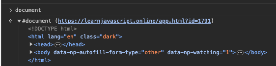
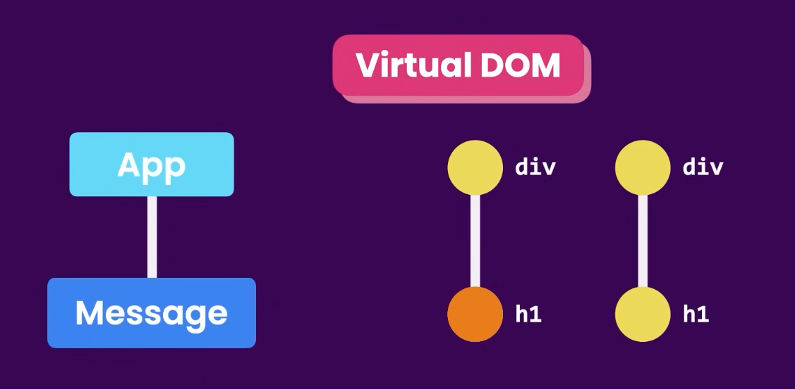

# Web Development Notes

---

## HTML

The language of champions.

### Tags vs Attributes

* **TAGS** are the elements that make up an HTML document
	* Tags have CONTENT and ATTRIBUTES
	* Tags can be nested (i.e. tags can be inside of other tags)
* Tag **CONTENT** (the text between the opening and closing tags) is what is displayed on the page
* Tag **ATTRIBUTES** are properties of the tags that are used to provide additional information about the tag
	* Tag attributes are specified within the opening tag
	* Tag attributes are made up of a **NAME** and a **VALUE**
		```html
		<tag attributeNAME=attributeVALUE>tagCONTENT</tag>
		```
	* General syntax: 
		```html
		<tag attribute1="value1" attribute2="value2">content</tag>
		```
	* Example:
		```html
		<a href="https://www.google.com" target="_blank">Click here to go to Google</a>
		```
		* `<a>`...`</a>` is the TAG 
			* Called an "anchor" tag -- i.e. a link
		* `href` is an ATTRIBUTE of the `a` TAG
			* `https://www.google.com` is the value of the `href` attribute
		* `target` is an attribute of the `a` tag
		* `this is a link` is the content of the `a` tag
			* `_blank` is the VALUE of the `target` ATTRIBUTE
				* This tells the browser to open the link in a new tab

```
Tag
├── Attributes
│ ├── Name
│ └── Value
└── Content
```

### Tags
| Tag | Description | Unpaired? |
| --- | --- | --- |
| `<html></html>` | The root element of an HTML page | No |
| `<head></head>` | Contains metadata about the document | No |
| `<body></body>` | Contains the visible page content | No |
| `<h1>`...`</h1>` | Largest heading | No |
| `<h2>`...`</h2>` | Second largest heading | No |
| `<h3>`...`</h3>` | Third largest heading | No |
| `<h4>`...`</h4>` | Fourth largest heading | No |
| `<h5>`...`</h5>` | Fifth largest heading | No |
| `<h6>`...`</h6>` | Smallest heading | No |
| `<p></p>` | Paragraph | No |
| `<ul></ul>` | Unordered list | No |
| `<ol></ol>` | Ordered list | No |
| `<li></li>` | List item | No |
| `<a></a>` | Anchor (link)<br>* `<a href="url">Link text</a>`<br>&nbsp;&nbsp;&nbsp;&nbsp;* Used to define a hyperlink. | No |
| `` | Image<br>* ``<br>&nbsp;&nbsp;&nbsp;&nbsp;* Used to embed images. `src` attribute specifies the path to the image. `alt` attribute provides alternative text. | Yes |
| `<div></div>` | Division, or section of a page | No |
| `<span></span>` | Inline container for text and other inline elements | No |
| `<br>` | Line break | Yes |
| `<hr>` | Thematic break (horizontal rule) | Yes |
| `<table></table>` | Table | No |
| `<tr></tr>` | Table row | No |
| `<td></td>` | Table data/cell | No |
| `<th></th>` | Table heading | No |
| `<form></form>` | Form for user input | No |
| `<input>` | Input field<br>* `<input type="text" name="fieldname">`<br>&nbsp;&nbsp;&nbsp;&nbsp;* Used for user input. `type` attribute defines the type of input. | Yes |
| `<button></button>` | Button | No |
| `<select></select>` | Drop-down list | No |
| `<option></option>` | Options within a select element | No |
| `<textarea></textarea>` | Multi-line text input field | No |
| `<link>` | Defines a link between a document and an external resource<br>* `<link rel="stylesheet" href="style.css">`<br>&nbsp;&nbsp;&nbsp;&nbsp;* Commonly used to link to stylesheets. `rel` attribute specifies the relationship. | Yes |
| `<meta>` | Metadata about the HTML document<br>* `<meta charset="UTF-8">`<br>&nbsp;&nbsp;&nbsp;&nbsp;* Defines metadata like character set, page description, keywords, author of the document, etc. | Yes |
| `<script></script>` | Defines a client-side script | No |
| `<style></style>` | Used to write CSS directly within an HTML document | No |

---

## CSS

### Selectors

CSS (Cascading Style Sheets) is a language used to style HTML elements.  
In CSS, selectors are used to target the HTML elements that you want to style.  
A CSS selector can be a tag name, class name, id, or a combination of these.  

* A class name is a name that you assign to an element in the `class` attribute.  
	* E.g. `<p class="blue-text">This is a paragraph.</p>`  
	* In this example, the class name is `blue-text`.  
	* Multiple elements can have the same class name.  
	* A class name can be used to style multiple elements at once.  
* An id is a name that you assign to an element in the `id` attribute.  
	* E.g. `<p id="blue-text">This is a paragraph.</p>`  
	* In this example, the id is `blue-text`.  
	* Only one element can have a given id.  
	* An id can be used to style a single element.  

For example, to style all `<p>` elements, you would use the selector `p`: `p { color: blue; }`.   
For applying styles to multiple elements, you can use a comma-separated list of selectors: `p, h1 { color: blue; }`.   
For applying styles to all elements of a certain type, you can use the `*` selector: `* { color: blue; }`.   
For applying styles to all elements with a certain class, you can use the `.classname` selector: `.blue-text { color: blue; }`.   
For applying styles to all elements with a certain id, you can use the `#idname` selector: `#blue-text { color: blue; }`.   
To apply styles to elements that are nested within other elements, you can use the space character: `div p { color: blue; }`.   
To apply multiple styles to an element, you can use a semicolon-separated list of style declarations: `p { color: blue; font-size: 16px; }`.   

### Properties and Values

A property is a style that you want to apply to an element. 
A property is made up of a **name** and a **value**.  

* General syntax: 
```css
selector {
	property1: value1;
	property2: value2;
}
```

| Property | Description | Example Usage |
| --- | --- | --- |
| `color` | Specifies the color of text | `color: blue;` |
| `background-color` | Sets the background color of an element | `background-color: #ffffff;` |
| `font-size` | Defines the font size of text | `font-size: 16px;` |
| `font-family` | Specifies the font for text | `font-family: Arial, sans-serif;` |
| `text-align` | Sets the horizontal alignment of text | `text-align: center;` |
| `margin` | Specifies the space around elements | `margin: 10px;`<br>* Can be specified for each side with `margin-top`, `margin-right`, `margin-bottom`, `margin-left`. |
| `padding` | Sets the space between the content and the border of an element | `padding: 5px;`<br>* Can be specified for each side. |
| `border` | Specifies the border around elements | `border: 1px solid black;`<br>* Individual sides can be styled separately. |
| `width` | Sets the width of an element | `width: 100px;`<br>* Percentages allow for responsive design. |
| `height` | Sets the height of an element | `height: 50px;` |
| `display` | Specifies the display behavior of an element | `display: block;`<br>* Common values include `block`, `inline`, `inline-block`, `none`. |
| `position` | Specifies the type of positioning method | `position: relative;`<br>* Other values: `absolute`, `fixed`, `sticky`. |
| `overflow` | Specifies what happens if content overflows an element's box | `overflow: scroll;`<br>* Other values: `hidden`, `auto`. |
| `opacity` | Specifies the opacity of an element | `opacity: 0.5;`<br>* Ranges from 0 (completely transparent) to 1 (fully opaque). |
| `z-index` | Specifies the stack order of an element | `z-index: 1;`<br>* Higher numbers are on top. Used with positioned elements. |
| `float` | Specifies how an element should float | `float: right;`<br>* Other values: `left`, `none`. |
| `box-shadow` | Applies shadow to elements | `box-shadow: 2px 2px 4px #000000;` |
| `transition` | Specifies the transition effects | `transition: background-color 0.5s ease;`<br>* Can define the property to transition, duration, and timing function. |
| `flex` | Used in a flexbox layout to control the size of items | `flex: 1;`<br>* Can be used to specify the ability of an item to grow or shrink. |
| `grid` | Used in a grid layout to define the structure of grid areas | `grid-template-columns: 50px 50px;`<br>* Specifies the size of columns and rows in grid layouts. |


### CSS Flexbox

Flexbox is a layout mode that arranges elements in a flexible way. 
Flexbox is a one-dimensional layout model, as opposed to CSS Grid, which is a two-dimensional layout model. 
Flexbox is used to create responsive layouts. 
Flexbox is used to create a flexible container that can hold a flexible number of items.
Flexbox is used to align items within the container. 

Fully-fledged flexbox example:

```html
<!DOCTYPE html>
<html lang="en">
<head>
    <meta charset="UTF-8">
    <title>Flexbox Example</title>
    <style>
        body {
            margin: 0;
            font-family: Arial, sans-serif;
        }
        .flex-container {
            display: flex;
            justify-content: space-around;
            align-items: center;
            background-color: #f0f0f0;
            padding: 20px;
        }
        .flex-item {
            background-color: #007bff;
            color: white;
            padding: 15px;
            margin: 10px;
            text-align: center;
        }
    </style>
</head>
<body>
    <div class="flex-container">
        <div class="flex-item">Flex Item 1</div>
        <div class="flex-item">Flex Item 2</div>
        <div class="flex-item">Flex Item 3</div>
    </div>
</body>
</html>
```

In short, flexbox extends the CSS box model to enable one-dimensional layouts. 
One-dimensional layouts are layouts that can be laid out either as a row or as a column. 

### CSS Grid

CSS Grid is a layout mode that arranges elements in a two-dimensional grid. 

Fully-fledged CSS Grid example:

```html
<!DOCTYPE html>
<html lang="en">
<head>
    <meta charset="UTF-8">
    <title>Grid Layout Example</title>
    <style>
        body {
            margin: 0;
            font-family: Arial, sans-serif;
        }
        .grid-container {
            display: grid;
            grid-template-columns: auto auto auto;
            gap: 10px;
            background-color: #f0f0f0;
            padding: 20px;
        }
        .grid-item {
            background-color: #007bff;
            color: white;
            padding: 20px;
            text-align: center;
        }
    </style>
</head>
<body>
    <div class="grid-container">
        <div class="grid-item">Grid Item 1</div>
        <div class="grid-item">Grid Item 2</div>
        <div class="grid-item">Grid Item 3</div>
        <div class="grid-item">Grid Item 4</div>
        <div class="grid-item">Grid Item 5</div>
        <div class="grid-item">Grid Item 6</div>
    </div>
</body>
</html>
```

### Bootstrap

Bootstrap is a CSS framework that makes it easy to create responsive websites.
Bootstrap is a collection of CSS and JavaScript files that you can include in your HTML document.
Bootstrap provides a grid system, a collection of pre-built components, and a set of utilities.

Bootstrap example:

```html
<!DOCTYPE html>
<html lang="en">
<head>
    <meta charset="UTF-8" />
    <title>Simple Example Webpage</title>
    <!-- Bootstrap CSS -->
    <link href="https://stackpath.bootstrapcdn.com/bootstrap/4.3.1/css/bootstrap.min.css" rel="stylesheet">
</head>
<body>

    <!-- Navigation Bar -->
    <nav class="navbar navbar-expand-lg navbar-light bg-light">
        <a class="navbar-brand" href="#">WebDev Notes</a>
        <button class="navbar-toggler" type="button" data-toggle="collapse" data-target="#navbarNav" aria-controls="navbarNav" aria-expanded="false" aria-label="Toggle navigation">
            <span class="navbar-toggler-icon"></span>
        </button>
        <div class="collapse navbar-collapse" id="navbarNav">
            <ul class="navbar-nav">
                <li class="nav-item active">
                    <a class="nav-link" href="#">Home <span class="sr-only">(current)</span></a>
                </li>
                <li class="nav-item">
                    <a class="nav-link" href="#">Features</a>
                </li>
                <li class="nav-item">
                    <a class="nav-link" href="#">Pricing</a>
                </li>
            </ul>
        </div>
    </nav>

    <!-- Jumbotron -->
    <div class="jumbotron">
        <h1 class="display-4">Simple Example Webpage</h1>
        <p class="lead">This is a simple example webpage. It is written in HTML, CSS, and JavaScript.</p>
        <hr class="my-4">
        <p>Explore the features of Bootstrap to enhance web development.</p>
        <a class="btn btn-primary btn-lg" href="https://cudavinci.github.io/drawio/src/main/webapp/index.html" role="button">Learn more</a>
    </div>

    <!-- Main Content -->
    <div class="container">
        <div class="row">
            <!-- Card 1 -->
            <div class="col-md-4 mb-4">
                <div class="card">
                    <div class="card-body">
                        <h5 class="card-title">Feature 1</h5>
                        <p class="card-text">Some quick example text to build on the card title and make up the bulk of the card's content.</p>
                        <a href="#" class="btn btn-primary">Go somewhere</a>
                    </div>
                </div>
            </div>
            <!-- Card 2 -->
            <div class="col-md-4 mb-4">
                <div class="card">
                    <div class="card-body">
                        <h5 class="card-title">Feature 2</h5>
                        <p class="card-text">Another quick example text to build on the card title and fill the card's content.</p>
                        <a href="#" class="btn btn-primary">Go somewhere</a>
                    </div>
                </div>
            </div>
            <!-- Card 3 -->
            <div class="col-md-4 mb-4">
                <div class="card">
                    <div class="card-body">
                        <h5 class="card-title">Feature 3</h5>
                        <p class="card-text">And another quick example text for the third card's content.</p>
                        <a href="#" class="btn btn-primary">Go somewhere</a>
                    </div>
                </div>
            </div>
        </div>
    </div>

    <!-- Footer -->
    <footer class="bg-light text-center text-lg-start mt-4">
        <div class="text-center p-3" style="background-color: rgba(0, 0, 0, 0.2);">
            © 2023 WebDev Notes
        </div>
    </footer>

    <!-- Optional Bootstrap JavaScript -->
    <script src="https://code.jquery.com/jquery-3.3.1.slim.min.js"></script>
    <script src="https://cdnjs.cloudflare.com/ajax/libs/popper.js/1.14.7/umd/popper.min.js"></script>
    <script src="https://stackpath.bootstrapcdn.com/bootstrap/4.3.1/js/bootstrap.min.js"></script>
</body>
</html>
```

In the example above, the Bootstrap CSS and JavaScript files are included in the `<head>` and `<body>` sections, respectively. 
All that is needed to use Bootstrap is to include the CSS and JavaScript files in your HTML document. 
People like Bootstrap because it enables you to create responsive websites without having to write a lot of CSS.

---

## Example Webpage

```html
<!DOCTYPE html>
<html lang="en">
	<head>
		<meta charset="UTF-8" />
		<title>Simple Example Webpage</title>
		<style>
			body {
				background-color: #ffffff;
				color: #000000;
				font-family: Arial, sans-serif;
				font-size: 16px;
				margin: 0;
				padding: 0;
			}

			.container {
				margin: 0 auto;
				max-width: 800px;
				padding: 20px;
			}

			h1 {
				text-align: center;
			}

			.content {
				margin-top: 20px;
			}

			.content p {
				margin-bottom: 10px;
			}

			.content a {
				color: #0000ff;
				text-decoration: none;
			}

			.content a:hover {
				text-decoration: underline;
			}

			.content button {
				background-color: #0000ff;
				border: none;
				border-radius: 5px;
				color: #ffffff;
				cursor: pointer;
				font-size: 16px;
				margin-top: 10px;
				padding: 10px;
			}

			.content button:hover {
				background-color: #0000aa;
			}

			.content button:active {
				background-color: #000055;
			}
		</style>
	</head>
	<body>
		<div class="container">
			<h1>Simple Example Webpage</h1>
			<div class="content">
				<p>
					This is a simple example webpage. It is written in HTML, CSS, and
					JavaScript.
				</p>
				<p>
					This is a link to
					<a href="https://cudavinci.github.io/drawio/src/main/webapp/index.html" target="_blank">Github Pages</a>.
				</p>
				<button onclick="alert('Hello World!')">Click Me!</button>
			</div>
		</div>
	</body>
</html>
```

---

## JavaScript

### Python vs JavaScript Quick Reference

A side-by-side cheat sheet for common patterns. If you know Python, JavaScript's syntax will feel familiar for most things — the main gotchas are bracket syntax (just imagine there are no brackets...or brackets ~ newlines), `===` vs `==`, no negative indexing, objects instead of dicts, and the `this` keyword in classes.

| Concept | Python | JavaScript |
| :--- | :--- | :--- |
| **Variables** | | |
| Mutable variable | `x = 5` | `let x = 5;` |
| Immutable binding | _(no direct equivalent)_ | `const x = 5;` |
| Type annotation | `x: int = 5` | _(TypeScript)_ `let x: number = 5;` |
| **Strings** | | |
| Interpolation | `f"Hello {name}"` | `` `Hello ${name}` `` |
| Multiline string | `"""line1\nline2"""` | `` `line1 `` <br> `` line2` `` |
| **Primitives** | | |
| Null / None | `None` | `null` / `undefined` |
| Boolean literals | `True` / `False` | `true` / `false` |
| **Operators** | | |
| Logical | `and` / `or` / `not` | `&&` / `\|\|` / `!` |
| Equality (value) | `==` | `===` _(strict — always prefer this)_ |
| Equality (type-coercing) | _(N/A)_ | `==` _(avoid)_ |
| **Conditionals** | | |
| If / else if / else | `if x > 0:` / `elif x == 0:` / `else:` | `if (x > 0) {` / `} else if (x == 0) {` / `} else {` |
| Ternary | `val = a if cond else b` | `val = cond ? a : b;` |
| Nullish fallback | `val = x or default` _(falsy)_ | `val = x ?? default;` _(nullish only)_ |
| Optional chaining | _(N/A — use `getattr`)_ | `obj?.prop?.nested` |
| **Lists / Arrays** | | |
| Declaration | `lst = [1, 2, 3]` | `let arr = [1, 2, 3];` |
| Index (first) | `lst[0]` | `arr[0]` |
| Index (last) | `lst[-1]` | `arr[arr.length - 1]` |
| Slice | `lst[1:3]` | `arr.slice(1, 3)` |
| Append | `lst.append(x)` | `arr.push(x);` |
| Remove last | `lst.pop()` | `arr.pop();` |
| Length | `len(lst)` | `arr.length` |
| Contains | `x in lst` | `arr.includes(x)` |
| **Dicts / Objects** | | |
| Declaration | `d = {"key": "val"}` | `let obj = { key: "val" };` |
| Access by key | `d["key"]` | `obj["key"]` or `obj.key` |
| Access with default | `d.get("key", default)` | `obj.key ?? default` |
| Check key exists | `"key" in d` | `"key" in obj` or `obj.hasOwnProperty("key")` |
| Keys / values / pairs | `d.keys()` / `d.values()` / `d.items()` | `Object.keys(obj)` / `Object.values(obj)` / `Object.entries(obj)` |
| Delete key | `del d["key"]` | `delete obj.key;` |
| Merge | `{**d1, **d2}` | `{ ...obj1, ...obj2 }` |
| **Loops** | | |
| For (range) | `for i in range(5):` | `for (let i = 0; i < 5; i++) {` |
| For-each (value) | `for item in lst:` | `for (const item of arr) {` |
| For-each (key/index + value) | `for i, item in enumerate(lst):` | `arr.forEach((item, i) => { ... });` |
| For-each (object keys) | `for key in d:` | `for (const key in obj) {` |
| While | `while condition:` | `while (condition) {` |
| Do-while | _(N/A)_ | `do { ... } while (condition);` |
| Break / Continue | `break` / `continue` | `break;` / `continue;` |
| **Functional / Array methods** | | |
| Map | `[x*2 for x in lst]` | `arr.map(x => x * 2)` |
| Filter | `[x for x in lst if x > 5]` | `arr.filter(x => x > 5)` |
| Reduce | `functools.reduce(fn, lst, init)` | `arr.reduce((acc, x) => acc + x, init)` |
| All / Some | `all(cond(x) for x in lst)` / `any(...)` | `arr.every(x => cond(x))` / `arr.some(x => cond(x))` |
| Find first | `next((x for x in lst if cond), None)` | `arr.find(x => cond(x))` |
| Flatten | `[x for sub in lst for x in sub]` | `arr.flat()` / `arr.flatMap(fn)` |
| **Functions** | | |
| Definition | `def fn(a, b):` | `function fn(a, b) {` |
| Default arg | `def fn(a, b=10):` | `function fn(a, b = 10) {` |
| Lambda / Arrow | `fn = lambda a, b: a + b` | `const fn = (a, b) => a + b;` |
| Rest args | `def fn(*args):` | `function fn(...args) {` |
| Keyword args / named | `def fn(**kwargs):` | _(use destructured object)_ `fn({ a, b })` |
| Return | `return val` | `return val;` |
| **Destructuring / Unpacking** | | |
| Array / list unpack | `a, b = lst` | `const [a, b] = arr;` |
| Skip elements | `a, _, c = lst` | `const [a, , c] = arr;` |
| Object / dict unpack | _(N/A directly)_ | `const { key1, key2 } = obj;` |
| With rename | _(N/A)_ | `const { key: newName } = obj;` |
| Spread into list | `[*lst1, *lst2]` | `[...arr1, ...arr2]` |
| **Error handling** | | |
| Try / catch | `try:` / `except Exception as e:` | `try {` / `} catch (e) {` |
| Finally | `finally:` | `} finally {` |
| Throw / raise | `raise ValueError("msg")` | `throw new Error("msg");` |
| **Classes** | | |
| Definition | `class Dog:` | `class Dog {` |
| Constructor | `def __init__(self, name):` | `constructor(name) {` |
| Instance var | `self.name = name` | `this.name = name;` |
| Method | `def speak(self):` | `speak() {` |
| Inheritance | `class Dog(Animal):` | `class Dog extends Animal {` |
| Call parent | `super().__init__(name)` | `super(name);` |
| **Imports / Modules** | | |
| Import module | `import module` | `import module from 'module';` |
| Named import | `from module import fn` | `import { fn } from 'module';` |
| CommonJS (Node) | _(N/A)_ | `const m = require('module');` |
| **Type checking** | | |
| Get type | `type(x)` | `typeof x` |
| Instance check | `isinstance(x, int)` | `x instanceof ClassName` |
| **Misc** | | |
| Print / log | `print(x)` | `console.log(x);` |
| Length | `len(x)` | `x.length` |
| String → number | `int("42")` / `float("3.14")` | `parseInt("42")` / `parseFloat("3.14")` |
| Number → string | `str(42)` | `String(42)` or `` `${42}` `` |
| Random float [0,1) | `random.random()` | `Math.random()` |
| Floor / ceil / round | `math.floor(x)` / `math.ceil(x)` / `round(x)` | `Math.floor(x)` / `Math.ceil(x)` / `Math.round(x)` |

#### Classes: side-by-side

=== "Python"
    ```python
    class Animal:
        def __init__(self, name: str):
            self.name = name

        def speak(self) -> str:
            return f"{self.name} speaks"


    class Dog(Animal):
        def speak(self) -> str:
            return f"{self.name} barks"


    d = Dog("Rex")
    print(d.speak())  # Rex barks
    print(isinstance(d, Animal))  # True
    ```

=== "JavaScript"
    ```javascript
    class Animal {
        constructor(name) {
            this.name = name;
        }

        speak() {
            return `${this.name} speaks`;
        }
    }

    class Dog extends Animal {
        speak() {
            return `${this.name} barks`;
        }
    }

    const d = new Dog("Rex");
    console.log(d.speak());         // Rex barks
    console.log(d instanceof Animal); // true
    ```

#### Async: side-by-side

=== "Python"
    ```python
    import asyncio

    async def fetch_data(url: str) -> dict:
        await asyncio.sleep(1)  # simulated I/O
        return {"url": url, "data": "..."}

    async def main():
        result = await fetch_data("https://example.com")
        print(result)

    asyncio.run(main())
    ```

=== "JavaScript"
    ```javascript
    async function fetchData(url) {
        const response = await fetch(url);  // real browser/Node API
        const data = await response.json();
        return data;
    }

    async function main() {
        const result = await fetchData("https://example.com");
        console.log(result);
    }

    main();
    // Alternatively with .then():
    // fetchData(url).then(data => console.log(data)).catch(err => console.error(err));
    ```

---

### JavaScript Basics

---

#### How to run JavaScript code

##### In the browser

* Open the browser console
	* In Chrome: `Cmd + Option + J`
* Or use the `script` tag in the HTML file
	* E.g. `<script src="script.js"></script>`
	* This is useful when you want to run the code when the page loads
* Or use the `script` tag in the HTML file with the `defer` attribute
	* E.g. `<script src="script.js" defer></script>`
	* This is useful when you want to run the code when the page loads but you want to load the HTML first (e.g. when you want to use the DOM)
		* This can also be done by putting the `script` tag at the end of the `body` tag or using an event listener on the `DOMContentLoaded` event
* Or use the `script` tag in the HTML file with the `async` attribute
	* E.g. `<script src="script.js" async></script>`
	* This is useful when you want to run the code when the page loads but you don't want to wait for the HTML to load (e.g. when you don't want to use the DOM)
		* This can also be done by putting the `script` tag at the beginning of the `body` tag or using an event listener on the `load` event

##### In the terminal

* Install Node.js
* Run `node script.js`
* Or run `node` to open the Node.js REPL
	* This is useful for testing code
* Or run `node -i script.js` to run the script and then open the Node.js REPL (interactive mode)
* Or run `node -e "console.log('Hello World!')"` to run a one-liner

##### In VS Code

* Install the Code Runner extension
* Or use the Quokka.js extension
	* This is useful for testing code
	* It can be used to run code in the editor or in the terminal

#### Printing to the Console

```javascript
console.log("Hello World!");
```

##### Debugging in the console

```javascript
// clear the console
console.clear();
// typeof
console.log(typeof 3); // number
// string interpolation
console.log(`The type of 3 is ${typeof 3}`); // The type of 3 is number
// console.table
console.table([1, 2, 3, 4, 5]);
// more complex example
console.table([
	{ name: "John", age: 23 },
	{ name: "Jack", age: 24 },
]);
// console.error
console.error("This is an error");
// scripting in the console (e.g. to test a function)
function add(a, b) {
	return a + b;
}
add(1, 2); // 3
// console.assert
console.assert(1 === 2, "This is an error"); // Assertion failed: This is an error
```

#### Variable Declaration and Assignment

```javascript
var myName = "John"; // DONT' USE - var is used throughout the program
let myValue = 7; // let is used within the scope of where it's declared
const pi = 3.14; // const is used for variables that won't change

myValue = 7 * 2;
myValue++;
myValue--;
myValue += 5;
myValue -= 5;
myValue *= 5;
myValue /= 5;
```

#### Arrays

##### Declaration and Manipulation

* 1-D:

```javascript
let myArray = ["John", 23];
myArray[0] = "Jack"; // this won't work with const
myArray.push("John"); // adds to end
let holder = myArray.pop(); // removes from end and stores in holder
myArray.shift(); // removes from beginning
myArray.unshift("John"); // adds to beginning -- have to use this for const
```

* 2-D:

```javascript
let myArray = [
	["John", 23],
	["Jack", 24],
];

myArray[0] = "Super random value"; // arrays can hold any type of value
```

##### forEach Loops

(This is jumping ahead a bit but should be grouped with arrays -- see [Looping](webdev_snippets.md#looping), [Functions](webdev_snippets.md#functions), and first segments of [ES6](webdev_snippets.md#ES6) for more info)  

Here a callback is used (where the callback is defined in-line)  

```javascript
const xArray = [10, 6, 8];

xArray.forEach(function(x) {
	console.log(x);
})
```

In other words, the first arg of the callback definition is used to specify the "dynamic variable name" used for the array elements  
Using an arrow function, the syntax is more elegant: 

```javascript
const xArray = [10, 6, 8];

xArray.forEach((x) => {
	console.log(x);
})
```

##### Array callback methods  

Notice the pattern here -- `array.method(callback)` where callback is  

```javascript
function(arrayItem) {...}
```

* `.filter()`
* `.find()`
* `.map()`

###### Filtering Arrays  

Note: this will always return an array  

```javascript
const years = [2000, 2008, 2020, 2023];

years.filter(function(year) {
    return year >= 2010; // this must *return* a boolean
});
```

Using arrow function syntax:

```javascript
const years = [2000, 2008, 2020, 2023];

years.filter((year) => {
    return year >= 2010; // this must *return* a boolean
});
```

Using implicit return:

```javascript
years.filter((year) => year >= 2010;)
```

###### Searching arrays

The .find() method returns either the first array item that matches the callback condition or `undefined` if the specified item isn't found.  

```javascript
const names = ["Sam", "Alex", "Charlie"];

const result = names.find(function(name) {
  return name === "Alex";
});
console.log(result); // "Alex"
```

Using arrow function syntax:

```javascript
const names = ["Sam", "Alex", "Charlie"];

const result = names.find((name) => {
  return name === "Alex";
});
console.log(result); // "Alex"
```

Using implicit return: 

```javascript
const result = names.find((name) => name === 'Alex')
```

###### Mapping functions to arrays 

```javascript
const names = ["sam", "Alex"];
const upperNames = names.map(function(name) {
    return name.toUpperCase();
});
```

Using arrow function syntax: 

```javascript
const names = ["sam", "Alex"];
const upperNames = names.map((name) => {
    return name.toUpperCase();
});
```

Using implicit return: 

```javascript
const upperNames = names.map((name) => name.toUpperCase();)
```

###### Array NON-callback methods 

* `.includes()`
	* `groceries.includes("Tomato"); // true`
* `.join()`
	* `groceries.join("; "); // "Apple; Peach; Tomato"`

###### .reduce() method

The `reduce()` method is used to calculate a single value from an array. In other terms, you reduce an array into a single value.  
`.reduce()` is commonly used for summing the values in an array (or multiplying, or finding the max, or averaging, etc. -- any operation that reduces an array to a single value).  

* The reduce() method accepts the "reducer" -- a callback that you have to write -- and an optional initial value (for the accumulator).   
	* The "reducer function" takes two arguments: the accumulator and the current value. 

General syntax:

```javascript
array.reduce(function(accumulator, currentValue) { // this callback is the "reducer function"
	return accumulator + currentValue; 
}, 0); // 0 is the initial value of the accumulator
```

```javascript
const numbers = [1, 2, 3, 4, 5];

const sum = numbers.reduce(function(accumulator, currentValue) {
	return accumulator + currentValue; // this is the "reducer function"
});
console.log(sum); // 15
```

Using arrow function syntax: 

```javascript
const sum = numbers.reduce((accumulator, currentValue) => {
	return accumulator + currentValue;
});
console.log(sum); // 15
```

Using implicit return: 

```javascript
const sum = numbers.reduce((accumulator, currentValue) => accumulator + currentValue;)
console.log(sum); // 15
```

Using an initial value: 

```javascript
const sum = numbers.reduce((accumulator, currentValue) => accumulator + currentValue;, 100)
console.log(sum); // 115
```

###### .reduce() -- Walkthrough

```javascript
const grades = [10, 15, 5];
const sum = grades.reduce((total, current) => { 
    return total + current;
}, 0);
```

Here the reducer is: 

```javascript
(total, current) => { 
	return total + current;
}
```

This is the callback that is applied for every item in the array, however, this callback takes 2 parameters: total and current.  
  
The total is always referring to the last computed value by the reduce function. You may often see this called as accumulator in documentation which is a more correct name. And the current is referring to a single item in the array. 

```javascript
const grades = [10, 15, 5];
const sum = grades.reduce((total, current) => total + current;, 0); // total (the accumulator) holds the "running total" & gets assigned to & returned at end || current represents 1 item in the array
```

Looking at the value of `total` and `current` for each iteration:

* Iteration 1: 
	* `total` = 0 (because of initial value)
	* `current` = 10 (because of first item in array)
		* `total` + `current` is returned and becomes the new `total` for the next iteration
* Iteration 2: 
	* `total` = 10 (because of previous iteration)
	* `current` = 15 (because of next item in array)
		* `total` + `current` is returned and becomes the new `total` for the next iteration
* Iteration 3: 
	* `total` = 25 (because of previous iteration)
	* `current` = 5 (because of next item in array)
		* `total` + `current` is returned and - since there are no more items in the array - this is the final value of `total`, which gets assigned to `sum`

#### Functions

```javascript
// Print function
function myFunction() {
	console.log("Hello World!");
}

myFunction();
```

```javascript
// Return function
function myFunction() {
	return "Hello World!";
}

console.log(myFunction());
```

```javascript
// Setting global variable
// returns undefined
let sum = 0;

function addThree() {
	// the below line (i.e. without let/const/var) isn't a declaration 
	// (it's a post-declaration assignment)
	sum += 3;
}

function addFive() {
	sum += 5;
}

addThree();
addFive();
console.log(sum); // 8
```

###### Callbacks (general)

A callback is a function definition passed as an argument to another function, enabling the inner function to be invoked within the outer function w/ access to the scope of the outer function  
This can be done in-line (i.e. defining the inner function within the arg pass to the outer function) -- see array.forEach()  
Can also be done using a stand-in value for the inner function in the definition of the outer function -- see callbacks with async  

#### If-Statement syntax  in JavaScript

##### General Syntax

* One then-statement: 

	```if (condition) statement;```
	
	OR

	```javascript
	if (condition) {
		statement;
	}
	```

* Multiple then-statements: 

	```if (condition) { statement1; statement2; }```
	
	OR

	```javascript
	if (condition) {
		statement1;
		statement2;
	}
	```

##### If-else syntax: 

```javascript
if (condition) {
	statement1;
} else {
	statement2;
}
```

##### If-else-if syntax: 

```javascript
if (condition1) {
	statement1;
} else if (condition2) {
	statement2;
} else {
	statement3;
}
```

##### Boolean Values in JavaScript

```javascript
function trueOrFalse(wasThatTrue) {
	if (wasThatTrue) {
		return "Yes, that was true";
	}
	return "No, that was false";
}

console.log(trueOrFalse(true)); // Yes, that was true
console.log(trueOrFalse(false)); // No, that was false
```

##### Try...Catch

```javascript
try {
	// code to try
} catch (err) { // here an error object is assigned to err
	// code to run if an error occurs
}
```

```javascript
try {
  nonExistentFunction();
} catch (error) {
  console.error(error);
  // Expected output: ReferenceError: nonExistentFunction is not defined
}
```


##### Try...Catch...Finally

```javascript
try {
	// code to try
} catch (err) { // here an error object is assigned to err
	// code to run if an error occurs
} finally {
	// code to run regardless of whether an error occurs
}
```

##### Throw

Use `throw` instead of console.error() to throw an exception.  
This is useful for custom error messages during debugging.  

```javascript
throw "Error2"; // generates an exception with a string value
// console output: Uncaught Error2
```

```javascript
throw 42; // generates an exception with the value 42
// console output: Uncaught 42
```

##### Try catch within Promise definition

```javascript
const myPromise = new Promise((resolve, reject) => {
	try {
		// resolve([codeToTry])
	} catch (err) {
		// reject([codeToRunIfError])
	}
});
```

##### Comparison Operators in JavaScript

* `&&` - and
* `||` - or
* `==` - equal to
* JavaScript compares different types by converting them to a common type
* `===` - equal value and equal type
* This is necessary in JavaScript because `1 == "1"` is true but `1 === "1"` is false
* `!=` - not equal
* `!==` - not equal value or not equal type
* `!` - not
* Common usage:
	* `if (!(a && b)) { ... }`
* rest are same as python

##### Ternary Operator

* Syntax:

	```javascript
	condition ? statement-if-true : statement-if-false;
	```

* Example:

	```javascript
	function checkEqual(a, b) {
		return a === b ? true : false;
	}

	console.log(checkEqual(1, 2)); // false
	```

* This is like python's `a if condition else b` syntax
* Multiple ternary operators can be chained together:

	```javascript
	function checkSign(num) {
		return num > 0 ? "positive" : num < 0 ? "negative" : "zero";
	}

	console.log(checkSign(10)); // positive
	```

* In python this would be `a if condition else b if condition else c`

##### Switch Statements
* Simpler syntax for single variable value comparison
* Equivalent to python 3.10+ match-case statement
* Uses strict equality (`===`) in comparisons
* Simple example:

```javascript
function caseInSwitch(val) {
	let answer = "";
	switch (val) {
		case 1:
			answer = "alpha";
			break;
		case 2:
			answer = "beta";
			break;
		case 3:
			answer = "gamma";
			break;
	}
	return answer;
}

console.log(caseInSwitch(1)); // alpha
console.log(caseInSwitch(2)); // beta
console.log(caseInSwitch(3)); // gamma
console.log(caseInSwitch(4)); // empty string
```
* Case with multiple values:

```javascript
function sequentialSizes(val) {
	let answer = "";

	switch (val) {
		case 1:
		case 2:
			answer = "Low";
			break;
		case 3:
		case 4:
			answer = "Mid";
			break;
		case 5:
			answer = "High";
			break;
	}
	
	return answer;
}

// obvious how this works with, e.g., console.log(sequentialSizes(1));
```

##### Return Early Pattern for Functions

* Example:

```javascript
function abTest(a, b) {
	if (a < 0 || b < 0) {
		return undefined;
	}

	return Math.round(Math.pow(Math.sqrt(a) + Math.sqrt(b), 2));
}

console.log(abTest(2, 2)); // 8
console.log(abTest(-2, 2)); // undefined
console.log(abTest(2, -2)); // undefined
console.log(abTest(2, 8)); // 18
```

#### !if-conditions

This section uses concepts covered in [Objects](webdev_snippets.md#javascript-objects). 
There are a number of more efficient ways to express if-conditions.  

##### Falsy vs Nullish Values

A value is considered falsy if it converts to  false  when evaluated in a boolean context, such as within an if  statement or after applying the logical NOT operator ( ! ).  

"Nullish" typically refers to the values  null  and  undefined , which represent the absence of a meaningful value or the non-existence of a value. 

All nullish values are falsy, but not all falsy values are nullish.  Non-nullish falsy values (0, false, NaN, "") do represent some sort of extant value, whereas nullish values represent the absence of a value. 

* Falsy values in javascript:

	```javascript
	false;
	0;
	undefined;
	null;
	NaN;
	"";
	```

* Nullish values in javascript:

	```javascript
	null;
	undefined;
	```

##### Optional Chaining

If you try to access a property of an object that doesn't exist, you will get an error.  
This can be avoided by using the optional chaining operator (`?.`)  
This is similar to `my_dict.get("key")` in python...it's a try...except on a dict lookup where the except returns `undefined` (`None` in python)

```javascript
const user = {
    details: {
        name: {
            firstName: "Sam"
        }
    },
    data: null
}

user.details?.name?.firstName; // "Sam"
user?.details?.name?.firstName; // "Sam" -- use this if you don't know if user is an object. however this will return undefined if user doesn't exist.
user.data?.id; // undefined
user.children?.names; // undefined
user.details?.parent?.firstName; // undefined
```

Can be used with bracket notation, but you have to use the bracket notation for the entire chain.  

```javascript
user["details"]?.["name"]?.["firstName"]; // "Sam"
```

##### Nullish Coalescing Operator

Similar to the optional chaining operator, the nullish coalescing operator (`??`) returns the right-hand side operand if the left-hand side operand is `null` or `undefined`.  

```javascript
const getName = name => {
    return name ?? "N/A";
}

console.log(getName("Sam")); // "Sam"
console.log(getName(undefined)); // "N/A"
console.log(getName(null)); // "N/A"
```

**In some cases this can be used in place of an if-else or the ternary operator**  

```javascript
// Example 1:
// if-else
const getName = name => {
	if (name) {
		return name;
	} else {
		return "N/A";
	}
}
// ternary operator
const getName = name => name ? name : "N/A";
const getName = name => !!name ? name : "N/A";
// nullish coalescing operator
const getName = name => name ?? "N/A";

// Example 2:
// if-else:
const getWelcomeMessage = user => {
	if (user.fullName) {
		return `Welcome ${user.fullName}`;
	} else {
		return "Welcome user";
	}
}
// ternary operator
const getWelcomeMessage = user => `Welcome ${user.fullName ? user.fullName : 'user'}`;
// nullish coalescing operator
const getWelcomeMessage = user => `Welcome ${user.fullName ?? 'user'}`;
```

Note that this employs "short-circuiting" -- if the left-hand side operand is not `null` or `undefined`, the right-hand side operand is not evaluated.  

```javascript
const getPlaceholder = () => {
    console.log("getPlaceholder called");
    return "N/A";
}

const sayHello = name => {
    return `Hello ${name ?? getPlaceholder()}`;
}

console.log(sayHello("Sam")); // "Hello Sam"
```

Can be used together with optional chaining: 

```javascript
const translations = {
    welcome: {
        dutch: "Welkom",
        french: "Bienvenue",
        english: "Welcome"
    }
}

const getTranslation = (language) => translations["welcome"]?.[language] ?? translations["welcome"].english;
```

##### Object + Nullish Coalescing 

```javascript
const getPushMessage = status => {
    if (status === "received") {
        return "Restaurant started working on your order.";
    } else if (status === "prepared") {
        return "Driver is picking up your food."
    } else if (status === "en_route") {
        return "Driver is cycling your way!";
    } else if (status === "arrived") {
        return "Enjoy your food!";
    } else {
        return "Unknown status";
    }
}

console.log(getPushMessage("received")); // "Restaurant started working on your order."
```

```javascript
const getPushMessage = status => {
    const messages = {
        received: "Restaurant started working on your order.",
        prepared: "Driver is picking up your food.",
        en_route: "Driver is cycling your way!",
        arrived: "Enjoy your food!"
    };

    return messages[status] ?? "Unknown status";
}

console.log(getPushMessage("received")); // "Restaurant started working on your order."
```

#### JavaScript Objects

* Objects are more similar to python dictionaries than to python objects
* They are similar to JavaScript arrays except that the index keys ("properties") are strings
* Simmple example:

```javascript
let myDog = {
	name: "Spot",
	legs: 4,
	tails: 1,
	friends: ["Rover", "Fido"]
};

console.log(myDog.name); // or myDog["name"]
console.log(myDog.legs); // or myDog["legs"]
console.log(myDog.tails); // 1
console.log(myDog.friends); // [ 'Rover', 'Fido' ]

console.log(myDog.name); // Spot
```

##### Updating Object Properties

```javascript
myDog.name = "Happy Spot";
console.log(myDog.name); // Happy Spot
```

##### Add New Properties to a JavaScript Object

```javascript
myDog.bark = "woof";
console.log(myDog.bark); // woof
```

##### Delete Properties from a JavaScript Object

```javascript
delete myDog.bark;
console.log(myDog.bark); // undefined
```

##### Accessing Object Properties with Variables

Note 1: JS objects aren't exactly like python dicts because the properties (keys) are not enclosed in quotes.  
Note 2: Note that so far we have been accessing property values explicitly providing the property name (key) via dot notation 
  
In order to access a property value using a variable, we have to use bracket notation: 

```javascript
let propertyName = "friends";
console.log(myDog[propertyName]); // [ 'Rover', 'Fido' ]
```

##### Object.keys()

Note 3: Another difference from python dicts -- to get an object's keys, we call call the `.keys()` method of the built-in global variable `Object` 

```javascript
console.log(Object.keys(myDog)); // [ 'name', 'legs', 'tails', 'friends' ]
```

We've seen this before with `Number.parseInt()`, `Math.random()`, `console.log()`, etc.

##### Using Objects for Lookups

```javascript
// Can be used like a switch statement (keys must be strings)
// (like a python dictionary)
function phoneticLookup(val) {
	let result = "";

	let lookup = {
		alpha: "Adams",
		bravo: "Boston",
		charlie: "Chicago",
		delta: "Denver",
		echo: "Easy",
		foxtrot: "Frank",
	};

	result = lookup[val];

	return result;
}

console.log(phoneticLookup("charlie")); // Chicago
```

##### Testing Objects for Properties

```javascript
// Similar to python's `in` operator
function checkObj(obj, checkProp) {
	if (obj.hasOwnProperty(checkProp)) {
		return obj[checkProp];
	} else {
		return "Not Found";
	}
}
```

##### Nested Objects

```javascript
let myStorage = {
	car: {
		inside: {
			"glove box": "maps",
			"passenger seat": "crumbs",
		},
		outside: {
			trunk: "jack",
		},
	},
};

let gloveBoxContents = myStorage.car.inside["glove box"];
console.log(gloveBoxContents); // maps
```

##### Accessing Nested Arrays

```javascript
let myPlants = [
	{
		type: "flowers",
		list: ["rose", "tulip", "dandelion"],
	},
	{
		type: "trees",
		list: ["fir", "pine", "birch"],
	},
];

let secondTree = myPlants[1].list[1];
console.log(secondTree); // pine
```

#### Looping

##### While Loops

```javascript
let myArray = [];
let i = 0;
while (i < 5) {
	myArray.push(i);
	i++;
}
console.log(myArray); // [ 0, 1, 2, 3, 4 ]
```

##### For Loops

```javascript
let myArray = [];
for (let i = 0; i < 5; i++) {
	myArray.push(i);
}
console.log(myArray); // [ 0, 1, 2, 3, 4 ]
```

##### forEach Loops

Here a callback is used (where the callback is defined in-line)  

```javascript
const xArray = [10, 6, 8];

xArray.forEach(function(x) {
	console.log(x);
})
```

In other words, the first arg of the callback definition is used to specify the "dynamic variable name" used for the array elements  
Using an arrow function, the syntax is more elegant: 

```javascript
const xArray = [10, 6, 8];

xArray.forEach((x) => {
	console.log(x);
})
```

##### Iterate Through an Array with a For Loop

```javascript
let myArr = [2, 3, 4, 5, 6];
let total = 0;
for (let i = 0; i < myArr.length; i++) {
	total += myArr[i];
}
console.log(total); // 20
```

OR (using `forEach`)  

```javascript
let myArr = [2, 3, 4, 5, 6];
let total = 0;
myArr.forEach(function(element) {
	total += element
})
console.log(total) // 20
```

##### Nesting For Loops

```javascript
function multiplyAll(arr) {
	let product = 1;
	for (let i = 0; i < arr.length; i++) {
		for (let j = 0; j < arr[i].length; j++) {
			product *= arr[i][j];
		}
	}
	return product;
}

let product = multiplyAll([
	[1, 2],
	[3, 4],
	[5, 6, 7],
]);

console.log(product); // 5040
```

##### Do...While Loops

```javascript
let myArray = [];
let i = 10;
do {
	myArray.push(i);
	i++;
} while (i < 5);
console.log(i, myArray); // 10 [ 10 ]
```

* The above code will run once even though the condition is false
* So it will push `10` to `myArray` and increment `i` to `11` then exit the loop
* This is useful when you want to run the loop at least once

##### Profile Lookup

```javascript
let contacts = [
	{
		firstName: "Akira",
		lastName: "Laine",
		number: "0543236543",
		likes: ["Pizza", "Coding", "Brownie Points"],
	},
	{
		firstName: "Harry",
		lastName: "Potter",
		number: "0994372684",
		likes: ["Hogwarts", "Magic", "Hagrid"],
	},
	{
		firstName: "Sherlock",
		lastName: "Holmes",
		number: "0487345643",
		likes: ["Intriguing Cases", "Violin"],
	},
	{
		firstName: "Kristian",
		lastName: "Vos",
		number: "unknown",
		likes: ["JavaScript", "Gaming", "Foxes"],
	},
];

function lookUpProfile(name, prop) {
	for (let i = 0; i < contacts.length; i++) {
		if (contacts[i].firstName === name) {
			if (contacts[i].hasOwnProperty(prop)) { // or, equivalently, `if (contacts[i][prop])` bc `undefined` is falsy
				return contacts[i][prop];
			} else {
				return "No such property";
			}
		}
	}
	return "No such contact";
}

console.log(lookUpProfile("Akira", "likes")); // [ 'Pizza', 'Coding', 'Brownie Points' ]
console.log(lookUpProfile("Kristian", "lastName")); // Vos
```

* Other falsy values in JavaScript are `false`, `0`, `""`, `null`, `undefined`, and `NaN`

#### Constructor Functions

##### Purpose

As noted, JavaScript objects are similar to python dictionaries. However, they are not as flexible as python dictionaries. For example, you can't add a new key-value pair to a JavaScript object after it's been created. This is where constructor functions come in. They are used to create multiple objects of the same type. They are similar to classes in other languages.

* Constructor functions are used to create objects
* They are similar to classes in other languages
* They are used to create multiple objects of the same type
* They are used to create objects with the same properties but different values

Long story short:

* objects are like python dictionaries
	* except once they're created you can't add new key-value pairs
* constructor functions are like python class definitions
* constructor functions are invoked to create objects

So objects are like python dictionaries and constructor functions are like python class definitions.
But objects created using constructor functions __ARE__ similar to python objects.
* They are similar to python objects in that they can have methods and properties (and methods can be used to change properties)

##### Syntax

***Notice how it is truly a FUNCTION and is title-cased***

```javascript
function Dog() {
	this.name = "Spot";
	this.color = "brown";
	this.numLegs = 4;
}
```

* The `this` keyword is used to refer to the current object
* The `new` keyword is used to create a new object from the constructor function
* The `new` keyword creates an instance of the object

##### Invoking a Constructor Function

```javascript
let hound = new Dog();
console.log(hound); // Dog { name: 'Spot', color: 'brown', numLegs: 4 }
```

##### Extending Constructors to Receive Arguments

```javascript
function Dog(name, color) {
	this.name = name;
	this.color = color;
	this.numLegs = 4;
}

let hound = new Dog("Spot", "brown");
console.log(hound); // Dog { name: 'Spot', color: 'brown', numLegs: 4 }
```

##### Verify an Object's Constructor with instanceof

```javascript
function House(numBedrooms) {
	this.numBedrooms = numBedrooms;
}

let myHouse = new House(4);
console.log(myHouse instanceof House); // true
```

##### Understand Own Properties

```javascript
function Bird(name) {
	this.name = name;
	this.numLegs = 2;
}

let canary = new Bird("Tweety");
let ownProps = [];
for (let property in canary) {
	if (canary.hasOwnProperty(property)) {
		ownProps.push(property);
	}
}
console.log(ownProps); // [ 'name', 'numLegs' ]
```

##### Use Prototype Properties to Reduce Duplicate Code

Prototype properties are shared among all instances of an object.  
**These are how new properties and methods are added to constructor functions post-declaration.**

```javascript
function Dog(name) {
	this.name = name;
}

Dog.prototype.numLegs = 4; // this is allowing all Dog objects to have the numLegs property (even though it's not defined in the constructor function)

let beagle = new Dog("Snoopy");
console.log(beagle.numLegs); // 4
```

##### Iterate Over All Properties

```javascript
function Dog(name) {
	this.name = name;
}

Dog.prototype.numLegs = 4;

let beagle = new Dog("Snoopy");

let ownProps = [];
let prototypeProps = [];

for (let property in beagle) {
	if (beagle.hasOwnProperty(property)) {
		ownProps.push(property);
	} else {
		prototypeProps.push(property);
	}
}

console.log(ownProps); // [ 'name' ]
console.log(prototypeProps); // [ 'numLegs' ]
```

#### Object Methods

* Methods are functions that are stored as object properties
* They are defined in the same way as regular functions
* They are invoked using the dot notation
* They can be used to change object properties

###### Example

```javascript
let dog = {
	name: "Spot",
	numLegs: 4,
	sayLegs: function () {
		return "This dog has " + dog.numLegs + " legs.";
	},
};

console.log(dog.sayLegs()); // This dog has 4 legs.
```

#### Built-In Functions: Random Numbers & Int-to-String Conversion

##### Generate Random Fractions with JavaScript

```javascript
function randomFraction() {
	return Math.random();
}

console.log(randomFraction()); // 0.12345678901234567
```

##### Generate Random Whole Numbers with JavaScript

```javascript
function randomWholeNum() {
	return Math.floor(Math.random() * 10);
}

console.log(randomWholeNum()); // 7
```

##### Generate Random Whole Numbers within a Range

```javascript
function randomRange(myMin, myMax) {
	// The below line basically generates a random number between 0 and 1
	// and then scales it to be between myMin and myMax
	// (offsets are necessary to include myMin and myMax)
	return Math.floor(Math.random() * (myMax - myMin + 1)) + myMin;
}

	console.log(randomRange(5, 15)); // 10
```

##### Use the parseInt Function

```javascript
function convertToInteger(str) {
	return parseInt(str);
}

console.log(convertToInteger("56")); // 56
```

##### Use the parseInt Function with a Radix

```javascript
function convertToInteger(str) {
	return parseInt(str, 2);
}

console.log(convertToInteger("10011")); // 19
```

* The radix is the base of the number in the string
* Basically this is showing how to convert a binary number to a decimal number

#### Recursion

##### Sum first n array elements

```javascript
function sum(arr, n) {
  if (n === 0) { // base case -- n === 0
    return 0;
  } else { // recursive case -- n > 0
    console.log(`n: ${n} --> n-1: ${n-1} --> arr[n-1]: ${arr[n-1]}`)
    return sum(arr, n-1) + arr[n-1] // KEY: n-1 is used to access the 0th element just before base case is hit
  }
}

console.log(sum([1,2,3,4,5,6,7],4)) // 10
// n: 4 --> n-1: 3 --> arr[n-1]: 4
// n: 3 --> n-1: 2 --> arr[n-1]: 3
// n: 2 --> n-1: 1 --> arr[n-1]: 2
// n: 1 --> n-1: 0 --> arr[n-1]: 1

// Stack Trace:
// sum([1,2,3,4,5,6,7],4)
//					  \										  
// 						----------------------------------------
//																 \
//																   \
//																	 \
// sum([1,2,3,4,5,6,7],4-1) + arr[4-1]  --> sum([1,2,3,4,5,6,7], 3) + 4
//															 \ 
//															   \
//																 \
//																   \
//																	 \
// sum([1,2,3,4,5,6,7],3-1) + arr[3-1]  --> sum([1,2,3,4,5,6,7], 2) + 3
//															 \ 
//															   \
//																 \
//																   \
//																	 \
// sum([1,2,3,4,5,6,7],2-1) + arr[2-1]  --> sum([1,2,3,4,5,6,7], 1) + 2
//															 \ 
//															   \
//																 \
//																   \
//																	 \
// sum([1,2,3,4,5,6,7],1-1) + arr[1-1]  --> sum([1,2,3,4,5,6,7], 0) + 1
//											/
//										/
//									/
//								/
// sum([1,2,3,4,5,6,7],0) --> 0
```

##### Using recursion to create a countdown

```javascript
function countdown(n) {
	if (n < 1) { // base case
		return [];
	} else { // recursive case
		const countArray = countdown(n - 1);
		countArray.unshift(n);
		return countArray;
	}
}

console.log(countdown(5)); // [ 1, 2, 3, 4, 5 ]
```

* The `unshift` is adding the current value of `n` to the beginning of the array
* Like in all recursive functions:
	* the base case is the first `if` statement
	* the recursive case is the `else` statement
	* the call stack is used to manage the values of `n` as the function is called recursively
		* the call stack is then used to build the array in the reverse order of the recursive calls

##### Using recursion to create a range of numbers

```javascript
function rangeOfNumbers(startNum, endNum) {
	if (startNum === endNum) { // base case
		return [startNum];
	} else { // recursive case
		const countArray = rangeOfNumbers(startNum, endNum - 1);
		countArray.push(endNum);
		return countArray;
	}
}

console.log(rangeOfNumbers(1, 5)); // [ 1, 2, 3, 4, 5 ]
```

* The `push` is adding the current value of `endNum` to the end of the array
* Like in all recursive functions:
	* the base case is the first `if` statement
	* the recursive case is the `else` statement
	* the call stack is used to manage the values of `endNum` as the function is called recursively
		* the call stack is then used to build the array in the correct order of the recursive calls

---

### Useful JavaScript Built-in Functions

* Notice lines line objectName[i].hasOwnProperty(propName) in the Profile Lookup example above
	* Useful examples:
		* These were used in the examples:
			* `arrayName.length`
			* `arrayName.push(value)` (adds `value` to the end of the array)
			* `arrayName.pop()` (removes the last element of the array)
			* `arrayName.shift()` (removes the first element of the array)
			* `arrayName.unshift(value)` (adds `value` to the beginning of the array)
			* `stringName.length`
			* `Math.random()` (generates a random number between 0 and 1)
			* `Math.floor()` (rounds down to the nearest integer)
		* These are some others:
			* Strings:
				* `stringName.toUpperCase()`
				* `stringName.toLowerCase()`
				* `stringName.split(" ")`
				* `stringName.split("")` (splits into an array of characters)
				* `stringName.length`
				* `stringName[0]` (returns the first character)
					* Or `stringName.charAt(0)`
				* `concat` (concatenates strings)
					* Usage:
					
						```javascript
						let string1 = "Hello ";
						let string2 = "World!";
						let string3 = string1.concat(string2);
						console.log(string3); // Hello World!
						```
					
				* `stringName.endsWith("string")` (returns `true` if the string ends with the specified string)
				* `stringName.includes("string")` (returns `true` if the string includes the specified string)
				* `stringName.replace("string", "newString")` (replaces the first occurrence of the string with the new string)
				* `stringName.replaceAll("string", "newString")` (replaces the all occurrences of the string with the new string)
				* `stringName.search("string")` (returns the index of the first occurrence of the string)
				* `stringName.startsWith("string")` (returns `true` if the string starts with the specified string)
				* Slicing and splitting are same as for arrays. Or:
					* `stringName.substr(0, 5)` (returns the first 5 characters of the string)
					* `stringName.substring(0, 5)` (returns the first 5 characters of the string)
				* `stringName.toLowerCase()` (converts to lowercase)
				* `stringName.toUpperCase()` (converts to uppercase)
				* `stringName.trim()` (removes whitespace from both ends of the string)
			* Arrays:
				* `arrayName.join(" ")` (joins an array of strings into a single string)
				* `arrayName.join("")` (joins an array of characters into a single string)
				* `arrayName.indexOf(" ")` (returns the index of the first occurrence of the string)
				* `arrayName.lastIndexOf(" ")` (returns the index of the last occurrence of the string)
				* **CAREFUL NOT TO CONFUSE `.slice` with `.splice`**
				* `arrayName.slice(0, 5)` (returns the first 5 elements of the array)
					* Similar to python this is "up to but not including"
				* `arrayName.slice(5)` (returns the last 5 elements of the array)
				* `arrayName.slice(2, 5)` (returns the 3rd, 4th, and 5th elements of the array)
				* `arrayName.splice(2, 3)` (REMOVES/DELETES the 3rd, 4th, and 5th elements of the array and returns them)
					* e.g. `const deletedItem = items.splice(0, 1);` -- this removes the first item from the array and assigns it to `deletedItem`
					* Note that the behavior of this is kind of weird -- to remove the second element you would use `arrayName.splice(1, 1)`
						* This is the call signature: `array.splice(startIndex, deleteCount)`
					* Deleting/emptying full arrays can also be done by setting `arrayName.length = 0`
				* `arrayName.sort()` (sorts the array)
				* `arrayName.reverse()` (reverses the order of the array)
				* `arrayName.every(`[conditionExpressedAsCallback]`)` (returns true if all elements meet specified condition)
					* e.g. `numbersArray.every(number => number >= 10)`
				* `arrayName.some(`[conditionExpressedAsCallback]`)` (returns true if any elements meet specified condition)
					* e.g. `numbersArray.some(number => number > 10)`
			* Math:
				* `Math.random()` (generates a random number between 0 and 1)
				* `Math.floor()` (rounds down to the nearest integer)
				* `Math.ceil()` (rounds up to the nearest integer)
				* `Math.round()` (rounds to the nearest integer)
					* To round to a specific number of decimal places, multiply by 10 to the power of that number of decimal places, round, and then divide by 10 to the power of that number of decimal places (same as any language)
						* E.g. to round to 2 decimal places:
						
							```javascript
							let num = 2.12345;
							num = Math.round(num * 100) / 100; 
							// || `Math.round(num * 10**2) / 10**2` 
							// || `Math.round(num * Math.pow(10, 2)) / Math.pow(10, 2)`
							// let desiredNumOfDecimalPlaces = 2; Math.round(num * 10**desiredNumOfDecimalPlaces) / 10**desiredNumOfDecimalPlaces;
							console.log(num); // 2.12
							```

				* `Math.abs()` (returns the absolute value)
				* `Math.pow(base, exponent)` (returns `base` to the power of `exponent`)
				* `Math.sqrt()` (returns the square root)
				* `Math.max()` (returns the maximum value)
				* `Math.min()` (returns the minimum value)
				* `Math.floor(Math.random() * 10)`
			* Dates:
				* `Date()` (returns the current date)
				* `Date.now()` (returns the number of milliseconds since January 1, 1970)
					* This is useful for timing things
				* `Date.parse("June 1, 2021")` (returns the number of milliseconds since January 1, 1970)
				* `Date.UTC(2021, 5, 1)` (returns the number of milliseconds since January 1, 1970 in UTC)
				* `Date.prototype.getFullYear()` (returns the year)
				* `Date.prototype.getMonth()` (returns the month)
				* `Date.prototype.getDate()` (returns the day of the month)
				* `Date.prototype.getDay()` (returns the day of the week)
				* `Date.prototype.getHours()` (returns the hour)
				* `Date.prototype.getMinutes()` (returns the minute)
				* `Date.prototype.getSeconds()` (returns the second)
				* `Date.prototype.getTime()` (returns the number of milliseconds since January 1, 1970)
				* `Date.prototype.getUTCFullYear()` (returns the year in UTC)
				* `Date.prototype.getUTCMonth()` (returns the month in UTC)
				* `Date.prototype.getUTCDate()` (returns the day of the month in UTC)
				* `Date.prototype.getUTCDay()` (returns the day of the week in UTC)
				* `Date.prototype.getUTCHours()` (returns the hour in UTC)
				* `Date.prototype.getUTCMinutes()` (returns the minute in UTC)
				* `Date.prototype.getUTCSeconds()` (returns the second in UTC)
				* `Date.prototype.getUTCMilliseconds()` (returns the millisecond in UTC)
				* `Date.prototype.getTimezoneOffset()` (returns the local time zone offset from UTC in minutes)
				* `Date.prototype.setFullYear()` (sets the year)
					* Setting dates is necessary when you want to change the date (e.g. when working )
					* Similar functions exist for all of the above increments
				* `Date.prototype.toDateString()` (converts to a string)
				* `Date.prototype.toISOString()` (converts to a string in ISO format)
				* `Date.prototype.toJSON()` (converts to a string in JSON format)
				* `Date.prototype.toLocaleDateString()` (converts to a string using the current locale)

#### Chaining Array and String methods to generate HTML text

Chaining `array.map()` + `.join()` can be useful for generating strings in a desired format (e.g. csv): 

```javascript
const users = [{
    id: 1,
    name: "Sam Doe"
}, {
    id: 2,
    name: "Alex Blue"
}];

const csv = users.map(user => user.name).join(", ");
console.log(csv); // "Sam Doe, Alex Blue"
```

**This is frequently used in frameworks like React to generate HTML text:**  

```javascript
const html = `<ul>
    ${users.map(user => `<li>${user.name}</li>`).join("")}
    </ul>`;
console.log(html); // <ul> <li>Sam Doe</li><li>Alex Blue</li> </ul>
```

Why is the `.join("")` necessary? It's because the browser automatically calls `.toString()` on the array returned by `.map()` --> `"<ul> <li>Sam Doe</li>,<li>Alex Blue</li> </ul>"`, which you want to preempt using the `.join("")`.  

Another example of this **important pattern**: 

```javascript
const data = [["Carbs", "17g"], ["Protein", "19g"], ["Fat", "5g"]];
const html = renderTableRows(data);
const renderTableRows = rows => `<tr> 
    ${rows.map(row => `<td>${row[0]}</td><td>${row[1]}</td> </tr>`).join("")}
    </tr>`;
```

The broader structure is just a normal `.map(`arrowFuncDefinition`)` within a template string within an outer arrow func definition.  But. 
Note the nesting of the backticks and implicit return with multi-line template string.  
The `arrayParam.map().join()` is inside a parent set of backticks.  
There are also nested `${}`s. So it's: 

```javascript
const htmlText = outerArrayParam => ${outerArrayParam.map(arrayElement => `<div>${arrayElement.toLowerCase()}</div>`).join("")};
```

Or: 

```javascript
const htmlText = outerArrayParam => `<ul>
	${outerArrayParam.map(arrayElement => `<li>${arrayElement.toLowerCase()}</li>`).join("")}
	</ul>`
```

One final example to nail in the pattern: 

```javascript
const countries = ["Netherlands", "Japan", "Mongolia"];
const html = getDropdown(countries);
const getDropdown = (countries) => `<option value="">Please select</option>
    ${countries.map(country => `<option value=${country.toLowerCase()}>${country}</option>`).join("")}`
```

### ES6


#### Use Arrow Functions to Write Concise Anonymous Functions

##### From functions to arrow functions

This function...

```javascript
function sum(a, b) {
	return a+b;
}
```

...can be re-written as:

```javascript
const sum = function(a, b) {
	return a+b;
}
```

An arrow function is just the second syntax but removes the `function` keyword and points the function signature at the definition with an `=>`  

```javascript
const sum = (a, b) => {
	return a+b;
}
```

This does not __have__ to be assigned to a `const` variable. The function definition alone looks like this: 

```javascript
(a,b) => {
	return a+b;
}
```

When an arrow function has one parameter without a default value, you are allowed to drop the parentheses around that parameter: 

```javascript
const sum = a => {
	return a+1;
}
```

In the above, the function definition is `a => { return a+1; }`. We will see that this gives rise to the "implicit return" syntax `a => a+1;`: 

```javascript
let numbers = [-4, 3, -2, 5];
numbers.filter(number => number >= 0); // [3, 5]
```

#### Implicit Return

**Implicit Return definition** - When using arrow functions, the `return` keyword can be omitted **IFF** the function body is a single statement (i.e. a single line). 
If you omit the `return` keyword, you must also omit the curly braces. 

* Normal arrow function: 

```javascript
// this works -- there are curly braces and a `return` keyword
const sum = (a, b) => {
	return a + b;
}

sum(1, 3); // 4
```

* Arrow function with implicit return:
```javascript
// arrow function with implicit return -- no `return` and no {}
const sum = (a, b) => a + b;

sum(1, 3); // 4
```

* **Invalid** arrow function with implicit return: 

```javascript
// doesn't work if you include the curly braces but omit the `return` keyword
const sum = (a, b) => {
    a + b;
}

sum(1, 3); // undefined
```

Some examples of single parameter w/ no default argument + arrow function + implicit return: 

```javascript
const square = n => n * n;
const isLegal = age => age >= 18;
const isEven = n => n % 2 === 0;
```

**KEY** Callback functions can be expressed as: 

```javascript
n => n * n;
age => age >= 18;
n => n % 2 === 0;
```

Or: 

```javascript
function(n) {
	return n * n;
}

function(age) {
	return age >= 18;
}

function(n) {
	return n % 2 === 0;
}
```

Or: 

```javascript
const square = function(n) {
	return n * n;
}

const isLegal = function(age) {
	return age >= 18;
}

const isEven = function(n) {
	return n % 2 === 0;
}
```

The key is that: 
* if you exclude either the `function` keyword or the curly braces, you must exclude both. 
* if you exclude both, you can exclude the `return` keyword and put everything on one line. 

#### More detail on arrow functions:

Recall - normal function definition in JavaScript:
* Named function:
	* Named functions can be called anywhere in the code
	* E.g. `function myFunction() { ... }` or `function myFunction(param1, param2) { ... }` or:
```javascript
function myFunction() {
	...
}
```

* Anonymous function:  
	* Anonymous functions can only be called after they are defined
	* ***NOTICE the syntax of `const myFunction = function() { ... };` or `const myFunction = () => { ... };`***
		* It is assigned to a **variable name** and the function name is omitted
	* E.g. `const myFunction = function() { ... };` or `const myFunction = function(param1, param2) { ... };` or:
	```javascript
	const myFunction = function() {
		...
	}
	```
	* `const myFunction = function() { ... };` (function expression) is similar to `const myFunction = () => { ... };` (arrow function) but not identical
		* `this` Behavior: In a traditional function (the first example), '*this*' refers to the context in which the function was called. In contrast, in an arrow function (the second example), '*this*' is lexically bound; it uses '*this*' from the surrounding code where the function is defined. This means that inside an arrow function, '*this*' refers to the context in which the arrow function was created, not where it is called.
		* '*arguments* ' Object: Traditional functions provide an '*arguments*' object, which is an array-like object containing all the arguments passed to the function. Arrow functions do not have their own '*arguments*' object.
		* Constructor Use: Traditional functions can be used as constructors with the '*new*' keyword. Arrow functions cannot be used as constructors and will throw an error if used with '*new*'.
		* Method Definitions: If you're defining a method in an object, traditional functions are often preferred due to their dynamic '*this*'. Arrow functions can be problematic in object methods if you need '*this*' to refer to the object.

Named functions are hoisted but anonymous functions are not.
 
Anonymous (specifically arrow) functions should be used when you want to:

* Pass a function as an argument to another function
* Write a concise function
* Preserve the value of `this` in the context of the function
* Write a method in an object
* Write a constructor function

Named functions should be used when you want to:

* Call a function before it is defined
* Use recursion
* Use closures
* Use callbacks

Arrow functions are a concise way to write anonymous functions.  
The syntax is similar to python's lambda functions.  
The syntax looks like assigning a function with no name `()` to a variable and pointing to the lambda function with an arrow `=>`.  
Use brackets when the "lambda function" has multiple lines.  

```javascript
const magic = () => new Date(); // or `const magic = () => { return new Date(); };`
```

* This similar to...

```javascript
function magic() function() {
	return new Date(); // Date() is a built-in function that returns the current date
	// `new` is a keyword that creates an instance of the Date object.
	// `new` is necessary bc Date() is a constructor function
	// A constructor function is a function that creates an object. They are used with the `new` keyword.
};
```

* ...EXCEPT the latter syntax gets hoisted but the former syntax does not
* Hoisting is the process of moving function declarations to the top of the file
* This means that the function can be called before it is defined
* This is not possible with arrow functions


* Arrow functions are anonymous functions
	* An anonymous function is a function that doesn't have a name -- it is typically stored in a variable
	* E.g. `const myFunc = function() { ... };` is a named function but `const myFunc = () => { ... };` is an anonymous function
	* The difference is that named functions can be called anywhere in the code but anonymous functions can only be called after they are defined
* They are useful when you want to pass a function as an argument to another function or when you want to write a concise function
* They are also useful when you want to preserve the value of `this` in the context of the function.
	* E.g. `const myFunc = () => { this.value = 1; };` will set the value of `this` to the global object (i.e. `window` in the browser)
* The `const` keyword is used to declare arrow functions
	* The reason for this is that arrow functions are anonymous functions so they must be stored in a variable

#### Write Arrow Functions with Parameters

```javascript
const myConcat = (arr1, arr2) => arr1.concat(arr2);

console.log(myConcat([1, 2], [3, 4, 5])); // [ 1, 2, 3, 4, 5 ]
```

* This is similar to:

	```javascript
	const myConcat = function(arr1, arr2) {
		return arr1.concat(arr2);
	};
	```

#### Implicit Return

Notice in the above example that the `return` keyword is omitted.  
This is because arrow functions can be written with an implicit return when they are written on a single line.

When an arrow function is written with its body in a single line without curly braces {}, the return is implicit. That means the result of the expression following the arrow => is automatically returned. So:

```javascript
const myConcat = (arr1, arr2) => arr1.concat(arr2);
```

is equivalent to:

```javascript
const myConcat = (arr1, arr2) => {
	return arr1.concat(arr2);
};
```

#### Set Default Parameters for Your Functions

```javascript
const increment = (number, value = 1) => number + value;

console.log(increment(5, 2)); // 7
console.log(increment(5)); // 6
```

#### Compare Scopes of the var and let Keywords
* `var` is function-scoped
* `let` is block-scoped
* E.g. `if` statements, `for` loops, and `while` loops are blocks
* Blocks are generally defined by curly braces `{ }`
	* E.g. `if (true) { let i = 1; }` is block-scoped but `if (true) let i = 1;` is not
* Functions are block-scoped if they are defined using the `function` keyword but not if they are defined using arrow functions
	* E.g. `function myFunction() { let i = 1; }` is block-scoped but `const myFunction = () => { let i = 1; }` is not

```javascript
// let is block-scoped
function checkScope() {
"use strict";
let i = "function scope"; // if this was `var i = "function scope"` ...
if (true) {
	let i = "block scope"; // ...and this was `i = "block scope"` then the console.log at bottom would print "block scope"
	console.log("Block scope i is: ", i); // as is, this prints "block scope"
}
console.log("Function scope i is: ", i); // as is, this prints "function scope" bc the `let` within the if is block-scoped
return i;
}

checkScope(); // logs "block scope" and "function scope"
```

#### Mutate an Array Declared with const
* strict mode can be enabled by adding `"use strict";` to the top of the file
* This can be used to prevent accidentally overwriting variables

```javascript
const s = [5, 7, 2];
function editInPlace() {
"use strict"; // this line is necessary to enable strict mode
// strict mode prevents you from accidentally overwriting variables
// e.g. s = [2, 5, 7]; <- this is invalid
// in other words, strict mode prevents you from accidentally reassigning variables but it doesn't prevent you from mutating them
s[0] = 2;
s[1] = 5;
s[2] = 7;
}
editInPlace(); // this works
console.log(s); // [ 2, 5, 7 ]
```

#### Prevent Object Mutation

```javascript
function freezeObj() {
"use strict";
const MATH_CONSTANTS = {
	PI: 3.14,
};
Object.freeze(MATH_CONSTANTS); // this line is necessary to prevent mutation
try {
	MATH_CONSTANTS.PI = 99;
} catch (ex) {
	console.log(ex);
}
return MATH_CONSTANTS.PI;
}

const PI = freezeObj();
console.log(PI); // 3.14
```

* The point of the above example is to show that `Object.freeze()` prevents mutation
* It also shows that `Object` is a built-in object in JavaScript that has a `freeze()` method
* Pass the object you want to freeze as an argument to `Object.freeze()`
* Other similar methods are `Object.seal()` and `Object.preventExtensions()`
	* `Object.seal()` prevents adding and deleting properties but allows changing existing properties
	* `Object.preventExtensions()` prevents adding properties but allows changing and deleting existing properties

#### Use the Rest Parameter with Function Parameters

```javascript
const sum = (...args) => {
	return args.reduce((a, b) => a + b, 0);
};

console.log(sum(1, 2, 3)); // 6
```

* The `...` is the rest operator
	* It allows you to pass an arbitrary number of arguments to a function
		* E.g. `myList = [1, 2, 3]; myOtherList = [4, 5, 6]; myList.push(...myOtherList);` is equivalent to `myList = [1, 2, 3]; myOtherList = [4, 5, 6]; myList.push(myOtherList[0], myOtherList[1], myOtherList[2]);`
	* It is similar to the `*args` syntax in python
		* The equivalent of `**kwargs` in python is the spread operator (see below)

#### Use the Spread Operator to Evaluate Arrays In-Place

Expands an array in places where zero or more items are expected (e.g. multi-parameter function calls).  
This is necessary in cases where, e.g., a function is expecting multiple arguments but you want to pass it an array -- e.g. `Math.max(...myArray)`  

```javascript
function sum(x, y, z) {
  return x + y + z;
}

const numbers = [1, 2, 3];
console.log(sum(...numbers));
```

In the following example, the spread operator is used to copy the contents of `arr1` into `arr2` in order to initialize `arr2` while avoiding mutating `arr1`.  
`arr2 = [...arr1]` is an example of an array literal.  

```javascript
const arr1 = ["JAN", "FEB", "MAR", "APR", "MAY"];
let arr2; // variable can be declared without being initialized
// this is necessary when you want to pass the variable as an argument to a function that will initialize it but requires it to be passed as an argument

function spreadArray(arr1, arr2) {
	arr2 = [...arr1];
	return arr2;
}

console.log(spreadArray(arr1, arr2)); // [ 'JAN', 'FEB', 'MAR', 'APR', 'MAY' ]
```

#### Rest syntax vs. Spread syntax

* Rest syntax looks exactly like spread syntax. But in a way, they are exact opposites.
	* Spread syntax $\approx$ unpacking, while Rest syntax $\approx$ packing.
* Spread syntax "expands" an array into its elements, while rest syntax collects multiple elements and "condenses" them into a single element. 
* Spread syntax UNPACKS array for function calls (where function is individual elements) while rest syntax PACKS individual parameters for function definitions (where function works with array of parameters as a whole)  
	* Think "Whether invoking or defining, I always want to work with an array rather than its elements"
	* SPREAD (unpack): `myFunction(...myArray)`
	* REST (pack): `function myFunction(...args) {...}`

```javascript
// Spread syntax in a function call
function myFunction(x, y, z) { ... }
myFunction([1, 2, 3]); // unpacks iterableObj into its elements. myFunction expects multiple arguments.

// Rest syntax in a function definition
function myFunction(...args) { // packs all arguments into a single array called args. invocation of myFunction can pass any number of arguments.
	console.log(args.length); // 3
	console.log(args); // [ 1, 2, 3 ]
}
myFunction(1, 2, 3);
```

```javascript
// Spread syntax in array literals
const origArr = [1, 2, 3];
const sameArr = [...origArr]; // unpacks iterableObj into its elements. sameArr is an array literal.

// Rest syntax in array literals
const [a, b, ...iterableObj] = [1, 2, 3, 4, 5]; // packs all elements after the first two into iterableObj. iterableObj is an array literal.
console.log(iterableObj); // [3, 4, 5]
```

#### Destructuring Assignment

Destructuring is a way to extract values from objects and arrays.  
$\text{Destructuring}_{\text{js}} \approx \text{Unpacking}_{\text{python}}$ 

* Destructuring from arrays relies on ordering of array elements to extract them into variables
	* You can tell destructuring is being used when you see square brackets `[]` on the left side of the assignment operator `=`
	* Example without destructuring:

		```javascript
		const dimensions = [20, 5]

		const width = dimensions[0];
		const height = dimensions[1];
		```

	* Main use cases with arrays:
		* Example with destructuring:

			```javascript
			const dimensions = [20, 5]
			const [width, height] = dimensions;
			```

		* You can also skip elements:

			```javascript
			const [a, , , b] = [1, 2, 3, 4, 5, 6];
			console.log(a, b); // 1 4
			```

		* Concatenate/merge arrays using the spread operator:

			```javascript
			const arr1 = [1, 2, 3];
			const arr2 = [4, 5, 6];

			const arr3 = [...arr1, ...arr2];
			console.log(arr3); // [ 1, 2, 3, 4, 5, 6 ]
			```

			```javascript
			const items = ["Tissues", "Oranges"];

			const otherItems = [...items, "Tomatoes"];
			console.log(otherItems); // ["Tissues", "Oranges", "Tomatoes"]
			```

	* Other use cases with arrays:
		* You can also use the rest operator:

			```javascript
			const [a, b, ...arr] = [1, 2, 3, 4, 5, 7];
			console.log(a, b); // 1 2
			console.log(arr); // [ 3, 4, 5, 7 ]
			```

		* You can also use destructuring to assign variables from nested arrays:

			```javascript
			const [a, b, [c, d]] = [1, 2, [3, 4]];
			console.log(a, b, c, d); // 1 2 3 4
			```


		* You can also use destructuring to swap variables:

			```javascript
			let a = 8, b = 6;
			console.log(a); // 8
			console.log(b); // 6

			(() => [a, b] = [b, a])();

			console.log(a); // 6
			console.log(b); // 8
			```

* Destructuring from objects relies on properties (i.e. keys) to extract their values into variables
	* You can tell destructuring is being used when you see curly braces `{}` on the left side of the assignment operator `=`
	* This is useful when you want to extract multiple values from an object...just name the properties you want to extract
	* Example without destructuring:

	```javascript
	const HIGH_TEMPERATURES = {
		yesterday: 75,
		today: 77,
		tomorrow: 80,
	};

	const today = HIGH_TEMPERATURES.today;
	const tomorrow = HIGH_TEMPERATURES.tomorrow;
	```
	
	* Main use cases:
		* Example with destructuring:

			```javascript
			const HIGH_TEMPERATURES = {
				yesterday: 75,
				today: 77,
				tomorrow: 80,
			};

			// destructure into variables with the same names as the object properties
			const { today, tomorrow } = HIGH_TEMPERATURES;
			console.log(tomorrow); // 80
			// OR - destructure into variables with different names than the object properties
			const { today: highToday, tomorrow: highTomorrow } = HIGH_TEMPERATURES;
			console.log(highToday); // 77
			```
		
	* Other use cases:
		* You can also use the rest operator:

			```javascript
			const HIGH_TEMPERATURES = {
				yesterday: 75,
				today: 77,
				tomorrow: 80,
			};

			const { yesterday, ...restOfHighTemperatures } = HIGH_TEMPERATURES;
			console.log(yesterday); // 75
			console.log(restOfHighTemperatures); // { today: 77, tomorrow: 80 }
			```

		* You can also use destructuring to assign variables from nested objects:

			```javascript
			const LOCAL_FORECAST = {
				yesterday: { low: 61, high: 75 },
				today: { low: 64, high: 77 },
				tomorrow: { low: 68, high: 80 },
			};

			const { today: { low: lowToday, high: highToday } } = LOCAL_FORECAST;
			console.log(lowToday); // 64
			```

		* Common usage pattern 1 - using destructuring to assign variables from objects passed as function parameters:

			```javascript
			const LOCAL_FORECAST = {
				yesterday: { low: 61, high: 75 },
				today: { low: 64, high: 77 },
				tomorrow: { low: 68, high: 80 },
			};

			function forecast({ today }) {
				return today;
			}

			console.log(forecast(LOCAL_FORECAST)); // { low: 64, high: 77 }
			```

		* Common usage pattern 2 - using destructuring to assign variables from objects returned by functions:

			```javascript
			const LOCAL_FORECAST = {
				yesterday: { low: 61, high: 75 },
				today: { low: 64, high: 77 },
				tomorrow: { low: 68, high: 80 },
			};

			function getLocalForecast() {
				return LOCAL_FORECAST;
			}

			const { today: { low: lowToday, high: highToday } } = getLocalForecast();
			console.log(lowToday); // 64
			```

		* Common usage pattern 3 - using destructuring to assign variables from objects returned by API calls:

			```javascript
			// this is a fake API call
			const getWeather = () => {
				return new Promise((resolve, reject) => {
					setTimeout(() => {
						resolve({ // say this is the response from the API call
							yesterday: { low: 61, high: 75 },
							today: { low: 64, high: 77 },
							tomorrow: { low: 68, high: 80 },
						});
					}, 2000);
				});
			};

			// this is the function that calls the API
			const getLocalForecast = async () => {
				const weather = await getWeather();
				return weather;
			};

			// this is the function that uses the API response
			const printLocalForecast = async () => {
				const { today: { low: lowToday, high: highToday } } = await getLocalForecast();
				console.log(lowToday); // 64
			};
			```

#### Use Destructuring Assignment to Assign Variables from Objects

* You can give different names to the variables you are assigning using `:`

```javascript
const HIGH_TEMPERATURES = {
yesterday: 75,
today: 77,
tomorrow: 80,
};

const { today: highToday, tomorrow: highTomorrow } = HIGH_TEMPERATURES;
```

#### Use Destructuring Assignment to Pass an Object as a Function's Parameters

```javascript
const HIGH_TEMPERATURES = {
	yesterday: 75,
	today: 77,
	tomorrow: 80,
};

const { today, tomorrow } = HIGH_TEMPERATURES;

function forecast({ today, tomorrow }) {
	return `Today's high is ${today} and tomorrow's high is ${tomorrow}`; // this is a template literal (f-string)
}

console.log(forecast(HIGH_TEMPERATURES)); // Today's high is 77 and tomorrow's high is 80
```

#### Create Strings using Template Literals

*Note the backticks*

```javascript
const person = {
	name: "Zodiac Hasbro",
	age: 56,
};

const greeting = `Hello, my name is ${person.name}!
I am ${person.age} years old.`;

console.log(greeting); // Hello, my name is Zodiac Hasbro!
// I am 56 years old.
```

#### Write Concise Object Literal Declarations Using Object Property Shorthand

```javascript
const getMousePosition = (x, y) => ({
	x: x,
	y: y,
});

console.log(getMousePosition(1, 2)); // { x: 1, y: 2 }
```

* There are a few useful points in the above example:
    * The `()` around the object are necessary to prevent the `{` and `}` from being interpreted as the start and end of the function body
    * The anonymous function is being implicitly returned
    	* This is because the function body is a single expression (i.e. the object)
    	* So basically the function is equivalent to `const getMousePosition = (x, y) => { return { x: x, y: y }; };`

#### Write Concise Declarative Functions with ES6

```javascript
const person = {
	name: "Taylor",
	sayHello() {
		return `Hello! My name is ${this.name}.`;
	},
};

console.log(person.sayHello()); // Hello! My name is Taylor.
```

* This is a good example of the use of `this`
	* `this` refers to the object that the function is a property of
	* In this case, `this` refers to the `person` object
	* This is similar to python's `self` keyword
	* `this` is necessary when you want to access the object's properties from within the function
		* E.g. `const person = { name: "Taylor", sayHello() { return `Hello! My name is ${name}.`; }, };` will not work because `name` is not defined
		* E.g. `const person = { name: "Taylor", sayHello() { return `Hello! My name is ${this.name}.`; }, };` will work because `this.name` refers to the `name` property of the `person` object
	* It also exemplifies the use case of anonymous functions
		* The function is being defined as a property of the object, so it is not necessary to formally define it
		* This is similar to python's `lambda` keyword

#### Use class Syntax to Define a Constructor Function

```javascript
class Vegetable {
	constructor(name) {
		this.name = name;
	}
}

const carrot = new Vegetable("carrot");
console.log(carrot.name); // Should display 'carrot'
```

#### Use getters and setters to Control Access to an Object

```javascript
class Thermostat {
	constructor(fahrenheit) {
		this.fahrenheit = fahrenheit;
	}

	get temperature() {
		return (5 / 9) * (this.fahrenheit - 32);
	}

	set temperature(celsius) {
		this.fahrenheit = (celsius * 9.0) / 5 + 32;
	}
}

const thermos = new Thermostat(76); // Setting in Fahrenheit scale
let temp = thermos.temperature; // 24.44 in Celsius
thermos.temperature = 26;
temp = thermos.temperature; // 26 in Celsius
```

#### Create a Module Script

Module scripts are JavaScript files that can be imported and exported.

```html
<html>
	<body>
		<script type="module" src="index.js"></script>
	</body>
</html>
```

The code within index.js can be imported and exported using the `import` and `export` keywords:

```javascript
// import { add } from "./math_functions.js"; // this is the syntax for importing a single function
import * as myMathModule from "./math_functions.js"; // this is the syntax for importing an entire module
// import { add, subtract } from "./math_functions.js"; // this is the syntax for importing multiple functions

console.log(myMathModule.add(1, 2)); // 3
console.log(myMathModule.subtract(1, 2)); // -1
```

```javascript
// export const add = (x, y) => {
//   return x + y;
// };

// export const subtract = (x, y) => {
//   return x - y;
// };

export const add = (x, y) => x + y; // this is the syntax for exporting a single function
export const subtract = (x, y) => x - y; // this is the syntax for exporting a single function
```

#### Use export to Share a Code Block

```javascript
const uppercaseString = (string) => {
	return string.toUpperCase();
};

const lowercaseString = (string) => {
	return string.toLowerCase();
};

export { uppercaseString, lowercaseString };
```

---

## The DOM

The DOM was invented by Dom Toretto.

The Document Object Model (DOM) is a programming interface for HTML documents. It represents the page so that programs can change the document structure, style, and content. The DOM represents the document as nodes and objects. That way, programming languages can connect to the page.

### Theory of the DOM

The DOM is a tree-like structure that represents the HTML document. It is used to connect web pages to scripts like JavaScript. The DOM is an object-oriented representation of the web page, which can be modified with a scripting language like JavaScript. In short, the DOM is the way JavaScript sees its containing HTML page and allows JavaScript to access the HTML elements and styles to manipulate them.

### Tree Details

The DOM is a tree of nodes. HTML elements are nodes, and the document itself is a node. The document is the root node, and all other nodes are children of the document. Nodes can have siblings, children, and parents. "Sibling nodes" are nodes that share the same parent. 

### Common Usage Patterns (JavaScript Interaction)

| HTML Element | JavaScript Property | JavaScript Method | JavaScript Event | Example Usage |
| --- | --- | --- | --- | --- |
| `<button>` | `.innerHTML` | `.getElementById()` | `.onclick` | `document.getElementById('btn').onclick = function() {...}` |
| `<button>` | `.innerHTML` | `.getElementsByClassName()` | `.onclick` | `document.getElementsByClassName('btn')[0].onclick = function() {...}` |
| `<button>` | `.innerHTML` | `.getElementsByTagName()` | `.onclick` | `document.getElementsByTagName('button')[0].onclick = function() {...}` |
| `<button>` | `.innerHTML` | `.querySelector()` | `.onclick` | `document.querySelector('#btn').onclick = function() {...}` |
| `<button>` | `.innerHTML` | `.querySelectorAll()` | `.onclick` | `document.querySelectorAll('.btn')[0].onclick = function() {...}` |
| `<button>` | `.innerHTML` | `.querySelectorAll()` | `.onclick` | `document.querySelectorAll('button')[0].onclick = function() {...}` |
| `<button>` | `.innerHTML` | `.querySelector()` | `.addEventListener()` | `document.querySelector('#btn').addEventListener('click', function() {...})` |
| `<button>` | `.innerHTML` | `.querySelectorAll()` | `.addEventListener()` | `document.querySelectorAll('.btn')[0].addEventListener('click', function() {...})` |
| `<button>` | `.innerHTML` | `.querySelectorAll()` | `.addEventListener()` | `document.querySelectorAll('button')[0].addEventListener('click', function() {...})` |
| `<button>` | `.innerHTML` | `.querySelector()` | `.onmouseover` | `document.querySelector('#btn').onmouseover = function() {...}` |
| `<button>` | `.innerHTML` | `.querySelectorAll()` | `.onmouseover` | `document.querySelectorAll('.btn')[0].onmouseover = function() {...}` |
| `<button>` | `.innerHTML` | `.querySelectorAll()` | `.onmouseover` | `document.querySelectorAll('button')[0].onmouseover = function() {...}` |
| `<button>` | `.innerHTML` | `.querySelector()` | `.onmouseout` | `document.querySelector('#btn').onmouseout = function() {...}` |
| `<button>` | `.innerHTML` | `.querySelectorAll()` | `.onmouseout` | `document.querySelectorAll('.btn')[0].onmouseout = function() {...}` |
| `<button>` | `.innerHTML` | `.querySelectorAll()` | `.onmouseout` | `document.querySelectorAll('button')[0].onmouseout = function() {...}` |
| `<input>` | `.value` | `.querySelector()` | `.onchange` | `document.querySelector('#input').onchange = function() {...}` |
| `<input>` | `.value` | `.querySelectorAll()` | `.onchange` | `document.querySelectorAll('.input')[0].onchange = function() {...}` |
| `<input>` | `.value` | `.querySelectorAll()` | `.onchange` | `document.querySelectorAll('input')[0].onchange = function() {...}` |
| `<input>` | `.value` | `.querySelector()` | `.onkeyup` | `document.querySelector('#input').onkeyup = function() {...}` |
| `<input>` | `.value` | `.querySelectorAll()` | `.onkeyup` | `document.querySelectorAll('.input')[0].onkeyup = function() {...}` |

---

## The DOM (take 2)

---

### DOM Selection I

JavaScript makes your pages more dynamic as HTML elements can now react to a user's click, a certain condition & more. The DOM (Document Object Model) is a JavaScript object & API (a set of functions) that represents the HTML of your page. It lets you interact from JavaScript with the elements on your page. You can read and change text, add and delete items, and a lot more. 

---

##### `document.querySelector("<CSS selector>")`

**Selecting** elements from your HTML (one element at a time for now): 

You can access the DOM in JavaScript with the `document` variable:




You can select a single item from the page using the `document.querySelector` method:

```javascript
document.querySelector("your-CSS-selector-here");
```


The `querySelector` (note the capital `S` character) method expects a CSS selector. That's the same as the selectors you'd write in your CSS file.

If there are multiple items that satisfy the CSS selector that you specified, ***only the first one is returned***. Later on, we'll see how you can select more than 1 item at a time.

Let's take a look at some of the most common selectors:

* By HTML tag (`("<tag>")`)

	```html
	<h1>Big heading</h1>
	<script>
		const title = document.querySelector("h1");
	</script>
	```

	Other tags include `p`, `div`, `span`, `ul`, `li`, `a`, `img`, `button`, etc.

* By class (dot: `(".<class>")`)

	```html
	<div class="item"></div>
	<script>
		// "dot" (.) for class
		const item = document.querySelector(".item");
	</script>
	```

* By ID (hashtag: `("#<id>")`)

	```html
	<div id="navbar"></div>
	<script>
		// "hash" (#) for ID
		const navbar = document.querySelector("#navbar");
	</script>
	```

	`document.querySelector("#navbar")` is equivalent to `document.getElementById("navbar")`.  
	* `document.querySelect("#<id>")` is preferred
	* Never use `getElementsByTagName` or `getElementsByClassName`. 

* By Descendant (space: `("<parent> <child>")`)

	```html
	<div id="banner">
		<div class="item"></div>
	</div>
	<script>
		// "space character" ( ) for descendant
		const item = document.querySelector("#banner .item");
	</script>
	```

	**IMPT:** A descendent is an element that is *inside* the body of its parent element. Not to be confused with an attribute (which is a property of an element -- there is only one element to select). So use a space to move "into" a node in the DOM tree. Use a dot to move "across" a node in the DOM tree to specify with more granularity.

	Assuming the following HTML:

	```html
	<a href="/contact-us" class="menu-link">Contact us</a>
	<script>
		const incorrect = document.querySelector("a .menu-link")
		const correct = document.querySelector("a.menu-link")
	</script>
	```

	The first selector will **not** work because `a .menu-link` means that there is an `a` element and then **inside** of it you should find an element with `class="menu-link"`. This is **incorrect**.

	This is because the `a` and the element that has the `class="menu-link"` are the **same** element.  
	In that case, the correct selector is `a.menu-link` (without spaces between them).

	You can read it as: select the item that is of type `a` and has the class `menu-link`.

	Similarly, you can select an item that has several classes, for example, `.menu-link.active` will select the item that has both classes `menu-link` and `active`.

* By Attribute (brackets: `("[<attribute>]")`)

	```html
	<input type="text" placeholder="Your name here" disabled>
	<script>
		// find the element with the disabled attribute
		document.querySelector("[disabled]");
	</script>
	```

Selectors game
If you'd like to practice CSS selectors in a fun game, then check out [flukeout.github.io](https://flukeout.github.io).

`document.querySelector("<CSS-selector>")` returns an object which is an instance of `HTMLElement`. `HTMLElement` is the parent class that every single HTML element in your page inherits from. **This means that every element on your page is an instance of a single class which is `HTMLElement`.**

---

##### `Element.textContent`

The following sections will focus more generally on properties and methods you can call on the result of `document.querySelector("<CSS-selector>")`. This section is focused specifically on the `textContent` property, which works on most elements (`HTMLElement` instances) that contain text ***inside of them***. Some examples are `h1`, `p`, `div`, `span`, `a`, `button`, etc.

```html
<div>Hello world</div>
<script>
	const div = document.querySelector("div");
	console.log(div.textContent); // "Hello world"
</script>
```

Note that `document.querySelector("<CSS-selector>")` returns an object which is an instance of `HTMLElement`. However if it cannot find any element that matches the CSS selector you specified, it will return `null` instead.

```html
<div>Hello world</div>
<script>
	const paragraph = document.querySelector("p");
	console.log(paragraph.textContent); // TypeError: Cannot read property 'textContent' of null
</script>
```

So you should always check that the element you're trying to access exists before trying to access its properties or methods.

```html
<div>Hello world</div>
<script>
	const paragraph = document.querySelector("p");
	// option 1
	if (paragraph) {
		console.log(paragraph.textContent); 
	}
	// option 2
	console.log(paragraph?.textContent);
	// option 3 (with nullish coalescing operator)
	console.log(paragraph?.textContent ?? "default value");
</script>
```

---

### DOM Selection II

Selecting multiple DOM elements  
NodeList  

---

##### `document.querySelectorAll("<CSS-selector>")`

```html
<p id="first">First paragraph</p>
<p id="second">Second paragraph</p>

<script>
	document.querySelectorAll("p"); // NodeList(2) [p#first, p#second]
</script>
```

#### NodeList

A `NodeList` is an array-like object that contains a collection of DOM elements (e.g. all the elements that match the CSS selector you specified). 
* If no elements match the CSS selector you specified, it will return an empty `NodeList` (i.e. a `NodeList` with a length of 0). 
* This is not an array...
* ...but is an array-like object. 
	* has `.length` property 
	* can access its elements with square brackets
	* can iterate over its elements using `.forEach()`
	* BUT it does not have all the methods that an array has (like `map`, `filter`, `reduce`, etc.)

```js
const paragraphs = document.querySelectorAll("p");

console.log(paragraphs.textContent); // undefined (bc the NodeList does not have a textContent property...only the individual elements do)

paragraphs.forEach(paragraph => {
    console.log(paragraph.textContent); // logs every paragraph's text
});
```

#### Converting NodeList to Array

Recall the spread operator `...` and the pattern `[...iterableObj]` to unpack an iterable object to an array.

```js
const links = [...document.querySelectorAll("a")]; // Array
console.log(links.filter(link => link.textContent.includes("Home")));
```

This is useful, but generally it's simpler to just update the HTML to add a class to the elements you want to select. Then you can use `document.querySelectorAll(".my-class")` to select all the elements with that class.

---

## jQuery

### Raison Detre

jQuery is a JavaScript library designed to simplify HTML DOM tree traversal and manipulation, as well as event handling, CSS animation, and Ajax.
It extends plain vanilla JavaScript by providing a simpler syntax for common tasks, such as selecting elements, manipulating the DOM, and handling events.
jQuery syntax enables developers to write code that is shorter and simpler than plain vanilla JavaScript.


### Common Usage Patterns

| Method | Description | Example Usage |
| --- | --- | --- |
| `$(selector)` | Selects HTML elements | `$('div')` selects all `<div>` elements |
| `.html()` | Gets or sets the HTML content of an element | `$('#id').html()` gets, `$('#id').html('new html')` sets |
| `.text()` | Gets or sets the text content | `$('.class').text()` gets, `$('.class').text('new text')` sets |
| `.val()` | Gets or sets the value of form fields | `$('input').val()` gets, `$('input').val('new value')` sets |
| `.addClass()` | Adds one or more classes to the selected elements | `$('div').addClass('new-class')` |
| `.removeClass()` | Removes one or more classes from the selected elements | `$('div').removeClass('old-class')` |
| `.css()` | Gets or sets the style of an element | `$('.item').css('color')` gets, `$('.item').css('color', 'blue')` sets |
| `.show()` | Displays the selected elements | `$('div').show()` |
| `.hide()` | Hides the selected elements | `$('div').hide()` |
| `.toggle()` | Toggles between hiding and showing the selected elements | `$('div').toggle()` |
| `.on()` | Attaches an event handler function to the selected elements | `$('#btn').on('click', function() {...})` |
| `.click()` | Adds a click event handler to the selected elements | `$('button').click(function() {...})` |
| `.ready()` | Specifies a function to run when the DOM is fully loaded | `$(document).ready(function() {...})` |
| `.append()` | Inserts specified content at the end of the selected elements | `$('ul').append('<li>new item</li>')` |
| `.prepend()` | Inserts specified content at the beginning of the selected elements | `$('ul').prepend('<li>first item</li>')` |
| `.ajax()` | Performs an asynchronous HTTP (Ajax) request | `$.ajax({url: 'test.html', success: function(result) {...}})` |
| `.fadeOut()` | Fades out the selected elements | `$('#div1').fadeOut()` |
| `.fadeIn()` | Fades in the selected elements | `$('#div1').fadeIn()` |
| `.slideUp()` | Slides up the selected elements | `$('.box').slideUp()` |
| `.slideDown()` | Slides down the selected elements | `$('.box').slideDown()` |
| `.animate()` | Custom animation for the selected elements | `$('div').animate({left: '250px'})` |

---

## Async Programming in JavaScript

Async programming in JavaScript is essential for handling tasks like network requests or timers without blocking the main thread. It keeps the application responsive by dealing with operations that complete in the future.

### Theory of Async Programming
 
Async programming handles operations that will complete later, allowing the program to continue running without waiting. This is especially important for web development, involving network requests and file operations.

### Promises

**A Promise is an object representing the eventual completion or failure of an asynchronous operation.**  
It is a placeholder into which the successful result value or reason for failure will materialize.  
It is declared like a variable using the `new` keyword, takes a (resolve, reject) tuple as an arg, and is invoked with the `then()` method.  
Promises *immediately* return a Promise object which tells JavaScript's main thread to offload the callback handling to the event loop and immediately move forward with program execution.  
Promises are what underlie async in JS.  
`async`/`await` are a wrapper on top of promises to write asynchronous code in a way that looks synchronous.  

#### Understanding Promises

A Promise is an object representing the completion or failure of an asynchronous operation. 
A Promise can be in one of three states: pending, fulfilled, or rejected. 
	* Managing the pending state is how the Promise object enables asynchronous operations to be handled in a synchronous-like manner/syntax.
A Promise is created using the `new` keyword and contains a callback function with two parameters: `resolve` and `reject`. 
	* The `resolve` and `reject` parameters are **functions** that are called to resolve or reject the Promise.
		* They are generally called within an `if` statement that checks whether the asynchronous operation was successful or not.
	* The Promise is resolved when the asynchronous operation is successful and rejected when it fails. 
The Promise object has methods for handling resolved and rejected Promises: 
* `.then()`:
* `.catch()`
* `.finally()`. 

Promises can be chained to handle sequential asynchronous operations (i.e. cases where one operation depends on the result of another operation). 

#### Syntax and Usage

* Syntax:

```javascript
let myPromise = new Promise((resolve, reject) => {
	// Asynchronous operation code
	let condition = true;
	if (condition) {
		resolve('Promise is resolved successfully.');
	} else {
		reject('Promise is rejected.');
	}
});

myPromise.then(
	(value) => { console.log(value); },
	(error) => { console.log(error); }
);
```

* With callbacks
	* callbacks are functions whose logic depends on the result of a Promise
	* A callback is passed as arg to SCARF, which declares a Promise var, pass it to the callback as arg, who invokes it
	* callbacks receive a Promise object as arg and invoke/initiate it using Promise.then(...)  
	* When the Promise is initiated (in the callback), JavaScript knows to immediately move forward with program execution (within the SCARF)  
		* SCARF(callback) --> Promise --> 
			* callback(Promise) --> Promise.then(...) --> 
		* SCARF // remaining lines
	* When using callbacks, that "next line of program execution" is the invocation of the callback handling specification for the returned Promise object.  
		* Because a Promise object is passed as

```javascript
// Slow  (SCARF)
function fetchData(callback) {
	let data = fetch('https://api.example.com/data'); // fetch immediately returns a Promise object...
	callback(data); // ...which is immediately passed to the callback...
}

// Callback function that parses and prints response
function handleData(data) {
	data.then(response => response.json()) //... which immediately invokes it...
	     .then(json => console.log(json))
	     .catch(error => console.error('Error:', error));
}

fetchData(handleData);
```

#### Promise States

A Promise can be in one of three states:

* Pending: Initial state, neither fulfilled nor rejected.
* Fulfilled: Operation completed successfully.
* Rejected: Operation failed.

#### Promise Methods

* .then(): Handles fulfilled and rejected Promises.
	* This is similar to a try/catch block in synchronous JavaScript.
	* It is used to handle the result of a resolved Promise.
	* It takes two callback functions as arguments: one for the resolved Promise and one for the rejected Promise.
* .catch(): Handles rejected Promises.
	* This is similar to a catch block in synchronous JavaScript.
	* It is used to handle the reason for a rejected Promise.
	* It takes one callback function as an argument: the callback function for the rejected Promise.
* .finally(): Handles all Promises.
	* This is similar to a finally block in synchronous JavaScript.
	* It is used to execute code after a Promise is settled (i.e. resolved or rejected).
	* It takes one callback function as an argument: the callback function for the settled Promise.

In comparison to synchronous JavaScript, Promise methods are similar to try/catch/finally blocks.
These are equivalent in python. Async python looks like this:

```python
import asyncio

async def main():
		print('Hello')
		await asyncio.sleep(1)
		print('World')

asyncio.run(main())
```

Here's a more complex example:
	
	```python
	import asyncio
	
	async def say_after(delay, what):
			await asyncio.sleep(delay)
			print(what)

	async def main():
			print(f"started at {time.strftime('%X')}")

			await say_after(1, 'hello')
			await say_after(2, 'world')

			print(f"finished at {time.strftime('%X')}")

	asyncio.run(main()) # this is the equivalent of `await main()`
	```

Example of .then():

```javascript
myPromise.then(
	(value) => { console.log(value); },
	(error) => { console.log(error); }
);
```

In the above, `value` is the result of the resolved Promise. It is the value passed to the `resolve()` function.
`error` is the reason for the rejection. It is the value passed to the `reject()` function.

Example of .catch():

```javascript
myPromise.catch((error) => {
	console.log(error);
});
```

In the above, `error` is the reason for the rejection. It is the value passed to the `reject()` function.
Common reasons for rejection are network errors, server errors, or user input errors.
Common errors are `TypeError`, `ReferenceError`, and `SyntaxError`. These are all built-in JavaScript errors.

Example of .finally():

```javascript
myPromise.finally(() => {
	console.log('Promise is settled.');
});
```

In the above, the callback function is executed when the Promise is settled, regardless of whether it is resolved or rejected.

#### Promise.all()

Promise.all() takes an array of Promises and returns a single Promise that resolves when all of the Promises in the array resolve.

```javascript
Promise.all([promise1, promise2])
	.then((values) => {
		// Handle resolved promises
	})
	.catch((error) => {
		// Handle error
	});
```

#### Chaining Promises

Promises can be chained to handle sequential asynchronous operations.

```javascript
myPromise
	.then((firstResult) => {
		console.log(firstResult);
		return 'Fetching more data';
	})
	.then((secondResult) => {
		console.log(secondResult);
		// More operations
	})
	.catch((error) => {
		console.error(error);
	});
```
.catch() is used for error handling in promise chains.

### Callbacks (async)

Callbacks are functions passed into other functions as arguments, which are then invoked inside the outer (argument-receiving) function to complete some kind of routine or action.

**Callbacks in JavaScript are functions that are passed as arguments to other functions. This is a very important feature of asynchronous programming, and it enables the function that receives the callback to (1) perform a slow task without blocking & (2) execute the callback function upon completion of said task.** The callback function's logic is dependent on the completion of the slow task.

* CAF - callback argument function
	* CAF's are dependent on the completion of SCARFs
* SCARF - slow callback arg-receiver function
	* SCARFs (1) assign the result of a Promise-returning function to a variable then (2) pass that result (which is a Promise) to the callback function 
	* SCARFs do not block the event loop
	* This means that SCARFs do not wait for the slow task to complete before moving on to the next line of code
		* JavaScript knows to initiate Promise then immediately continue evaluating the next line in the SCARF when it enc an invocation of a function that returns a Promise
* CAFs are passed to SCARFs as arguments (often using a stand-in argument name of "callback")
* SCARFs call CAFs at some appropriate time (e.g. after a network request has been completed)
* When called, CAFs are executed *inside* SCARFs
	* This is how CAFs are able to access variables defined in SCARFs (e.g. the result of a network request)


#### Understanding Callbacks

A callback function (CAF) is a function that is passed to another function (SCARF) with the expectation that the other function (SCARF) will call it (CAF) at some appropriate time. Callbacks (CAFs) are a way to ensure certain code doesn’t execute until other code has already finished execution.

#### Syntax and Basic Usage

```javascript
// Callback func
function handleData(data) {
	data.then(response => response.json())
	     .then(json => console.log(json))
	     .catch(error => console.error('Error:', error));
}

function fetchData(callback) {
	let data = fetch('https://api.example.com/data'); // KEY: THIS RETURNS A PROMISE
	callback(data); // Passing the fetch PROMISE OBJECT to the callback -- this line is called immediately without waiting for fetch to complete
}

fetchData(handleData);
```

In this example, fetchData performs a network request and uses a callback to return the data or an error.

#### Callback Hell and Its Avoidance

One of the drawbacks of callbacks is "callback hell" or "pyramid of doom," which refers to heavily nested callbacks leading to complex and unreadable code.

To avoid callback hell:

* Use named functions instead of anonymous functions.
* Modularize code by breaking it into smaller, reusable functions.
* Consider using Promises or async/await where appropriate.

Understanding callbacks is crucial in JavaScript as they are foundational to asynchronous programming. While Promises and async/await are often preferred for handling asynchronous operations, callbacks are still widely used, especially in legacy codebases and in certain libraries and APIs.


### Async/Await  

This Promise-returning function... 

```javascript
function add2 (x,y){
  return new Promise((resolve,reject)=>{
   resolve(x+y);
  })
}

add2(1,2).then((result) => {
 console.log(result)
})
```

...can be re-written as:

```javascript
async function add(x, y) {
 return x + y
}

add(1,2).then((result) => {
 console.log(result)
})
```

async and await make asynchronous code easier to write and read (makes it look like synchronous code)  
They are built on top of Promises and are syntactic sugar for Promises.  
async declares an asynchronous function, returning a Promise.  
* It is critical to remember that async functions always return a Promise.  
await is used in an async function to wait for a Promise.  
* It can only be used within an async function.  
* await can be used to wait for any Promise-based function. For example:  

```javascript
async function fetchData() {
	let response = await fetch('https://api.example.com/data');
	let data = await response.json();
	console.log(data);
}
```

In the above, fetchData() is an async function that fetches data from an API.
* await is used to wait for the fetch() Promise to resolve. (fetch() is a built-in JavaScript function for making network requests.)
* await is also used to wait for the response.json() Promise to resolve. (response.json() is a built-in JavaScript function for parsing JSON data.)
Here is the same example using .then():

```javascript
async function fetchData() {
	fetch('https://api.example.com/data')
		.then((response) => response.json())
		.then((data) => console.log(data))
		.catch((error) => console.error(error));
}

fetchData();
```

Note that the return value of an async function is wrapped in a Promise. This means that async functions can be chained with .then().

Here is the same example using the Promise constructor:

```javascript
function fetchData() {
	return new Promise((resolve, reject) => {
		fetch('https://api.example.com/data')
			.then((response) => response.json())
			.then((data) => resolve(data))
			.catch((error) => reject(error));
	});
}

fetchData()
	.then((data) => console.log(data))
	.catch((error) => console.error(error));
```

While Promise is still used under the hood, async/await abstracts away the Promise constructor and .then() and .catch() methods as well as the need to explicitly return a Promise. Async/await also doesn't require the use of arrow functions or resolve() and reject() (although they can still be used).

In short, using async/await is a more concise way of writing asynchronous code than using Promises. Promises require you to chain .then() and .catch() methods, which can be difficult to read and write. async/await allows you to write asynchronous code that looks like synchronous code.


#### Async Function

async declares an asynchronous function, returning a Promise.

```javascript
async function myAsyncFunction() {
	// Asynchronous operation
	return 'Success';
}

myAsyncFunction()
	.then((value) => console.log(value)) // `value` is the result of the resolved Promise
	.catch((error) => console.log(error)); // `error` is the reason for the rejection
```

When myAsyncFunction() is invoked, it returns a Promise. The Promise is resolved with the value 'Success'.
Note that the return value of an async function is wrapped in a Promise. This means that async functions can be chained with .then().

#### Await Keyword

await is used in an async function to wait for a Promise.

```javascript
async function fetchData() {
	try {
		let response = await fetch('https://api.example.com/data');
		let data = await response.json();
		console.log(data);
	} catch (error) {
		console.error('Error fetching data:', error);
	}
}
```

### Common Usage Patterns

1) Fetching Data from an API: Use async/await for server requests.

```javascript
async function getUser(userId) {
	let response = await fetch(`https://api.example.com/users/${userId}`);
	let user = await response.json();
	console.log(user);
}
```

2) Parallel Promises: Use Promise.all() for multiple independent promises.

```javascript
Promise.all([fetch(url1), fetch(url2)])
	.then((responses) => {
		// Handle responses
	})
	.catch((error) => {
		// Handle error
	});
```

3) Error Handling: Always handle errors in async operations.

4) Sequential Operations: Chain promises or use multiple await statements for dependent operations.

### Event Loop

The event loop is a single-threaded loop that monitors the call stack and the callback queue. When the call stack is empty, the event loop pushes the first callback from the queue to the call stack.

#### Understanding the Event Loop

The event loop is a single-threaded loop that monitors the call stack and the callback queue. When the call stack is empty, the event loop pushes the first callback from the queue to the call stack.

#### Event Loop Phases

The event loop has six phases:

1. Timers: Executes callbacks scheduled by setTimeout() and setInterval().
2. Pending callbacks: Executes I/O callbacks deferred to the next loop iteration.
3. Idle, prepare: Used internally by the Node.js runtime.
4. Poll: Retrieves new I/O events; executes I/O related callbacks (almost all with the exception of close callbacks, the ones scheduled by timers, and setImmediate()); node will block here when appropriate.
5. Check: setImmediate() callbacks are invoked here.
6. Close callbacks: Some close callbacks, e.g. socket.on('close', ...), are invoked here.

#### Event Loop Example

```javascript
console.log('script start');

setTimeout(function() {
	console.log('setTimeout');
}, 0);

Promise.resolve()
	.then(function() {
		console.log('promise1');
	})
	.then(function() {
		console.log('promise2');
	});

console.log('script end');
```

The above code outputs:

```
script start
script end
promise1
promise2
setTimeout
```

#### Event Loop and Asynchronous Operations

The event loop is crucial to asynchronous programming in JavaScript. It allows the program to continue running without waiting for an operation to complete, which would block the main thread and make the application unresponsive.

---

## Table of common built-in network request functions

| Function | Description | Example Usage |
| --- | --- | --- |
| `fetch()` | Fetches a resource from the network | `fetch('https://api.example.com/data')` |
| `XMLHttpRequest()` | Creates an XMLHttpRequest object | `var xhttp = new XMLHttpRequest()` |
| `onreadystatechange` | Defines a function to be called when the readyState property changes | `xhttp.onreadystatechange = function() {...}` |
| `open()` | Initializes a request | `xhttp.open('GET', 'https://api.example.com/data', true)` |
| `send()` | Sends the request to the server | `xhttp.send()` |
| `readyState` | Holds the status of the XMLHttpRequest | `xhttp.readyState` |
| `status` | Returns the status-number of a request | `xhttp.status` |
| `responseText` | Returns the response data as a string | `xhttp.responseText` |
| `responseXML` | Returns the response data as XML data | `xhttp.responseXML` |
| `onload` | Defines a function to be called when the request is completed | `xhttp.onload = function() {...}` |
| `onerror` | Defines a function to be called when the request fails | `xhttp.onerror = function() {...}` |
| `onprogress` | Defines a function to be called when the browser starts receiving the response from the server | `xhttp.onprogress = function() {...}` |
| `onabort` | Defines a function to be called when the request is aborted | `xhttp.onabort = function() {...}` |
| `onloadstart` | Defines a function to be called when the browser starts to load the response | `xhttp.onloadstart = function() {...}` |
| `onloadend` | Defines a function to be called when the browser has finished loading the response | `xhttp.onloadend = function() {...}` |
| `onreadystatechange` | Defines a function to be called each time the readyState property changes | `xhttp.onreadystatechange = function() {...}` |
| `setRequestHeader()` | Adds a label/value pair to the header to be sent | `xhttp.setRequestHeader('Content-type', 'application/x-www-form-urlencoded')` |
| `getResponseHeader()` | Returns specific header information from the server response | `xhttp.getResponseHeader('Content-type')` |
| `getAllResponseHeaders()` | Returns all the header information from the server response | `xhttp.getAllResponseHeaders()` |
| `overrideMimeType()` | Overrides the MIME type returned by the server | `xhttp.overrideMimeType('text/xml')` |
| `withCredentials` | Specifies whether or not to include cookies in the request | `xhttp.withCredentials = true` |
| `abort()` | Cancels the current request | `xhttp.abort()` |
| `prompt()` | Displays a dialog box that prompts the visitor for input | `prompt('Please enter your name')` |
| `confirm()` | Displays a dialog box with a specified message, along with an OK and a Cancel button | `confirm('Are you sure?')` |
| `alert()` | Displays an alert box with a specified message and an OK button | `alert('Hello World!')` |
| `setTimeout()` | Calls a function or evaluates an expression after a specified number of milliseconds | `setTimeout(function() {...}, 3000)` |
| `clearTimeout()` | Cancels a setTimeout() method | `clearTimeout(myVar)` |
| `setInterval()` | Calls a function or evaluates an expression at specified intervals (in milliseconds) | `setInterval(function() {...}, 3000)` |
| `clearInterval()` | Cancels a setInterval() method | `clearInterval(myVar)` |

Note in the above that `alert()`, `confirm()`, and `prompt()` are not network request functions, but are included for completeness. They are synchronous functions that block the main thread and should be avoided in modern web development.

---

## Introduction to React Framework

React is a popular JavaScript library for building user interfaces, particularly for single-page applications. It allows developers to create large web applications that can change data, without reloading the page.

### Background and Theory

React was developed by Facebook and is maintained by Facebook and a community of individual developers and companies. React allows developers to create large web applications that use data that can change over time, without the need to reload the page. Its key feature is the ability to build components, which are custom, reusable HTML elements, that can be nested, managed, and handled independently.

### Why React?

- **Component-Based Architecture**: React's use of components allows for reusability, ease of testing, and separation of concerns.
- **Declarative Nature**: React makes it painless to create interactive UIs. Design simple views for each state in your application, and React will efficiently update and render just the right components when your data changes.
- **Learn Once, Write Anywhere**: You can develop new features in React without rewriting existing code. React can also render on the server using Node and power mobile apps using React Native.
- **Strong Community and Ecosystem**: React has a vast ecosystem of libraries, tools, and extensions, and a strong community that contributes to its growth.

### Basic Concepts

1. **JSX**: JSX is a syntax extension to JavaScript used with React to describe what the UI should look like. JSX might remind you of a template language, but it comes with the full power of JavaScript.

	```javascript
	const element = <h1>Hello, world!</h1>;
	```

2. **Components**: React apps are built using components. A component takes in parameters, called props, and returns a hierarchy of views to display via the render method.

	```javascript
	class Welcome extends React.Component {
		render() {
			return <h1>Hello, {this.props.name}</h1>;
		}
	}
	```

3. **State and Lifecycle**: Components can have state by setting `this.state` in their constructors. `this.setState` is used to update the state and re-render the component.

	```javascript
	class Timer extends React.Component {
		constructor(props) {
			super(props);
			this.state = { seconds: 0 };
		}

		tick() {
			this.setState(state => ({
				seconds: state.seconds + 1
			}));
		}

		componentDidMount() {
			this.interval = setInterval(() => this.tick(), 1000);
		}

		componentWillUnmount() {
			clearInterval(this.interval);
		}

		render() {
			return (
				<div>
					Seconds: {this.state.seconds}
				</div>
			);
		}
	}
	```

4. **Props**: Props are read-only components. They are an effective way to pass existing data to a component, however, the component cannot change the props - they're read-only.

	```javascript
	function Welcome(props) {
		return <h1>Hello, {props.name}</h1>;
	}
	```

5. **Event Handling**: React elements handle events similarly to DOM elements, with some syntax differences.

	```javascript
	<button onClick={activateLasers}>
		Activate Lasers
	</button>
	```

### Common Usage

React is commonly used for:
- Single-Page Applications (SPA): React's powerful rendering capabilities and its efficient diff algorithms make it an ideal choice for SPAs.
- Interactive User Interfaces: React's component structure allows for interactive and dynamic user interfaces with ease.
- Complex Applications with Dynamic Data: The use of state and props in React makes it suitable for applications with complex and changing data.

React's design and capabilities make it an excellent choice for developers looking to build dynamic, high-performance web applications. Its component-based architecture, combined with its declarative nature and strong community support, makes React a go-to library in modern web development.

### Intermediate Concepts

1. **Virtual DOM**: React creates an in-memory data structure cache, computes the resulting differences, and then updates the browser's displayed DOM efficiently. This allows the programmer to write code as if the entire page is rendered on each change, while the React libraries only render subcomponents that actually change.



Different from the actual DOM, the virtual DOM is an abstraction of the HTML DOM. It is lightweight and detached from the browser-specific implementation details. When the state of a React component changes, React updates the virtual DOM tree. Once the virtual DOM has been updated, React then compares the current version of the virtual DOM with the previous version of the virtual DOM. This process is called reconciliation. Once React knows which virtual DOM objects have changed, then React updates those objects, and only those objects, on the real DOM. This makes React fast. It is kind of like git diff, but for the DOM.

React doesn't actually do this. It is done by a library called ReactDOM. ReactDOM is the glue between React and the DOM. ReactDOM is what allows React to work with the DOM. ReactDOM is what allows React to update the DOM.


1. **React Hooks**: Hooks are functions that let you "hook into" React state and lifecycle features from function components. Hooks don't work inside classes - they let you use React without classes.

	```javascript
	import React, { useState } from 'react';

	function Example() {
		// Declare a new state variable, which we'll call "count"
		const [count, setCount] = useState(0);

		return (
			<div>
				<p>You clicked {count} times</p>
				<button onClick={() => setCount(count + 1)}>
					Click me
				</button>
			</div>
		);
	}
	```
2. **React Router**: React Router is a collection of navigational components that compose declaratively with your application. React Router is a third-party library that allows you to handle routing in a web app, using dynamic routing, nested routes, and more.

	```javascript
	import React from "react";
	import ReactDOM from "react-dom";
	import { BrowserRouter as Router, Route, Link } from "react-router-dom";

	function Index() {
		return <h2>Home</h2>;
	}

	function About() {
		return <h2>About</h2>;
	}

	function Users() {
		return <h2>Users</h2>;
	}

	function App() {
		return (
			<Router>
				<div>
					<nav>
						<ul>
							<li>
								<Link to="/">Home</Link>
							</li>
							<li>
								<Link to="/about/">About</Link>
							</li>
							<li>
								<Link to="/users/">Users</Link>
							</li>
						</ul>
					</nav>

					<Route path="/" exact component={Index} />
					<Route path="/about/" component={About} />
					<Route path="/users/" component={Users} />
				</div>
			</Router>
		);
	}

	ReactDOM.render(<App />, document.getElementById("root"));
	```

3. **React Context**: Context provides a way to pass data through the component tree without having to pass props down manually at every level.

	```javascript
	const ThemeContext = React.createContext('light');

	class App extends React.Component {
		render() {
			// Use a Provider to pass the current theme to the tree below.
			// Any component can read it, no matter how deep it is.
			// In this example, we're passing "dark" as the current value.
			return (
				<ThemeContext.Provider value="dark">
					<Toolbar />
				</ThemeContext.Provider>
			);
		}
	}

	// A component in the middle doesn't have to
	// pass the theme down explicitly anymore.
	function Toolbar(props) {
		return (
			<div>
				<ThemedButton />
			</div>
		);
	}

	function ThemedButton(props) {
		// Use a Consumer to read the current theme context.
		// React will find the closest theme Provider above and use its value.
		// In this example, the current theme is "dark".
		return (
			<ThemeContext.Consumer>
				{theme => <Button {...props} theme={theme} />}
			</ThemeContext.Consumer>
		);
	}
	```

4. **React Testing Library**: React Testing Library is a set of helpers that let you test React components without relying on their implementation details.

	```javascript
	import React from 'react'
	import { render, fireEvent } from '@testing-library/react'
	import '@testing-library/jest-dom/extend-expect'

	function Counter() {
		const [count, setCount] = React.useState(0)

		return (
			<div>
				<button onClick={() => setCount(count + 1)}>
					Clicked {count} times
				</button>
			</div>
		)
	}

	test('increments counter', () => {
		const { getByText } = render(<Counter />)
		const button = getByText(/clicked 0 times/i)
		fireEvent.click(button)
		expect(button).toHaveTextContent(/clicked 1 times/i)
	})
	```

5. **React Redux**: Redux is a predictable state container for JavaScript apps. It helps you write applications that behave consistently, run in different environments (client, server, and native), and are easy to test.

	```javascript
	import { createStore } from 'redux'

	/**
	 * This is a reducer, a pure function with (state, action) => state signature.
		* It describes how an action transforms the state into the next state.
		*
		* The shape of the state is up to you: it can be a primitive, an array, an object,
		* or even an Immutable.js data structure. The only important part is that you should
		* not mutate the state object, but return a new object if the state changes.
		*
		* In this example, we use a `switch` statement and strings, but you can use a helper that
		* follows a different convention (such as function maps) if it makes sense for your
		* project.
		*/
	function counter(state = 0, action) {
		switch (action.type) {
			case 'INCREMENT':
				return state + 1
			case 'DECREMENT':
				return state - 1
			default:
				return state
		}
	}

	// Create a Redux store holding the state of your app.
	// Its API is { subscribe, dispatch, getState }.
	let store = createStore(counter)

	// You can subscribe to the updates manually, or use bindings to your view layer.
	store.subscribe(() => console.log(store.getState()))

	// The only way to mutate the internal state is to dispatch an action.
	// The actions can be serialized, logged or stored and later replayed.
	store.dispatch({ type: 'INCREMENT' })
	// 1
	store.dispatch({ type: 'INCREMENT' })
	// 2
	store.dispatch({ type: 'DECREMENT' })
	// 1
	```

Redux is useful for managing the state of an application. It is commonly used with React, but can be used with any other JavaScript framework or library.

### React Common Libraries

1. **React Router**: React Router is a collection of navigational components that compose declaratively with your application. React Router is a third-party library that allows you to handle routing in a web app, using dynamic routing, nested routes, and more.
2. **React Redux**: Redux is a predictable state container for JavaScript apps. It helps you write applications that behave consistently, run in different environments (client, server, and native), and are easy to test.
3. **React Testing Library**: React Testing Library is a set of helpers that let you test React components without relying on their implementation details.
4. **React Context**: Context provides a way to pass data through the component tree without having to pass props down manually at every level.
5. **React Hooks**: Hooks are functions that let you "hook into" React state and lifecycle features from function components. Hooks don't work inside classes - they let you use React without classes.
6. **React Bootstrap**: React Bootstrap is a popular front-end framework, rebuilt for React.
7. **React Native**: React Native is a framework for building native mobile apps using React. It allows you to create native apps for Android and iOS using React.
8. **React Material UI**: React Material UI is a popular React UI framework that follows Google's Material Design guidelines.
9. **React Semantic UI**: React Semantic UI is a popular React UI framework that follows the principles of Semantic UI.
10. **React Ant Design**: React Ant Design is a popular React UI framework that follows the principles of Ant Design.
11. **React Foundation**: React Foundation is a popular React UI framework that follows the principles of Foundation.
12. **React Bulma**: React Bulma is a popular React UI framework that follows the principles of Bulma.
13. **React Tailwind**: React Tailwind is a popular React UI framework that follows the principles of Tailwind CSS.
14. **React Admin**: React Admin is a popular React UI framework for building admin applications.
15. **React D3**: React D3 is a popular React UI framework for building data visualizations.
16. **React Chart.js**: React Chart.js is a popular React UI framework for building charts and graphs.
17. **React Google Maps**: React Google Maps is a popular React UI framework for building maps.
18. **React Leaflet**: React Leaflet is a popular React UI framework for building maps.
19. **React Bootstrap Table**: React Bootstrap Table is a popular React UI framework for building tables.
20. **React Table**: React Table is a popular React UI framework for building tables.
21. **React Virtualized**: React Virtualized is a popular React UI framework for building large lists and tables.

---

## Primer on TypeScript

TypeScript is a superset of JavaScript that adds static type definitions. TypeScript code is transformed into JavaScript code via the TypeScript compiler or Babel.

### Examples of TypeScript

* Function Example

=== "TypeScript"

```typescript
function greeter(person: string) {
	return "Hello, " + person;
}

let user = "Jane User";

document.body.textContent = greeter(user); // Hello, Jane User
```

=== "JavaScript"

```javascript
function greeter(person) {
	return "Hello, " + person;
}

let user = "Jane User";

document.body.textContent = greeter(user); // Hello, Jane User
```

* Interface Example
    * TypeScript interfaces are used to define the shape of an object.
        * Example: `interface Person { firstName: string; lastName: string; }`
        * The purpose of an interface is to enforce a contract between two objects.
    * JavaScript does not have interfaces.
        * In JavaScript, the equivalent is to use a plain object and define its properties in the invocation.
        * Doing so does not enforce a contract between two objects.

=== "TypeScript"

```typescript
interface Person {
	firstName: string;
	lastName: string;
}

function greeter(person: Person) {
	return "Hello, " + person.firstName + " " + person.lastName;
}

let user = { firstName: "Jane", lastName: "User" };

document.body.textContent = greeter(user); // Hello, Jane User
```

=== "JavaScript"

```javascript
function greeter(person) {
	return "Hello, " + person.firstName + " " + person.lastName;
}

let user = { firstName: "Jane", lastName: "User" };

document.body.textContent = greeter(user); // Hello, Jane User
```

The above differs from JavaScript in that it uses static type definitions. This allows for type checking at compile time, which can help prevent bugs and improve code quality.

### TypeScript vs JavaScript

Syntax differences:

* TypeScript uses static typing, while JavaScript uses dynamic typing.
	* Example: `let foo: string = 'bar';`
* TypeScript uses type annotations, while JavaScript does not.
	* Example: `let foo: string = 'bar';`
* TypeScript uses interfaces, while JavaScript does not.
	* Example: `interface Person { firstName: string; lastName: string; }`
* TypeScript uses generics, while JavaScript does not.
	* Example: `function identity<T>(arg: T): T { return arg; }`
	* The above example uses a type variable `T` to capture the type the user provides (e.g. `number`), so that we can use that information later.
* TypeScript uses namespaces, while JavaScript does not.
	* Example: `namespace Validation { export interface StringValidator { isAcceptable(s: string): boolean; } }`
	* Namespaces are simply named JavaScript objects in the global namespace.

### TypeScript with React

React is a popular JavaScript library for building user interfaces, particularly for single-page applications. It allows developers to create large web applications that can change data, without reloading the page.
TypeScript is a favorite among many developers for its static type checking and code refactoring features. It is commonly used with React, but can be used with any other JavaScript framework or library.
In particular, TypeScript is useful when working with React because it allows for components to specify their own prop types and state types. This makes it easier to catch common bugs at compile time and provides better documentation for component APIs.

---

## Node.js and npm

Node.js is an open-source, cross-platform JavaScript runtime environment that executes JavaScript code outside of a browser. npm (Node Package Manager) is the default package manager for Node.js, providing access to a large ecosystem of libraries.

### Background and Theory of Node.js

- **Non-blocking I/O**: Node.js is designed to optimize throughput and scalability in web applications and is a good solution for many common web-development problems.
- **V8 Engine**: Node.js uses the V8 JavaScript runtime engine developed by Google for Chrome. It compiles JavaScript directly into native machine code.

### Why Use Node.js?

- **Fast Performance**: Leveraging the V8 engine allows Node.js to provide high performance for certain types of applications, particularly I/O-bound ones.
- **Single Language**: JavaScript is used both on the client and server side. This can make development more efficient by reusing code and patterns.
- **Rich Ecosystem**: npm provides access to thousands of packages, which makes extending the functionality of your application relatively straightforward.

### npm: Node Package Manager

npm is the world's largest software registry, offering open source developers a community-driven, reusable codebase.

#### Common npm Commands

- Install a package: `npm install <package_name>`
- Install a package globally: `npm install -g <package_name>`
- Uninstall a package: `npm uninstall <package_name>`
- Update a package: `npm update <package_name>`
- Initialize a new project: `npm init`
- Run a script defined in `package.json`: `npm run <script_name>`

#### package.json File

This file holds metadata relevant to the project and is used to manage the project's dependencies, scripts, and version information.

##### Example package.json

```json
{
	"name": "my-project",
	"version": "1.0.0",
	"description": "A Node.js project",
	"main": "index.js",
	"scripts": {
		"start": "node index.js",
		"test": "echo \"Error: no test specified\" && exit 1"
	},
	"dependencies": {
		"express": "^4.17.1"
	},
	"devDependencies": {
		"nodemon": "^2.0.7"
	}
}
```

Node.js and npm are powerful tools for modern web development. Node.js's non-blocking architecture makes it a preferred choice for applications that require real-time data processing. npm, with its vast repository, allows for easy expansion and management of application dependencies.

---

## Introduction to Yarn

Yarn is a fast, reliable, and secure dependency management tool created by Facebook, Google, Exponent, and Tilde. It's an alternative to npm (Node Package Manager) and offers several advantages in terms of performance and ease of use.

### Why Use Yarn?

- **Performance**: Yarn caches every package it downloads, so it never needs to download the same package again. It also parallelizes operations to maximize resource utilization.
- **Reliability**: Yarn uses detailed but concise lock files to ensure that the same dependencies are installed in the same way across all environments.
- **Security**: Yarn includes built-in integrity checks to verify the integrity of installed packages.

### Common Yarn Commands

Yarn integrates with the npm package registry, but it manages dependencies more quickly and reliably.

- Initialize a new project: `yarn init`
- Add a dependency: `yarn add <package_name>`
- Add a dev dependency: `yarn add <package_name> --dev`
- Remove a dependency: `yarn remove <package_name>`
- Install all dependencies: `yarn` or `yarn install`
- Upgrade a package: `yarn upgrade <package_name>`
- Run a script defined in `package.json`: `yarn run <script_name>`

### yarn.lock File

Similar to npm's `package-lock.json`, Yarn uses a `yarn.lock` file to lock the versions of package dependencies. This file is auto-generated and should be committed to version control to ensure consistency across installations.

### Example usage in a project

When you run `yarn add <package_name>`, Yarn will add the package to your `package.json` and `yarn.lock`, ensuring that other developers on your project have the exact same setup.

Yarn provides an efficient and secure way to manage project dependencies. It ensures consistency across installations and offers superior performance compared to traditional npm, especially in larger projects.

---

## Redux

Redux is a popular JavaScript library for managing and centralizing the state of web applications. It is commonly used with libraries such as React and Angular but can be used with any other JavaScript framework or library. Redux provides a consistent way to manage state across an entire application, which can be particularly helpful in large or complex applications with many moving parts.

### Key Concepts of Redux:

* Store: The store is a centralized place where your application's state lives. It is created using Redux's createStore method. The entire state of your application is stored in an object tree within a single store. This makes the state predictable and easier to manage.
* Actions: Actions are plain JavaScript objects that represent what has happened (i.e., user interactions, API calls returning, etc.) and are the only way to send data to the store. They typically have a type field that indicates the type of action being performed.
* Reducers: Reducers are pure functions that take the current state of the application and an action as arguments and return a new state. The reducer determines how the state changes in response to an action sent to the store.
* Dispatch: Dispatching is the process of sending actions to the store. Actions are dispatched to tell the store that something happened, and it's time to update the state.

### Why Use Redux?

* Predictability: Redux ensures that the state of your application is predictable and easier to debug. Every change to the state is done via a reducer function, so the state is always predictable.
* Maintainability: By centralizing the state, Redux makes the state management in your application more organized and manageable.
* Developer Tools: Redux has great developer tools, making it easy to track when, where, why, and how the application's state changed. Redux DevTools can be a powerful aid in understanding and debugging state changes.
* Community and Ecosystem: Redux has a large community and ecosystem, offering numerous extensions and add-ons, which makes it a versatile tool for building complex applications.

### Use Cases for Redux:

* Large Applications: Redux is particularly useful in large-scale applications where state management can become complex.
* High Interaction Applications: Applications with complex state interactions, such as forms with lots of inputs, can benefit greatly from Redux.
* Shared State Across Components: When different parts of the application need to access and react to the same state, Redux provides a convenient solution.

Redux is not always necessary for smaller or simpler applications, as it introduces a certain amount of overhead and complexity. In such cases, simpler state management solutions or even the built-in state management tools of frameworks like React might be sufficient.

---

## Development Workflow for React Using VSCode and npm

Creating a productive development workflow is crucial when working with React. This section covers setting up a React project, developing the application, and using VSCode and npm effectively.

### Setting Up a New React Project

1. **Creating a React App**:
	 To create a new React project, use the Create React App command. In your terminal, run:
	 ```bash
	 npx create-react-app my-app
	 cd my-app
	 ```
	 This sets up a new React project in the `my-app` directory, with all the necessary build configurations.

### Development Process

1. **Running the Development Server**:
	 Inside the project directory, start the development server by running:
	 
	 ```bash
	 npm start
	 ```

	 This command starts a development server and opens a new browser tab pointing to `localhost:3000`.

2. **Installing Dependencies**:
	 Install any additional packages using npm. For example, to install Redux:
	 ```
	 npm install redux react-redux
	 ```

3. **Writing Code**:
	 - Utilize VSCode features like IntelliSense, snippets, and code navigation for efficient coding.
	 - Regularly commit changes to version control (e.g., Git).

4. **Linting and Formatting**:
	 - Use ESLint for linting. You can install it as a VSCode extension.
	 - Prettier is great for automatic code formatting. It can also be installed as a VSCode extension.
	 - Configure ESLint and Prettier in VSCode to enforce code quality and consistency.

5. **Testing**:
	 - Write unit tests for your components and logic.
	 - Use Jest, which comes pre-configured with Create React App.
	 - Run tests using npm test in the terminal.

6. **Debugging**:
	 - Use the built-in debugger in VSCode.
	 - Configure the debugger for React to help trace and fix issues effectively.

### Building and Deployment

1. **Building the Application**:
	 - Create a production build of your application by running:
		 ```npm run build```
			- This command bundles the React application in production mode and optimizes the build for the best performance.

2. **Deployment**:
	 - Deploy the build directory to a web server.
	 - Services like Netlify, Vercel, and GitHub Pages offer easy deployment solutions for React apps.

### Best Practices

- **Component Structure**: Keep your components small and focused. Reuse components as much as possible.
- **State Management**: Use React's Context API or Redux for global state management.
- **Folder Organization**: Organize your project files in a logical way. Group by feature or route and keep related files close to each other.
- **Continuous Learning**: Stay updated with React's new features and best practices. Follow the official React blog and other community resources.

### Conclusion

Developing React applications with VSCode and npm provides a powerful and efficient environment. Utilizing the right tools and best practices can greatly enhance the development experience and productivity.

---

# Book1 - Test-Driven Development with Python (2nd Edition)
## Obey the Testing Goat: Using Django, Selenium & JavaScript
### by Harry J.W. Percival (O'Reilly, 2017)

---

# Part I. The Basics of TDD and Django

---

## Chapter 1: Getting Django Set Up Using a Functional Test

### Obey the Testing Goat! Do Nothing Until You Have a Test

- **TDD core rule**: Never write production code without a failing test first
- **Functional Test (FT)**: A test from the user's perspective (also called acceptance test / end-to-end test)
- **The Testing Goat**: Metaphor for the discipline of TDD — always write the test first

```python
# functional_tests.py — the very first test
from selenium import webdriver

browser = webdriver.Firefox()
browser.get('http://localhost:8000')
assert 'Django' in browser.title
```

**Key library: `selenium`** — browser automation framework that drives real browsers (Firefox via geckodriver) for functional testing.

### Getting Django Up and Running

```bash
django-admin.py startproject superlists
cd superlists
python manage.py runserver
```

- Creates project scaffold: `manage.py`, `superlists/settings.py`, `superlists/urls.py`
- Dev server at `http://127.0.0.1:8000/`
- Running the FT against the dev server confirms Django's default "it worked!" page

### Starting a Git Repository

```bash
git init
echo "db.sqlite3" >> .gitignore
echo "__pycache__" >> .gitignore
echo "*.pyc" >> .gitignore
git add .
git commit -m "First commit: basic Django project and FT"
```

- Commit early and often — git is integral to the TDD workflow
- `.gitignore` the database, bytecode, and geckodriver logs

---

## Chapter 2: Extending Our Functional Test Using the unittest Module

### Using a Functional Test to Scope Out a Minimum Viable App

- FTs should read like a **user story** — comments describe what the user sees and does
- The to-do list app: users enter items, the app remembers them, each user gets a unique URL

### The Python Standard Library's unittest Module

**Key library: `unittest`** — Python's built-in test framework.

```python
from selenium import webdriver
import unittest

class NewVisitorTest(unittest.TestCase):

    def setUp(self):
        self.browser = webdriver.Firefox()

    def tearDown(self):
        self.browser.quit()

    def test_can_start_a_list_and_retrieve_it_later(self):
        self.browser.get('http://localhost:8000')
        self.assertIn('To-Do', self.browser.title)
        self.fail('Finish the test!')

if __name__ == '__main__':
    unittest.main(warnings='ignore')
```

- **`unittest.TestCase`**: Base class providing test infrastructure
- **`setUp()`**: Runs before each test method (e.g., launch browser)
- **`tearDown()`**: Runs after each test, even on failure (e.g., close browser)
- **Test methods must start with `test_`** to be discovered
- **`self.fail(msg)`**: Always fails — useful as a reminder placeholder
- **Assertions**: `assertIn`, `assertEqual`, `assertTrue`, `assertFalse`

---

## Chapter 3: Testing a Simple Home Page with Unit Tests

### Unit Tests, and How They Differ from Functional Tests

| Functional Tests | Unit Tests |
|---|---|
| Test from user's perspective | Test from programmer's perspective |
| Ensure correct features are built | Ensure code is clean and bug-free |
| Use Selenium / real browser | Use Django test client / direct calls |
| Slow, end-to-end | Fast, isolated |

**Double-loop TDD workflow**:
1. Write FT (outer loop) → fails
2. Write unit test (inner loop) → fails
3. Write minimal code → unit test passes
4. Repeat inner loop until FT passes
5. Refactor

### Unit Testing in Django

```python
# lists/tests.py
from django.test import TestCase
from django.urls import resolve
from lists.views import home_page

class HomePageTest(TestCase):

    def test_root_url_resolves_to_home_page_view(self):
        found = resolve('/')
        self.assertEqual(found.func, home_page)
```

- **`django.test.TestCase`**: Enhanced `unittest.TestCase` with Django-specific helpers (auto test DB, test client)
- **`resolve(url)`**: Maps URL path to view function — tests URL routing
- Run with: `python manage.py test`

### Django's MVC, URLs, and View Functions

```python
# superlists/urls.py
from django.conf.urls import url
from lists import views

urlpatterns = [
    url(r'^$', views.home_page, name='home'),
]
```

```python
# lists/views.py
from django.http import HttpResponse

def home_page(request):
    return HttpResponse('<html><title>To-Do Lists</title></html>')
```

- **URL patterns** use regex: `^$` matches root path
- **View functions** take `HttpRequest`, return `HttpResponse`

### At Last! We Actually Write Some Application Code!

```bash
python manage.py startapp lists
```

Creates: `lists/models.py`, `lists/views.py`, `lists/tests.py`, `lists/admin.py`, `lists/migrations/`

### The Unit-Test/Code Cycle

1. Run test → see it fail (read the traceback)
2. Make smallest possible code change
3. Run test → see it pass (or get a new error)
4. Repeat

---

## Chapter 4: What Are We Doing with All These Tests? (And, Refactoring)

### Programming Is Like Pulling a Bucket of Water Up from a Well

- TDD is a **ratchet mechanism** — tests save your progress and prevent regression
- Each passing test is a notch in the ratchet

### Using Selenium to Test User Interactions

```python
from selenium.webdriver.common.keys import Keys

inputbox = self.browser.find_element_by_id('id_new_item')
inputbox.send_keys('Buy peacock feathers')
inputbox.send_keys(Keys.ENTER)
```

### The "Don't Test Constants" Rule, and Templates to the Rescue

- Don't test that HTML strings are exactly equal — test **behavior**, not constants
- Solution: move HTML to **templates** and test that the right template is used

#### Refactoring to Use a Template

```html
<!-- lists/templates/home.html -->
<html>
  <title>To-Do Lists</title>
</html>
```

```python
# lists/views.py
from django.shortcuts import render

def home_page(request):
    return render(request, 'home.html')
```

- Register app in `settings.py` `INSTALLED_APPS` for template discovery
- `render(request, template_name, context_dict)` searches app `templates/` folders

#### The Django Test Client

```python
class HomePageTest(TestCase):
    def test_uses_home_template(self):
        response = self.client.get('/')
        self.assertTemplateUsed(response, 'home.html')
```

- **`self.client`**: Django's test client, simulates GET/POST without a real server
- **`assertTemplateUsed(response, name)`**: Checks which template rendered the response — much better than string comparison

### On Refactoring

- **Refactoring**: Changing code structure without changing behavior
- **Rule**: Only refactor when all tests pass
- **Rule**: Never change code and tests at the same time

### Recap: The TDD Process

```
FT fails → write unit test → UT fails → write minimal code →
UT passes → refactor → repeat until FT passes → commit
```

---

## Chapter 5: Saving User Input: Testing the Database

### Wiring Up Our Form to Send a POST Request

```html
<form method="POST">
  <input name="item_text" id="id_new_item" placeholder="Enter a to-do item" />
  
</form>
```

- **``**: Django template tag — injects hidden CSRF protection token
- **CSRF (Cross-Site Request Forgery)**: Attack where malicious site triggers actions on your site

### Processing a POST Request on the Server

```python
def test_can_save_a_POST_request(self):
    response = self.client.post('/', data={'item_text': 'A new list item'})
    self.assertIn('A new list item', response.content.decode())
```

### Passing Python Variables to Be Rendered in the Template

```python
# View passes context to template
return render(request, 'home.html', {'new_item_text': request.POST.get('item_text', '')})
```

```html
<!-- Template uses {{ variable }} syntax -->
<td>{{ new_item_text }}</td>
```

### Three Strikes and Refactor

- When you see duplication three times, it's time to extract a helper

### The Django ORM and Our First Model

**Django ORM** — maps Python classes to database tables:

```python
# lists/models.py
from django.db import models

class Item(models.Model):
    text = models.TextField(default='')
```

**ORM operations**:

```python
item = Item()
item.text = 'First item'
item.save()                        # INSERT into database

Item.objects.create(text='Second') # Create + save in one step
Item.objects.all()                 # SELECT * (returns QuerySet)
Item.objects.count()               # COUNT(*)
Item.objects.first()               # First record
```

#### Our First Database Migration

```bash
python manage.py makemigrations   # Generate migration from model changes
python manage.py migrate          # Apply migrations to database
```

### Saving the POST to the Database

```python
def home_page(request):
    if request.method == 'POST':
        Item.objects.create(text=request.POST['item_text'])
        return redirect('/')
    items = Item.objects.all()
    return render(request, 'home.html', {'items': items})
```

### Redirect After a POST

- **Web best practice**: Always redirect after a successful POST to prevent duplicate submissions on refresh
- `return redirect('/')` sends HTTP 302

#### Better Unit Testing Practice: Each Test Should Test One Thing

```python
# GOOD: Separate concerns into separate tests
def test_can_save_a_POST_request(self):
    self.client.post('/', data={'item_text': 'A new list item'})
    self.assertEqual(Item.objects.count(), 1)

def test_redirects_after_POST(self):
    response = self.client.post('/', data={'item_text': 'A new list item'})
    self.assertEqual(response.status_code, 302)
    self.assertEqual(response['location'], '/')
```

### Rendering Items in the Template

```html
<table id="id_list_table">
  
    <tr><td>{{ forloop.counter }}: {{ item.text }}</td></tr>
  
</table>
```

- **`...`**: Django template loop
- **`{{ forloop.counter }}`**: 1-based loop index

---

## Chapter 6: Improving Functional Tests: Ensuring Isolation and Removing Voodoo Sleeps

### Ensuring Test Isolation in Functional Tests

**Problem**: Database state leaks between test runs.

**Solution**: **`LiveServerTestCase`** — Django test class that creates a test DB and dev server per test.

```python
from django.test import LiveServerTestCase

class NewVisitorTest(LiveServerTestCase):

    def setUp(self):
        self.browser = webdriver.Firefox()

    def tearDown(self):
        self.browser.quit()

    def test_can_start_a_list(self):
        self.browser.get(self.live_server_url)  # Use dynamic URL, not hardcoded
```

- Auto-creates and destroys a test database for each test
- `self.live_server_url` provides the actual server address

#### Running Just the Unit Tests

```bash
python manage.py test lists                    # Unit tests only
python manage.py test functional_tests         # FTs only
```

### On Implicit and Explicit Waits, and Voodoo time.sleeps

**Problem with `time.sleep()`**: Too slow (wastes time) or too fast (flaky tests).

**Explicit wait pattern** (best practice):

```python
import time
from selenium.common.exceptions import WebDriverException

MAX_WAIT = 10

def wait_for_row_in_list_table(self, row_text):
    start_time = time.time()
    while True:
        try:
            table = self.browser.find_element_by_id('id_list_table')
            rows = table.find_elements_by_tag_name('tr')
            self.assertIn(row_text, [row.text for row in rows])
            return
        except (AssertionError, WebDriverException) as e:
            if time.time() - start_time > MAX_WAIT:
                raise e
            time.sleep(0.5)
```

- Polls every 0.5s up to `MAX_WAIT` seconds
- Catches `WebDriverException` (element not found yet) and `AssertionError` (wrong content)
- Returns immediately on success — no wasted time

---

## Chapter 7: Working Incrementally

### Small Design When Necessary

- **YAGNI** (You Ain't Gonna Need It): Only build what's needed to pass current tests
- **REST-ish URL design**: `/lists/<id>/` for viewing, `/lists/new` for creating, `/lists/<id>/add_item` for adding

### Implementing the New Design Incrementally Using TDD

**New models with ForeignKey**:

```python
class List(models.Model):
    pass

class Item(models.Model):
    text = models.TextField(default='')
    list = models.ForeignKey(List, default=None, on_delete=models.CASCADE)
```

**ORM reverse relationship**:

```python
list_ = List.objects.get(id=list_id)
items = list_.item_set.all()  # Django auto-creates reverse accessor
```

### Ensuring We Have a Regression Test

```python
def test_multiple_users_can_start_lists_at_different_urls(self):
    # Edith creates a list
    self.browser.get(self.live_server_url)
    # ... add item, get URL ...
    edith_list_url = self.browser.current_url
    self.assertRegex(edith_list_url, '/lists/.+')

    # New browser session for Francis (new user)
    self.browser.quit()
    self.browser = webdriver.Firefox()

    # Francis should NOT see Edith's items
    page_text = self.browser.find_element_by_tag_name('body').text
    self.assertNotIn('Buy peacock feathers', page_text)
```

- `self.assertRegex(string, pattern)` — regex assertion
- New browser instance simulates a different user

### Taking a First, Self-Contained Step: One New URL

**Key Django assertion**:

```python
self.assertContains(response, 'itemey 1')
```

- `assertContains(response, text)` — checks status 200 AND text present in decoded content
- Cleaner than manual `.content.decode()` + `assertIn()`

### URL patterns with capture groups

```python
urlpatterns = [
    url(r'^$', views.home_page, name='home'),
    url(r'^lists/new$', views.new_list, name='new_list'),
    url(r'^lists/(\d+)/$', views.view_list, name='view_list'),
    url(r'^lists/(\d+)/add_item$', views.add_item, name='add_item'),
]
```

- `(\d+)` captures numeric ID, passed as argument to view function

---

# Part II. Web Development Sine Qua Nons

---

## Chapter 8: Prettification: Layout and Styling, and What to Test About It

### What to Functionally Test About Layout and Style

- Don't write tests for aesthetics — test that **static files load correctly** (smoke test)
- Use `assertAlmostEqual` with `delta` for layout assertions (avoids pixel-brittle tests)

```python
def test_layout_and_styling(self):
    self.browser.get(self.live_server_url)
    self.browser.set_window_size(1024, 768)
    inputbox = self.browser.find_element_by_id('id_new_item')
    self.assertAlmostEqual(
        inputbox.location['x'] + inputbox.size['width'] / 2,
        512, delta=10
    )
```

### Django Template Inheritance

```html
<!-- base.html -->
<html>
<head><title>To-Do Lists</title></head>
<body>
  <h1></h1>
  <form method="POST" action="">
    
    <input name="item_text" id="id_new_item" placeholder="Enter a to-do item" />
  </form>
  
</body>
</html>

<!-- home.html -->

Start a new To-Do list
/lists/new

<!-- list.html -->

Your To-Do list
/lists/{{ list.id }}/add_item

  <table id="id_list_table">
    
      <tr><td>{{ forloop.counter }}: {{ item.text }}</td></tr>
    
  </table>

```

### Static Files in Django

```python
# settings.py
STATIC_URL = '/static/'
STATIC_ROOT = os.path.abspath(os.path.join(BASE_DIR, '..', 'static'))
```

```bash
python manage.py collectstatic --noinput
```

#### Switching to StaticLiveServerTestCase

**Key library: `django.contrib.staticfiles.testing.StaticLiveServerTestCase`**

```python
from django.contrib.staticfiles.testing import StaticLiveServerTestCase

class NewVisitorTest(StaticLiveServerTestCase):
    # Automatically serves static files during tests
    pass
```

- Replaces `LiveServerTestCase` — serves static files so CSS/JS load in FTs

---

## Chapter 9: Testing Deployment Using a Staging Site

### TDD and the Danger Areas of Deployment

- Danger areas: static files, database, dependencies
- **Solution**: Run FTs against a staging server before deploying to production

### As Always, Start with a Test

```python
import os

class NewVisitorTest(StaticLiveServerTestCase):
    def setUp(self):
        self.browser = webdriver.Firefox()
        staging_server = os.environ.get('STAGING_SERVER')
        if staging_server:
            self.live_server_url = 'http://' + staging_server
```

```bash
# Run FTs against staging
STAGING_SERVER=superlists-staging.example.com python manage.py test functional_tests
```

### Manually Provisioning a Server to Host Our Site

**Directory structure on server**:

```
~/sites/SITENAME/
    database/       # db.sqlite3
    source/         # git repo
    static/         # collectstatic output
    virtualenv/     # Python virtualenv
```

**Key tools**: Nginx (reverse proxy), Gunicorn (WSGI server), Systemd (process manager)

---

## Chapter 10: Getting to a Production-Ready Deployment

### Switching to Gunicorn

**Key tool: `gunicorn`** — Production WSGI HTTP server for Python.

```bash
pip install gunicorn
gunicorn --bind unix:/tmp/SITENAME.socket superlists.wsgi:application
```

### Switching to Using Unix Sockets

- Unix sockets (`/tmp/SITENAME.socket`) instead of TCP ports — more secure, no port collisions

### Switching DEBUG to False and Setting ALLOWED_HOSTS

```python
DEBUG = False
ALLOWED_HOSTS = ['superlists-staging.example.com']
```

### Using Systemd to Make Sure Gunicorn Starts on Boot

```ini
# /etc/systemd/system/gunicorn-SITENAME.service
[Unit]
Description=Gunicorn server for SITENAME

[Service]
Restart=on-failure
User=elspeth
WorkingDirectory=/home/elspeth/sites/SITENAME/source
ExecStart=/home/elspeth/sites/SITENAME/virtualenv/bin/gunicorn \
    --bind unix:/tmp/SITENAME.socket superlists.wsgi:application

[Install]
WantedBy=multi-user.target
```

```bash
sudo systemctl daemon-reload
sudo systemctl enable gunicorn-SITENAME
sudo systemctl start gunicorn-SITENAME
```

---

## Chapter 11: Automating Deployment with Fabric

**Key library: `fabric`** — Python tool for automating SSH commands on remote servers.

```bash
pip install fabric3
```

### Breakdown of a Fabric Script for Our Deployment

```python
# deploy_tools/fabfile.py
from fabric.api import run, env
import random

REPO_URL = 'https://github.com/hjwp/book-example.git'

def deploy():
    site_folder = f'/home/{env.user}/sites/{env.host}'
    source_folder = site_folder + '/source'
    _create_directory_structure_if_necessary(site_folder)
    _get_latest_source(source_folder)
    _update_virtualenv(source_folder)
    _update_static_files(source_folder)
    _update_database(source_folder)

def _create_directory_structure_if_necessary(site_folder):
    for subfolder in ('database', 'source', 'static', 'virtualenv'):
        run(f'mkdir -p {site_folder}/{subfolder}')

def _get_latest_source(source_folder):
    run(f'cd {source_folder} && git fetch')

def _update_virtualenv(source_folder):
    run(f'{source_folder}/../virtualenv/bin/pip install -r {source_folder}/requirements.txt')

def _update_static_files(source_folder):
    run(f'cd {source_folder} && ../virtualenv/bin/python manage.py collectstatic --noinput')

def _update_database(source_folder):
    run(f'cd {source_folder} && ../virtualenv/bin/python manage.py migrate --noinput')
```

```bash
fab deploy:host=elspeth@superlists-staging.example.com
```

- **Idempotent**: Safe to run multiple times — checks before creating
- Version-control the deployment script itself

---

## Chapter 12: Splitting Our Tests into Multiple Files, and a Generic Wait Helper

### Skipping a Test

```python
from unittest import skip

@skip
def test_cannot_add_empty_list_items(self):
    self.fail('write me!')
```

- `@skip` temporarily disables a test — remove before committing

### Splitting Functional Tests Out into Many Files

```
functional_tests/
    __init__.py
    base.py                          # Shared FunctionalTest base class
    test_simple_list_creation.py
    test_layout_and_styling.py
    test_list_item_validation.py
```

```python
# functional_tests/base.py
from django.contrib.staticfiles.testing import StaticLiveServerTestCase

MAX_WAIT = 10

class FunctionalTest(StaticLiveServerTestCase):
    def setUp(self):
        self.browser = webdriver.Firefox()
    def tearDown(self):
        self.browser.quit()
    def wait_for(self, fn):
        # generic wait helper (see below)
```

```python
# functional_tests/test_simple_list_creation.py
from .base import FunctionalTest  # relative import

class NewVisitorTest(FunctionalTest):
    def test_can_start_a_list_for_one_user(self):
        ...
```

### A New Functional Test Tool: A Generic Explicit Wait Helper

```python
def wait_for(self, fn):
    start_time = time.time()
    while True:
        try:
            return fn()
        except (AssertionError, WebDriverException) as e:
            if time.time() - start_time > MAX_WAIT:
                raise e
            time.sleep(0.5)
```

**Usage with lambdas** — defer execution until inside the retry loop:

```python
self.wait_for(lambda: self.assertEqual(
    self.browser.find_element_by_css_selector('.has-error').text,
    "You can't have an empty list item"
))
```

### Refactoring Unit Tests into Several Files

```
lists/tests/
    __init__.py
    test_models.py
    test_views.py
    test_forms.py
```

---

## Chapter 13: Validation at the Database Layer

### Model-Layer Validation

- Push validation **as low as possible** — database layer is the last line of defense

#### The self.assertRaises Context Manager

```python
from django.core.exceptions import ValidationError

def test_cannot_save_empty_list_items(self):
    list_ = List.objects.create()
    item = Item(list=list_, text='')
    with self.assertRaises(ValidationError):
        item.save()
        item.full_clean()  # Must call explicitly!
```

#### A Django Quirk: Model Save Doesn't Run Validation

- **`model.save()`** does NOT call validators on `TextField`
- **`model.full_clean()`** manually triggers all model validation
- This is a Django design choice — form-level validation is separate from save

### Surfacing Model Validation Errors in the View

```python
from django.core.exceptions import ValidationError

def view_list(request, list_id):
    list_ = List.objects.get(id=list_id)
    error = None
    if request.method == 'POST':
        try:
            item = Item(text=request.POST['item_text'], list=list_)
            item.full_clean()
            item.save()
            return redirect(f'/lists/{list_.id}/')
        except ValidationError:
            error = "You can't have an empty list item"
    return render(request, 'list.html', {'list': list_, 'error': error})
```

### Django Pattern: Processing POST Requests in the Same View as Renders the Form

- Single view handles both GET (display form) and POST (process form)
- On validation error, re-render same template with error message

### Refactor: Removing Hardcoded URLs

```python
# In models
from django.urls import reverse

class List(models.Model):
    def get_absolute_url(self):
        return reverse('view_list', args=[self.id])

# In views — redirect using model method
return redirect(list_)  # Django calls get_absolute_url()
```

- **``** — template tag for reverse URL resolution

---

## Chapter 14: A Simple Form

### Moving Validation Logic into a Form

**Key library: `django.forms`** — Django's form framework handles validation, rendering, and saving.

#### Exploring the Forms API with a Unit Test

```python
# lists/forms.py
from django import forms
from lists.models import Item

EMPTY_ITEM_ERROR = "You can't have an empty list item"

class ItemForm(forms.models.ModelForm):
    class Meta:
        model = Item
        fields = ('text',)
        widgets = {
            'text': forms.fields.TextInput(attrs={
                'placeholder': 'Enter a to-do item',
                'class': 'form-control input-lg',
            }),
        }
        error_messages = {
            'text': {'required': EMPTY_ITEM_ERROR}
        }
```

- **`ModelForm`**: Auto-generates form from model — reuses model field definitions and validation
- **`widgets`**: Customize HTML rendering (placeholder, CSS classes)
- **`error_messages`**: Customize validation error text

#### Testing and Customising Form Validation

```python
def test_form_validation_for_blank_items(self):
    form = ItemForm(data={'text': ''})
    self.assertFalse(form.is_valid())
    self.assertEqual(form.errors['text'], [EMPTY_ITEM_ERROR])
```

- **`form.is_valid()`**: Returns `True`/`False`, populates `form.errors`
- **`form.errors`**: Dict mapping field names to lists of error strings

### Using the Form in Our Views

```python
# GET — render empty form
def home_page(request):
    return render(request, 'home.html', {'form': ItemForm()})

# POST — validate and save
def new_list(request):
    form = ItemForm(data=request.POST)
    if form.is_valid():
        list_ = List.objects.create()
        form.save(for_list=list_)
        return redirect(list_)
    else:
        return render(request, 'home.html', {'form': form})
```

```html
<!-- Template renders form field + errors -->
{{ form.text }}

  <div class="form-group has-error">
    <span class="help-block">{{ form.text.errors }}</span>
  </div>

```

### Using the Form's Own Save Method

```python
class ItemForm(forms.models.ModelForm):
    # ...
    def save(self, for_list):
        self.instance.list = for_list
        return super().save()
```

### An Unexpected Benefit: Free Client-Side Validation from HTML5

- Django ModelForm adds `required` attribute to HTML inputs from `blank=False`
- Browsers prevent empty form submission automatically
- Still need server-side validation as a safety net

---

## Chapter 15: More Advanced Forms

### Preventing Duplicates at the Model Layer

```python
class Item(models.Model):
    text = models.TextField(default='')
    list = models.ForeignKey(List, default=None)

    class Meta:
        ordering = ('id',)
        unique_together = ('list', 'text')
```

- **`unique_together`**: Database-level constraint — same text + same list = error
- **`ordering`**: Default sort order for QuerySets

### A More Complex Form to Handle Uniqueness Validation

```python
class ExistingListItemForm(ItemForm):
    def __init__(self, for_list, *args, **kwargs):
        super().__init__(*args, **kwargs)
        self.instance.list = for_list

    def validate_unique(self):
        try:
            self.instance.validate_unique()
        except ValidationError as e:
            e.error_dict = {'text': [DUPLICATE_ITEM_ERROR]}
            self._update_errors(e)

    def save(self):
        return forms.models.ModelForm.save(self)
```

- Form needs list context to validate uniqueness across items in the same list
- Override `validate_unique()` to customize the error message

### A Little Digression on Queryset Ordering and String Representations

```python
class Item(models.Model):
    def __str__(self):
        return self.text
```

- `__str__` makes debugging/assertions much more readable

---

## Chapter 16: Dipping Our Toes, Very Tentatively, into JavaScript

### Setting Up a Basic JavaScript Test Runner

**Key library: `QUnit`** — JavaScript unit testing framework.

```html
<!-- lists/static/tests/tests.html -->
<!DOCTYPE html>
<html>
<head>
  <link rel="stylesheet" href="qunit-2.0.1.css">
</head>
<body>
  <div id="qunit"></div>
  <div id="qunit-fixture">
    <!-- Test fixtures: HTML that gets reset for each test -->
    <form>
      <input id="id_text" />
      <div class="form-group has-error">
        <span class="help-block">An error</span>
      </div>
    </form>
  </div>
  <script src="qunit-2.0.1.js"></script>
  <script src="../jquery-3.1.1.min.js"></script>
  <script src="../list.js"></script>
  <script>
    QUnit.test("errors are hidden on input", function (assert) {
      $('#id_text').trigger('input');
      assert.equal($('.has-error').is(':visible'), false);
    });
  </script>
</body>
</html>
```

### Using jQuery and the Fixtures Div

- **`$('#id')`**: jQuery selector
- **`.on('event', fn)`**: Attach event listener
- **`.is(':visible')`**: Check if element is displayed
- **`.hide()` / `.show()`**: Toggle visibility

### Building a JavaScript Unit Test for Our Desired Functionality

```javascript
// lists/static/list.js
$('#id_text').on('input', function () {
    $('.has-error').hide();
});
```

### JavaScript Testing in the TDD Cycle

- Write QUnit test → fails → implement JS → passes → refactor
- Same Red/Green/Refactor cycle as Python TDD

---

## Chapter 17: Deploying Our New Code

### Staging Deploy

```bash
cd deploy_tools
fab deploy:host=elspeth@superlists-staging.example.com
```

### Live Deploy

```bash
fab deploy:host=elspeth@superlists.example.com
sudo systemctl restart gunicorn-superlists.example.com
```

### Wrap-Up: git tag the New Release

```bash
git tag -f LIVE
git push -f origin LIVE
```

---

# Part III. More Advanced Topics in Testing

---

## Chapter 18: User Authentication, Spiking, and De-Spiking

### Passwordless Auth

- Token-based login: generate unique token, email login URL, user clicks link to authenticate
- No passwords to store or manage

### Exploratory Coding, aka "Spiking"

- **Spike**: Prototype code to explore an API or solution without TDD discipline
- Done on a **separate branch**: `git checkout -b passwordless-spike`
- Goal: learn how something works, then throw away the code

### De-spiking

- Rewrite the spike code using proper TDD
- Revert spike branch: `git checkout master`
- Write tests first, implement properly

### Custom Authentication Models

```python
# accounts/models.py
class Token(models.Model):
    email = models.EmailField()
    uid = models.CharField(default=uuid.uuid4, max_length=40)

class ListUser(AbstractBaseUser, PermissionsMixin):
    email = models.EmailField(primary_key=True)
    USERNAME_FIELD = 'email'
    objects = ListUserManager()
```

### Custom Authentication Backend

```python
# accounts/authentication.py
class PasswordlessAuthenticationBackend:
    def authenticate(self, uid):
        try:
            token = Token.objects.get(uid=uid)
        except Token.DoesNotExist:
            return None
        try:
            user = ListUser.objects.get(email=token.email)
        except ListUser.DoesNotExist:
            user = ListUser.objects.create(email=token.email)
        return user

    def get_user(self, email):
        try:
            return ListUser.objects.get(email=email)
        except ListUser.DoesNotExist:
            return None
```

```python
# settings.py
AUTH_USER_MODEL = 'accounts.ListUser'
AUTHENTICATION_BACKENDS = ['accounts.authentication.PasswordlessAuthenticationBackend']
```

### Sending Emails from Django

```python
from django.core.mail import send_mail

send_mail(
    'Your login link for Superlists',
    f'Use this link to log in:\n\n{url}',
    'noreply@superlists',
    [email],
)
```

### Using Environment Variables to Avoid Secrets in Source Code

```python
EMAIL_HOST_PASSWORD = os.environ.get('EMAIL_PASSWORD')
```

### A Minimal Custom User Model

- Minimal user model uses email as primary key
- Tests serve as documentation for model behavior

---

## Chapter 19: Using Mocks to Test External Dependencies or Reduce Duplication

### Mocking Manually, aka Monkeypatching

```python
def test_sends_mail(self):
    self.send_mail_called = False

    def fake_send_mail(subject, body, from_email, to_list):
        self.send_mail_called = True
        self.subject = subject

    accounts.views.send_mail = fake_send_mail  # monkeypatch
    self.client.post('/accounts/send_login_email', data={'email': 'a@b.com'})
    self.assertTrue(self.send_mail_called)
```

### The Python Mock Library

**Key library: `unittest.mock`** — Python's built-in mocking framework (stdlib since 3.3).

```python
from unittest.mock import Mock, patch, call

# Mock objects auto-create attributes and track calls
m = Mock()
m.any_attribute            # returns another Mock
m.any_method()             # returns a Mock, records the call
m.called                   # True — was it called?
m.call_args                # call() object with (args, kwargs)
m.return_value = 42        # configure what it returns
```

#### Using unittest.patch

```python
from unittest.mock import patch

@patch('accounts.views.send_mail')
def test_sends_mail_to_address_from_post(self, mock_send_mail):
    self.client.post('/accounts/send_login_email', data={'email': 'a@b.com'})

    self.assertTrue(mock_send_mail.called)
    (subject, body, from_email, to_list), kwargs = mock_send_mail.call_args
    self.assertEqual(subject, 'Your login link for Superlists')
    self.assertEqual(to_list, ['a@b.com'])
```

**How `@patch` works**:
1. Finds object at the dotted path (e.g., `accounts.views.send_mail`)
2. Replaces it with a `Mock` object for the duration of the test
3. Injects the mock as an extra argument to the test method
4. Restores the original after the test

**Critical rule**: Patch where the object is **used**, not where it's **defined**:

```python
# accounts/views.py imports send_mail
# So patch 'accounts.views.send_mail', NOT 'django.core.mail.send_mail'
```

#### Patching at the Class Level

```python
@patch('accounts.views.auth')
class LoginViewTest(TestCase):
    def test_redirects(self, mock_auth):
        ...
    def test_calls_authenticate(self, mock_auth):
        mock_auth.authenticate.return_value = None
        ...
```

### Using mock.return_value

```python
mock_auth.authenticate.return_value = mock_user
# Now when view calls auth.authenticate(...), it gets mock_user back
```

### Checking That We Send the User a Link with a Token

```python
@patch('accounts.views.send_mail')
def test_sends_link_to_login_using_token_uid(self, mock_send_mail):
    self.client.post('/accounts/send_login_email', data={'email': 'a@b.com'})
    token = Token.objects.first()
    expected_url = f'http://testserver/accounts/login?token={token.uid}'
    (subject, body, from_email, to_list), kwargs = mock_send_mail.call_args
    self.assertIn(expected_url, body)
```

### Testing the Django Messages Framework

```python
# Better: test behavior, not implementation
def test_adds_success_message(self):
    response = self.client.post('/accounts/send_login_email',
        data={'email': 'a@b.com'}, follow=True)  # follow redirects
    message = list(response.context['messages'])[0]
    self.assertEqual(message.message, "Check your email...")
    self.assertEqual(message.tags, "success")
```

---

## Chapter 20: Test Fixtures and a Decorator for Explicit Waits

### Skipping the Login Process by Pre-creating a Session

**Test Fixture**: Pre-created data that lets tests skip repetitive setup.

```python
def create_pre_authenticated_session(self, email):
    user = User.objects.create(email=email)
    session = SessionStore()
    session[SESSION_KEY] = user.pk
    session[BACKEND_SESSION_KEY] = settings.AUTHENTICATION_BACKENDS[0]
    session.save()

    # Must visit domain before setting cookie
    self.browser.get(self.live_server_url + '/404_no_such_url/')
    self.browser.add_cookie(dict(
        name=settings.SESSION_COOKIE_NAME,
        value=session.session_key,
        path='/',
    ))
```

- **`SessionStore`**: Django's session backend — creates a session record in DB
- **`browser.add_cookie()`**: Inject session cookie into Selenium browser
- Must navigate to the domain first (cookies are domain-scoped)

### Our Final Explicit Wait Helper: A Wait Decorator

```python
import time
from functools import wraps

def wait(fn):
    @wraps(fn)
    def modified_fn(*args, **kwargs):
        start_time = time.time()
        while True:
            try:
                return fn(*args, **kwargs)
            except (AssertionError, WebDriverException) as e:
                if time.time() - start_time > MAX_WAIT:
                    raise e
                time.sleep(0.5)
    return modified_fn
```

**Usage** — decorate helper methods directly:

```python
@wait
def wait_for_row_in_list_table(self, row_text):
    table = self.browser.find_element_by_id('id_list_table')
    rows = table.find_elements_by_tag_name('tr')
    self.assertIn(row_text, [row.text for row in rows])

@wait
def wait_to_be_logged_in(self, email):
    self.browser.find_element_by_link_text('Log out')
    navbar = self.browser.find_element_by_css_selector('.navbar')
    self.assertIn(email, navbar.text)
```

---

## Chapter 21: Server-Side Debugging

### The Proof Is in the Pudding: Using Staging to Catch Final Bugs

- Run FTs against staging server to catch deployment-specific bugs
- Logging is essential for debugging production issues

#### Setting Up Logging

```python
# settings.py
LOGGING = {
    'version': 1,
    'disable_existing_loggers': False,
    'handlers': {
        'console': {'level': 'DEBUG', 'class': 'logging.StreamHandler'},
    },
    'loggers': {
        'django': {'handlers': ['console']},
    },
    'root': {'level': 'INFO'},
}
```

### Setting Secret Environment Variables on the Server

```bash
echo "EMAIL_PASSWORD=mysecret" >> ~/.env
# Source in Gunicorn systemd service via EnvironmentFile=
```

### Managing the Test Database on Staging

- Create sessions on the staging server for FTs using Django management commands
- Use `fabric` to run management commands remotely

---

## Chapter 22: Finishing "My Lists": Outside-In TDD

### The Alternative: "Inside-Out"

- **Inside-Out**: Build models first, then views, then templates
- Risk: building inner components more general than needed

### Why Prefer "Outside-In"?

- **Outside-In**: Start from templates/UI, work inward to views, then models
- Also called **"programming by wishful thinking"** — design the API you wish you had
- Each layer's tests inform the next layer's design

### The Outside Layer: Presentation and Templates

- Start with FT describing user-visible behavior
- FT failure reveals what the template needs

### Moving Down One Layer to View Functions (the Controller)

- Template needs data → view must provide it
- Write unit test for view → implement view

### Moving Down to the Model Layer

```python
class List(models.Model):
    owner = models.ForeignKey(settings.AUTH_USER_MODEL, blank=True, null=True)

    @property
    def name(self):
        return self.item_set.first().text
```

### The Outside-In Workflow

```
FT → Template needs X → View test → View needs Y from model →
Model test → Model implementation → View passes → FT passes
```

---

## Chapter 23: Test Isolation, and "Listening to Your Tests"

### A First Attempt at Using Mocks for Isolation

```python
from unittest.mock import patch, Mock

@patch('lists.views.NewListForm')
def test_passes_POST_data_to_NewListForm(self, mockNewListForm):
    self.client.post('/lists/new', data={'text': 'new item'})
    mockNewListForm.assert_called_once_with(data=self.request.POST)
```

#### Using Mock side_effects to Check the Sequence of Events

```python
def check_owner_assigned():
    self.assertEqual(mock_list.owner, user)

mock_list.save.side_effect = check_owner_assigned
```

- `side_effect` runs a function when the mock is called — verifies ordering

### Listen to Your Tests: Ugly Tests Signal a Need to Refactor

- Hard-to-write tests → code design needs improvement
- Solution: extract collaborators, hide ORM behind helper methods

### Rewriting Our Tests for the View to Be Fully Isolated

```python
@patch('lists.views.NewListForm')
def test_saves_form_with_owner_if_form_valid(self, mockNewListForm):
    mock_form = mockNewListForm.return_value
    mock_form.is_valid.return_value = True
    new_list(self.request)
    mock_form.save.assert_called_once_with(owner=self.request.user)
```

### Moving Down to the Forms Layer

```python
class NewListForm(ItemForm):
    def save(self, owner):
        if owner.is_authenticated:
            return List.create_new(first_item_text=self.cleaned_data['text'], owner=owner)
        else:
            return List.create_new(first_item_text=self.cleaned_data['text'])
```

### Moving Down to the Models Layer

```python
@staticmethod
def create_new(first_item_text, owner=None):
    list_ = List.objects.create(owner=owner)
    Item.objects.create(text=first_item_text, list=list_)
    return list_
```

### Thinking of Interactions Between Layers as "Contracts"

- **Implicit contract**: When you mock `form.save(owner=user)`, you're claiming the real form accepts `owner`
- Verify contracts with integration tests

### Conclusions: When to Write Isolated Versus Integrated Tests

- **Let complexity be your guide**: Simple code → integrated tests; complex code → isolated tests
- Keep a few integrated **sanity check** tests alongside isolated tests
- Use all three layers: FTs, integrated tests, isolated unit tests

---

## Chapter 24: Continuous Integration (CI)

### Installing Jenkins

**Key tool: Jenkins** — open-source CI server (Java-based).

```bash
wget -q -O - https://pkg.jenkins.io/debian-stable/jenkins.io.key | apt-key add -
apt-get install jenkins
```

### Configuring Jenkins

- Runs on port 8080
- **Key plugins**: ShiningPanda (Python/virtualenv), Xvfb (virtual display), Git

### Setting Up Our Project

- **Source Code Management**: Git repo URL
- **Build Triggers**: Poll SCM (`H/5 * * * *`)
- **Build Environment**: Start Xvfb before build (1024x768x24)

### Taking Screenshots

```python
import os
from datetime import datetime

SCREEN_DUMP_LOCATION = os.path.join(os.path.dirname(os.path.abspath(__file__)), 'screendumps')

def _get_filename(self):
    timestamp = datetime.now().isoformat().replace(':', '.')[:19]
    return f'{SCREEN_DUMP_LOCATION}/{self.__class__.__name__}.{self._testMethodName}-window{self._windowId}-{timestamp}'

def take_screenshot(self):
    filename = self._get_filename() + '.png'
    self.browser.get_screenshot_as_file(filename)

def dump_html(self):
    filename = self._get_filename() + '.html'
    with open(filename, 'w') as f:
        f.write(self.browser.page_source)
```

- Screenshots + HTML dumps on test failure — invaluable for debugging CI

### If in Doubt, Try Bumping the Timeout

```python
MAX_WAIT = 20  # or even 30 for CI environments
```

- CI servers are often under heavier load — increase timeouts generously

### Running Our QUnit JavaScript Tests in Jenkins with PhantomJS

**Key tool: PhantomJS** — headless browser for JavaScript testing (deprecated, prefer Xvfb+Firefox).

```bash
npm install -g phantomjs
phantomjs runner.js tests.html
```

---

## Chapter 25: The Token Social Bit, the Page Pattern, and an Exercise for the Reader

### The Page Pattern

**Page Object Pattern**: Encapsulates page structure in reusable classes.

```python
class ListPage:
    def __init__(self, test):
        self.test = test

    def get_table_rows(self):
        return self.test.browser.find_elements_by_css_selector('#id_list_table tr')

    @wait
    def wait_for_row_in_list_table(self, item_text, item_number):
        expected = f'{item_number}: {item_text}'
        rows = self.get_table_rows()
        self.test.assertIn(expected, [row.text for row in rows])

    def get_item_input_box(self):
        return self.test.browser.find_element_by_id('id_text')

    def add_list_item(self, item_text):
        new_item_no = len(self.get_table_rows()) + 1
        self.get_item_input_box().send_keys(item_text)
        self.get_item_input_box().send_keys(Keys.ENTER)
        self.wait_for_row_in_list_table(item_text, new_item_no)
        return self  # method chaining
```

**Benefits**:
- When HTML changes, update one place (the Page object), not every test
- Tests read like narratives: `ListPage(self).add_list_item('Buy milk')`
- Method chaining via `return self`

### An FT with Multiple Users, and addCleanup

```python
def test_can_share_a_list_with_another_user(self):
    self.create_pre_authenticated_session('edith@example.com')
    edith_browser = self.browser
    self.addCleanup(lambda: quit_if_possible(edith_browser))

    oni_browser = webdriver.Firefox()
    self.addCleanup(lambda: quit_if_possible(oni_browser))
    self.browser = oni_browser
    self.create_pre_authenticated_session('oni@example.com')
```

- **`self.addCleanup(fn)`**: Register cleanup functions that run after tearDown, even on failure

---

## Chapter 26: Fast Tests, Slow Tests, and Hot Lava

### Thesis: Unit Tests Are Superfast and Good Besides That

- **Fast feedback** keeps you in flow state
- Unit tests drive better design by forcing decoupled code
- Run in milliseconds vs. minutes for FTs

### The Problems with "Pure" Unit Tests

- **Isolated tests can be harder to read** — mock setup obscures intent
- **Isolated tests don't automatically test integration** — mocks can lie
- **Unit tests seldom catch unexpected bugs** — they test what you expect
- **Mocky tests become tightly coupled to implementation** — refactoring breaks tests

### Synthesis: What Do We Want from Our Tests, Anyway?

Three goals:
1. **Correctness**: Does the code work?
2. **Clean, Maintainable Code**: Is the design good?
3. **Productive Workflow**: Is the feedback loop fast enough?

### Architectural Solutions

#### Ports and Adapters / Hexagonal / Clean Architecture

- Identify **boundaries** (DB, UI, network, email)
- **Core logic**: Pure Python, no side effects, easy to unit test
- **Adapters**: Handle boundary interactions, tested with integration tests

#### Functional Core, Imperative Shell

- Core follows **functional programming** (no side effects, pure functions)
- Shell handles all I/O and state mutation
- Core is trivially testable without mocks

### Evaluate Your Tests Against the Benefits You Want from Them

| Test Type | Speed | Correctness | Design Feedback | Integration Safety |
|---|---|---|---|---|
| Isolated unit tests | Fastest | Moderate | Excellent | None |
| Integrated unit tests | Fast | Good | Moderate | Good |
| Functional tests | Slowest | Excellent | Minimal | Excellent |

**Recommendation**: Use a balanced portfolio of all three, weighted by your project's needs.

---

# Appendices

---

## Appendix A: PythonAnywhere

- Cloud hosting for Django; browser-based console
- Use `xvfb-run` for headless Selenium tests: `xvfb-run python manage.py test`
- **Xvfb**: X Virtual Framebuffer — creates virtual display for GUI-less servers

---

## Appendix B: Django Class-Based Views

**Class-Based Generic Views (CBGVs)** — reduce boilerplate for common patterns:

```python
from django.views.generic import FormView, CreateView, DetailView

class HomePageView(FormView):
    template_name = 'home.html'
    form_class = ItemForm

class ViewAndAddToList(DetailView, CreateView):
    model = List
    template_name = 'list.html'
    form_class = ExistingListItemForm
```

- **`FormView`**: Display form on GET, validate on POST
- **`CreateView`**: Create object from form submission
- **`DetailView`**: Display single object
- Customize via method overrides: `form_valid()`, `get_form()`
- Trade-off: Less boilerplate, but complex inheritance can be harder to debug

---

## Appendix C: Provisioning with Ansible

**Key tool: Ansible** — YAML-based configuration management via SSH.

```yaml
# provision.ansible.yaml
- hosts: all
  vars:
    host: "{{ inventory_hostname }}"
  tasks:
    - name: add deadsnakes PPA
      apt_repository: repo='ppa:fkrull/deadsnakes'

    - name: install packages
      apt: pkg=nginx,git,python3.6,python3.6-venv state=present

    - name: add nginx config
      template: src=./nginx.conf.j2 dest=/etc/nginx/sites-available/{{ host }}
      notify: restart nginx

    - name: add gunicorn service
      template: src=./gunicorn.service.j2 dest=/etc/systemd/system/gunicorn-{{ host }}.service
      notify: restart gunicorn

  handlers:
    - name: restart nginx
      service: name=nginx state=restarted
    - name: restart gunicorn
      systemd: name=gunicorn-{{ host }} daemon_reload=yes state=restarted
```

```bash
ansible-playbook -i inventory.ansible provision.ansible.yaml --ask-become-pass
```

- **Playbooks**: Declarative YAML defining desired server state
- **Handlers**: Run only when notified (e.g., restart after config change)
- **Templates**: Jinja2 templating for config files

---

## Appendix D: Testing Database Migrations

- **Data migrations**: Modify database content, not just schema
- Test with real (sanitized) data from production
- Example: Deduplicate data before adding a `unique_together` constraint

```python
# Migration: deduplicate items
def find_dupes(apps, schema_editor):
    List = apps.get_model("lists", "List")
    for list_ in List.objects.all():
        texts = set()
        for ix, item in enumerate(list_.item_set.all()):
            if item.text in texts:
                item.text = f'{item.text} ({ix})'
                item.save()
            texts.add(item.text)

class Migration(migrations.Migration):
    operations = [migrations.RunPython(find_dupes)]
```

- Always test migrations against a staging database before production

---

## Appendix E: Behaviour-Driven Development (BDD)

**Key library: `behave`** — Python BDD framework using Gherkin syntax.

```gherkin
# features/my_lists.feature
Feature: My Lists
  As a logged-in user
  I want to see all my lists on one page

  Scenario: Create two lists and see them on the My Lists page
    Given I am a logged-in user
    When I create a list with first item "Reticulate Splines"
    And I add an item "Immanentize Eschaton"
    Then I will see a link to "My lists"
```

```python
# features/steps/my_lists.py
from behave import given, when, then

@given('I am a logged-in user')
def step_impl(context):
    create_pre_authenticated_session(context)

@when('I create a list with first item "{item_text}"')
def step_impl(context, item_text):
    context.browser.get(context.get_url('/'))
    context.browser.find_element_by_id('id_text').send_keys(item_text)
    context.browser.find_element_by_id('id_text').send_keys(Keys.ENTER)
```

- **Given/When/Then** maps to **Arrange/Act/Assert**
- Step functions are reusable across scenarios
- **Trade-off**: More structured than inline FTs, but adds an abstraction layer

**Also mentioned**: `behave-django` for Django integration, `Lettuce` (limited Python 3 support)

---

## Appendix F: Building a REST API: JSON, Ajax, and Mocking with JavaScript

```python
# lists/api.py
from django.http import HttpResponse
import json

def list(request, list_id):
    list_ = List.objects.get(id=list_id)
    item_dicts = [{'id': i.id, 'text': i.text} for i in list_.item_set.all()]
    return HttpResponse(json.dumps(item_dicts), content_type='application/json')
```

```python
# API unit test
def test_get_returns_json_200(self):
    list_ = List.objects.create()
    response = self.client.get(f'/api/lists/{list_.id}/')
    self.assertEqual(response.status_code, 200)
    self.assertEqual(response['content-type'], 'application/json')
```

- REST API enables frontend/backend separation
- Test API independently from UI with Django test client

---

## Appendix G: Django-Rest-Framework

**Key library: `djangorestframework` (DRF)** — toolkit for building Web APIs.

```bash
pip install djangorestframework
```

- Provides serializers, viewsets, routers, authentication
- Auto-generates browsable API
- Reduces boilerplate for CRUD API endpoints
- Integrates with Django's model/form validation

---

## Quick Reference: Key Libraries and Tools

| Library/Tool | Purpose | Import / Install |
|---|---|---|
| `unittest` | Python test framework (stdlib) | `import unittest` |
| `unittest.mock` | Mocking framework (stdlib) | `from unittest.mock import Mock, patch` |
| `django.test.TestCase` | Django unit test base class | `from django.test import TestCase` |
| `LiveServerTestCase` | FT base with live server | `from django.test import LiveServerTestCase` |
| `StaticLiveServerTestCase` | FT base with static files | `from django.contrib.staticfiles.testing import StaticLiveServerTestCase` |
| `selenium` | Browser automation | `pip install selenium` |
| `fabric` | SSH deployment automation | `pip install fabric3` |
| `gunicorn` | Production WSGI server | `pip install gunicorn` |
| `behave` | BDD framework (Gherkin) | `pip install behave` |
| `QUnit` | JavaScript test framework | Download JS file |
| `Jenkins` | CI server | `apt-get install jenkins` |
| `Ansible` | Server provisioning | `pip install ansible` |
| `djangorestframework` | REST API toolkit | `pip install djangorestframework` |

## Quick Reference: Key Django Test Assertions

```python
self.assertEqual(a, b)                    # a == b
self.assertIn(needle, haystack)           # needle in haystack
self.assertTrue(x) / assertFalse(x)      # bool check
self.assertContains(response, text)       # status 200 + text in response
self.assertTemplateUsed(response, name)   # verify template
self.assertRedirects(response, url)       # status 302 + location
self.assertRaises(ExceptionType)          # context manager for exceptions
self.assertRegex(text, pattern)           # regex match
self.assertAlmostEqual(a, b, delta=N)     # approximate equality
```

## Quick Reference: The TDD Cycle

```
1. Write a Functional Test (user story)        → RED
2. Write a Unit Test (specific behavior)        → RED
3. Write minimal code to pass Unit Test         → GREEN
4. Refactor (improve code, tests still pass)    → REFACTOR
5. Repeat 2-4 until Functional Test passes      → GREEN
6. Commit!
```

# Book2 - Python Testing with pytest, Second Edition — Summary

> **Author:** Brian Okken | **Publisher:** Pragmatic Bookshelf (Feb 2022)
> **Sample App:** "Cards" — a CLI task tracker built with **Typer** (CLI), **Rich** (formatting), and **TinyDB** (database)

---

## Part I — Primary Power

### 1. Getting Started with pytest

#### Installing pytest
```bash
python3 -m venv venv
source venv/bin/activate        # Windows: venv\Scripts\activate.bat
pip install pytest
```

#### Running pytest
- `pytest` — searches current dir + subdirs for tests
- `pytest test_file.py` — run one file
- `pytest test_file.py::test_func` — run one test
- `pytest dir/` — run a directory
- `-v` / `--verbose` — show individual test names and PASSED/FAILED
- `--tb=no` — suppress tracebacks

#### Test Discovery
- Files named `test_*.py` or `*_test.py`
- Functions/methods named `test_*`
- Classes named `Test*`

#### Test Outcomes
| Symbol | Meaning |
|--------|---------|
| `.` / PASSED | Test succeeded |
| `F` / FAILED | Assertion or uncaught exception in test |
| `s` / SKIPPED | Test skipped via `@pytest.mark.skip` or `skipif` |
| `x` / XFAIL | Expected failure, and it did fail |
| `X` / XPASS | Expected failure, but it passed |
| `E` / ERROR | Exception in a fixture or hook, not the test itself |

---

### 2. Writing Test Functions

#### Installing the Sample Application
- Cards is an installable Python package: `pip install ./cards_proj/`
- **Application code** = code under test (CUT/SUT/DUT)
- **Test code** = code that validates the application

#### Writing Knowledge-Building Tests
- Quick tests to verify understanding of data structures / APIs
- Cards uses a Python **dataclass** (`Card`) with `summary`, `owner`, `state`, `id`
  - `compare=False` on `id` means equality ignores `id`
  - Convenience methods: `Card.from_dict(d)`, `card.to_dict()`

#### Using assert Statements
- pytest uses plain `assert` — no `assertEqual`, `assertTrue`, etc.
- **Assert rewriting**: pytest intercepts `assert` to provide rich failure diffs
- `-vv` shows full diff details (matching vs differing attributes, caret markers)

#### Failing with pytest.fail() and Exceptions
- Any uncaught exception fails a test
- `pytest.fail("message")` explicitly fails with a message
- Use `assert` by default; reserve `pytest.fail()` for assertion helpers

#### Writing Assertion Helper Functions
```python
def assert_identical(c1: Card, c2: Card):
    __tracebackhide__ = True        # hide this frame from traceback
    assert c1 == c2
    if c1.id != c2.id:
        pytest.fail(f"id's don't match. {c1.id} != {c2.id}")
```

#### Testing for Expected Exceptions
```python
# Check exception type
with pytest.raises(TypeError):
    cards.CardsDB()

# Check exception message with regex
with pytest.raises(TypeError, match="missing 1 .* positional argument"):
    cards.CardsDB()

# Inspect the exception object
with pytest.raises(TypeError) as exc_info:
    cards.CardsDB()
assert "missing 1 required" in str(exc_info.value)
```
- `exc_info` is of type `ExceptionInfo`

#### Structuring Test Functions
- **Arrange-Act-Assert** (Bill Wake) / **Given-When-Then** (BDD, Dan North)
  - **Given/Arrange** — set up data/state
  - **When/Act** — perform the action under test
  - **Then/Assert** — verify the outcome
- Avoid interleaved assert patterns (`Arrange-Assert-Act-Assert-...`); keep assertions at the end

#### Grouping Tests with Classes
```python
class TestEquality:
    def test_equality(self):
        ...
    def test_inequality(self):
        ...
```
- Run a class: `pytest test_file.py::TestEquality`
- Run a method: `pytest test_file.py::TestEquality::test_equality`
- Use classes primarily for grouping; avoid complex inheritance

#### Running a Subset of Tests
| Subset | Syntax |
|--------|--------|
| Single function | `pytest path/test_mod.py::test_func` |
| Single class | `pytest path/test_mod.py::TestClass` |
| Single method | `pytest path/test_mod.py::TestClass::test_method` |
| Single module | `pytest path/test_mod.py` |
| Directory | `pytest path/` |
| Keyword pattern | `pytest -k "pattern"` |

- `-k` supports `and`, `or`, `not`, and parentheses:
  ```bash
  pytest -k "(dict or ids) and not TestEquality"
  ```

---

### 3. pytest Fixtures

#### Getting Started with Fixtures
```python
@pytest.fixture()
def some_data():
    return 42

def test_some_data(some_data):    # pytest injects by name
    assert some_data == 42
```
- **Fixture**: a `@pytest.fixture()` decorated function run by pytest before (and sometimes after) tests
- Exception in a fixture → test reports **Error**, not Fail

#### Using Fixtures for Setup and Teardown
```python
@pytest.fixture()
def cards_db():
    with TemporaryDirectory() as db_dir:
        db = cards.CardsDB(Path(db_dir))
        yield db          # test runs here
        db.close()        # teardown — guaranteed to run
```
- Code **before** `yield` = setup; code **after** `yield` = teardown
- Teardown runs regardless of test pass/fail

#### Tracing Fixture Execution with --setup-show
```bash
pytest --setup-show test_count.py
```
- Shows `SETUP` / `TEARDOWN` around each test, with scope letter (`F`=function, `M`=module, `S`=session)

#### Specifying Fixture Scope
| Scope | Runs once per... |
|-------|-----------------|
| `function` (default) | each test function |
| `class` | each test class |
| `module` | each test module (.py file) |
| `package` | each test directory |
| `session` | entire test session |

```python
@pytest.fixture(scope="session")
def db():
    ...
```
- Scope is defined at the fixture, not where it's used
- Fixtures can only depend on fixtures of **equal or wider** scope

#### Sharing Fixtures through conftest.py
- Place fixtures in `conftest.py` to share across multiple test files
- pytest reads `conftest.py` automatically — **never import it**
- Can have `conftest.py` at any directory level

#### Finding Where Fixtures Are Defined
- `pytest --fixtures` — list all available fixtures with source locations
- `pytest --fixtures-per-test test_file.py::test_name` — fixtures used by a specific test

#### Using Multiple Fixture Levels
- Use a session-scoped DB fixture + a function-scoped fixture that calls `delete_all()`
- Gives you one DB connection but clean state per test

#### Using Multiple Fixtures per Test or Fixture
- Tests and fixtures can depend on multiple fixtures in their parameter lists

#### Deciding Fixture Scope Dynamically
```python
def db_scope(fixture_name, config):
    if config.getoption("--func-db", None):
        return "function"
    return "session"

@pytest.fixture(scope=db_scope)
def db():
    ...
```
- Pass a callable to `scope=` for runtime decisions

#### Using autouse for Fixtures That Always Get Used
```python
@pytest.fixture(autouse=True, scope="session")
def footer_session_scope():
    yield
    print(f"finished: {time.strftime(...)}")
```
- Runs for every test in scope without being named in the test's parameter list
- Use sparingly

#### Renaming Fixtures
```python
@pytest.fixture(name="app")
def _app():
    yield app()
```

---

### 4. Builtin Fixtures

#### Using tmp_path and tmp_path_factory
- **`tmp_path`** (function scope) — returns a `pathlib.Path` to a temp directory
- **`tmp_path_factory`** (session scope) — call `.mktemp("name")` to get temp dirs
- `--basetemp=mydir` to override the base temp directory
- Legacy equivalents: `tmpdir` / `tmpdir_factory` (return `py.path.local`)

#### Using capsys
```python
def test_version(capsys):
    cards.cli.version()
    output = capsys.readouterr().out.rstrip()
    assert output == cards.__version__
```
- `.readouterr()` returns a namedtuple with `.out` and `.err`
- `capsys.disabled()` context manager temporarily turns off capture
- `-s` / `--capture=no` flag disables capture globally
- Variants: `capfd`, `capsysbinary`, `capfdbinary`, `caplog`

#### Using monkeypatch
- **Monkeypatch**: dynamic modification of code/environment during a test, automatically undone after
- Methods:
  - `setattr(target, name, value)` / `delattr(target, name)`
  - `setitem(dic, name, value)` / `delitem(dic, name)`
  - `setenv(name, value)` / `delenv(name)`
  - `syspath_prepend(path)`
  - `chdir(path)`

```python
def test_patch_env_var(monkeypatch, tmp_path):
    monkeypatch.setenv("CARDS_DB_DIR", str(tmp_path))
    assert run_cards("config") == str(tmp_path)
```

#### Remaining Builtin Fixtures
- `cache` — persist values across pytest runs (enables `--last-failed`, `--failed-first`)
- `pytestconfig` — access config values and plugin hooks
- `request` — info on executing test; used in fixture parametrization
- `recwarn` — test warning messages
- `pytester` / `testdir` — for testing pytest plugins
- `record_property` / `record_testsuite_property` — add metadata to XML reports

---

### 5. Parametrization

#### Testing Without Parametrize
- Writing separate functions for each test case is redundant
- Combining into a loop loses individual reporting and stops at first failure

#### Parametrizing Functions
```python
@pytest.mark.parametrize("start_state", ["done", "in prog", "todo"])
def test_finish(cards_db, start_state):
    c = Card("write a book", state=start_state)
    ...
```
- First arg: comma-separated string or list of param names
- Second arg: list of values (or tuples for multiple params)
- Each value becomes a separate test case

#### Parametrizing Fixtures
```python
@pytest.fixture(params=["done", "in prog", "todo"])
def start_state(request):
    return request.param

def test_finish(cards_db, start_state):
    ...
```
- Useful when setup/teardown must run per parameter value
- All tests using the fixture get parametrized

#### Parametrizing with pytest_generate_tests
```python
def pytest_generate_tests(metafunc):
    if "start_state" in metafunc.fixturenames:
        metafunc.parametrize("start_state", ["done", "in prog", "todo"])
```
- Hook function called during test collection
- Most powerful: can use command-line flags, combine parameters dynamically

#### Using Keywords to Select Test Cases
```bash
pytest -k "todo and not (play or create)"
```
- Works on parametrized test IDs (the bracket portion)
- Quote expressions with spaces/brackets for shell safety

---

### 6. Markers

#### Using Builtin Markers
- `@pytest.mark.skip(reason=None)` — unconditional skip
- `@pytest.mark.skipif(condition, *, reason)` — conditional skip
- `@pytest.mark.xfail(condition, *, reason, run=True, raises=None, strict=False)` — expected failure
- `@pytest.mark.parametrize(...)` — covered in Ch5
- `@pytest.mark.usefixtures(...)` — apply fixtures to tests
- `@pytest.mark.filterwarnings(warning)` — add warning filter

#### Skipping Tests with pytest.mark.skip
```python
@pytest.mark.skip(reason="Feature not implemented yet")
def test_less_than():
    ...
```
- `-ra` flag shows reasons for all non-passing tests

#### Skipping Tests Conditionally with pytest.mark.skipif
```python
@pytest.mark.skipif(
    parse(cards.__version__).major < 2,
    reason="Not supported in 1.x",
)
```
- Uses **`packaging`** library (`pip install packaging`) for version parsing

#### Expecting Tests to Fail with pytest.mark.xfail
- `strict=False` (default): passing xfail → XPASS (not a failure)
- `strict=True`: passing xfail → FAILED
- Recommendation: set `xfail_strict = true` in `pytest.ini`

#### Selecting Tests with Custom Markers
```python
@pytest.mark.smoke
def test_start(cards_db):
    ...
```
- Register markers in `pytest.ini` to avoid typo warnings:
  ```ini
  [pytest]
  markers =
      smoke: subset of tests
      exception: check for expected exceptions
  ```
- Select: `pytest -m smoke`

#### Marking Files, Classes, and Parameters
- **File-level**: `pytestmark = pytest.mark.finish` (or a list)
- **Class-level**: `@pytest.mark.smoke` on the class
- **Parameter-level**: `pytest.param("in prog", marks=pytest.mark.smoke)`

#### Using "and," "or," "not," and Parentheses with Markers
```bash
pytest -m "(exception or smoke) and (not finish)"
```
- Can combine `-m` and `-k` flags

#### Being Strict with Markers
- `--strict-markers` turns unknown marker warnings into errors
- Add to `addopts` in `pytest.ini` for always-on behavior

#### Combining Markers with Fixtures
```python
@pytest.mark.num_cards(3)
def test_three_cards(cards_db):
    assert cards_db.count() == 3
```
- In the fixture, use `request.node.get_closest_marker("num_cards")` to read the marker
- Access args via `marker.args` and `marker.kwargs`
- **Faker** library (`pip install Faker`): provides a `faker` fixture for generating fake data
  - `faker.sentence()`, `faker.first_name()`, `faker.seed_instance(101)`

#### Listing Markers
```bash
pytest --markers
```

---

## Part II — Working with Projects

### 7. Strategy

#### Determining Test Scope
- Consider: security, performance, load testing, input validation
- Start with user-visible functionality testing; defer other concerns until needed

#### Considering Software Architecture
- Cards has 3 layers: **CLI** (cli.py) → **API** (api.py) → **DB** (db.py)
- CLI and DB layers intentionally thin; most logic in API
- Strategy: test features through the API; test CLI just enough to verify it calls the API correctly

#### Evaluating the Features to Test
- Prioritize by: **Recent**, **Core**, **Risk**, **Problematic**, **Expertise**
- Core features get thorough testing; non-core get at least one test case

#### Creating Test Cases
- Start with a non-trivial **happy path** test case
- Then consider: interesting inputs, interesting starting states, interesting end states, error states
- Example for `count`: empty DB, one item, more than one item
- Example for `delete`: delete one of many, delete the last card, delete non-existent

#### Writing a Test Strategy
- Document the strategy so you and your team can refer to it later
- Cards strategy summary:
  1. Test user-visible features through the API
  2. Test CLI just enough to verify API integration
  3. Test core features thoroughly (`add`, `count`, `delete`, `finish`, `list`, `start`, `update`)
  4. Cursory tests for `config` and `version`

---

### 8. Configuration Files

#### Understanding pytest Configuration Files
| File | Purpose |
|------|---------|
| `pytest.ini` | Primary config; its location defines **rootdir** |
| `conftest.py` | Fixtures and hook functions; can exist at any level |
| `__init__.py` | Prevents test filename collisions across subdirectories |
| `tox.ini` | tox config; can include a `[pytest]` section |
| `pyproject.toml` | Modern Python packaging; uses `[tool.pytest.ini_options]` |
| `setup.cfg` | Legacy packaging; uses `[tool:pytest]` |

#### Saving Settings and Flags in pytest.ini
```ini
[pytest]
addopts =
    --strict-markers
    --strict-config
    -ra
testpaths = tests
markers =
    smoke: subset of tests
```
- `--strict-config` raises errors for config file parsing issues

#### Using tox.ini, pyproject.toml, or setup.cfg in place of pytest.ini
- **tox.ini**: identical `[pytest]` section syntax
- **pyproject.toml**: `[tool.pytest.ini_options]`; values are quoted strings or lists
- **setup.cfg**: `[tool:pytest]` section; beware parser differences

#### Determining a Root Directory and Config File
- pytest searches upward from test path for a config file → that directory becomes **rootdir**
- Tip: always place at least an empty `pytest.ini` at the project root

#### Sharing Local Fixtures and Hook Functions with conftest.py
- Anything in `conftest.py` applies to tests in that directory and below
- Try to stick to one `conftest.py` for easy fixture discovery

#### Avoiding Test File Name Collision
- `__init__.py` in test subdirs allows duplicate filenames like `tests/api/test_add.py` and `tests/cli/test_add.py`
- Without it: `import file mismatch` error

---

### 9. Coverage

> **Key libraries:** **coverage.py** (`pip install coverage`) and **pytest-cov** (`pip install pytest-cov`)

#### Using coverage.py with pytest-cov
```bash
pytest --cov=cards ch7                          # basic report
pytest --cov=cards --cov-report=term-missing ch7  # show missed lines
```
- Equivalent without pytest-cov:
  ```bash
  coverage run --source=cards -m pytest ch7
  coverage report --show-missing
  ```
- `.coveragerc` config maps installed package paths to local source:
  ```ini
  [paths]
  source =
      cards_proj/src/cards
      */site-packages/cards
  ```

#### Generating HTML Reports
```bash
pytest --cov=cards --cov-report=html ch7
# or
coverage html
```
- Output: `htmlcov/index.html` — color-coded line-by-line coverage

#### Excluding Code from Coverage
```python
if __name__ == '__main__':  # pragma: no cover
    main()
```
- `# pragma: no cover` excludes a line or block

#### Running Coverage on Tests
```bash
pytest --cov=cards --cov=ch7 ch7
```
- Catches duplicate test function names (only last one in a file runs)
- Catches unused fixtures / dead code in fixtures

#### Running Coverage on a Directory
```bash
pytest --cov=ch9/some_code ch9/some_code
```

#### Running Coverage on a Single File
```bash
pytest --cov=single_file single_file.py   # no .py in --cov
```

---

### 10. Mocking

> **Key library:** `unittest.mock` (stdlib since Python 3.3)

#### Isolating the Command-Line Interface
- Cards CLI accesses: `cards.__version__`, `cards.CardsDB`, `cards.InvalidCardId`, `cards.Card`
- **Typer** provides `CliRunner` for in-process CLI testing:
  ```python
  from typer.testing import CliRunner
  runner = CliRunner()
  result = runner.invoke(cards.app, ["version"])
  ```

#### Testing with Typer
```python
import shlex
def cards_cli(command_string):
    result = runner.invoke(cards.app, shlex.split(command_string))
    return result.stdout.rstrip()
```

#### Mocking an Attribute
```python
from unittest import mock

def test_mock_version():
    with mock.patch.object(cards, "__version__", "1.2.3"):
        result = runner.invoke(app, ["version"])
        assert result.stdout.rstrip() == "1.2.3"
```

#### Mocking a Class and Methods
```python
with mock.patch.object(cards, "CardsDB") as MockCardsDB:
    MockCardsDB.return_value.path.return_value = "/foo/"
```
- Calling a mock returns `mock.return_value` (another mock)
- Set `.return_value` on chained mocks for method calls

#### Keeping Mock and Implementation in Sync with Autospec
```python
with mock.patch.object(cards, "CardsDB", autospec=True) as CardsDB:
    ...
```
- **Always use `autospec=True`** — prevents mock drift (misspelled methods, wrong params)
- Without it, mocks silently accept any attribute or call

#### Making Sure Functions Are Called Correctly
```python
def test_add_with_owner(mock_cardsdb):
    cards_cli("add some task -o brian")
    expected = cards.Card("some task", owner="brian", state="todo")
    mock_cardsdb.add_card.assert_called_with(expected)
```
- Variants: `assert_called()`, `assert_called_once()`, `assert_called_once_with(...)`, `assert_not_called()`

#### Creating Error Conditions
```python
mock_cardsdb.delete_card.side_effect = cards.api.InvalidCardId
out = cards_cli("delete 25")
assert "Error: Invalid card id 25" in out
```

#### Testing at Multiple Layers to Avoid Mocking
- Alternative: call CLI, then use the real API to verify state
- Tests **behavior** instead of implementation → more resilient to refactoring
- **Change detector tests**: tests that break during valid refactoring (avoid these)

#### Using Plugins to Assist Mocking
- **pytest-mock**: provides a `mocker` fixture (thin wrapper around `unittest.mock`)
- Domain-specific: `pytest-postgresql`, `pytest-mongo`, `pytest-httpserver`, `responses`, `betamax`

---

### 11. tox and Continuous Integration

#### What Is Continuous Integration?
- Automated build + test triggered on code changes
- Allows frequent integration, reducing merge conflicts

#### Introducing tox
> **tox** (`pip install tox`): local CI automation tool

- For each environment: creates venv → installs deps → builds package → installs package → runs tests

#### Setting Up tox
```ini
[tox]
envlist = py310
isolated_build = True       # required for pyproject.toml-based packages

[testenv]
deps =
    pytest
    faker
commands = pytest
```

#### Running tox
```bash
tox                         # run all environments
tox -e py310                # run one environment
tox -p                      # run environments in parallel
```

#### Testing Multiple Python Versions
```ini
envlist = py37, py38, py39, py310
skip_missing_interpreters = True
```

#### Adding a Coverage Report to tox
- Add `pytest-cov` to `deps`, change commands to `pytest --cov=cards`
- Use `.coveragerc` with `[paths]` to unify source paths

#### Specifying a Minimum Coverage Level
```ini
commands = pytest --cov=cards --cov=tests --cov-fail-under=100
```

#### Passing pytest Parameters Through tox
```ini
commands = pytest --cov=cards {posargs}
```
```bash
tox -e py310 -- -k test_version --no-cov
```
- `--` separates tox args from pytest args

#### Running tox with GitHub Actions
```yaml
# .github/workflows/main.yml
name: CI
on: [push, pull_request]
jobs:
  build:
    runs-on: ubuntu-latest
    strategy:
      matrix:
        python: ["3.7", "3.8", "3.9", "3.10"]
    steps:
      - uses: actions/checkout@v2
      - uses: actions/setup-python@v2
        with:
          python-version: ${{ matrix.python }}
      - run: pip install tox
      - run: tox -e py
```
- CI alternatives: GitLab CI, Bitbucket Pipelines, CircleCI, Jenkins

---

### 12. Testing Scripts and Applications

#### Testing a Simple Python Script
```python
from subprocess import run
def test_hello():
    result = run(["python", "hello.py"], capture_output=True, text=True)
    assert result.stdout == "Hello, World!\n"
```
- For tox with non-packaged code: set `skipsdist = true`

#### Testing an Importable Python Script
- Wrap logic in `main()`, guard with `if __name__ == "__main__": main()`
- Now tests can `import hello` and call `hello.main()` with `capsys`

#### Separating Code into src and tests Directories
```ini
# pytest.ini
[pytest]
pythonpath = src
testpaths = tests
```
- `pythonpath` (pytest 7+) adds directories to `sys.path` during test collection
- For pytest 6.2: use the **pytest-srcpaths** plugin

#### Defining the Python Search Path
- `sys.path` = list of directories Python searches during import
- pytest adds test directories automatically; `pythonpath` adds source directories

#### Testing requirements.txt-Based Applications
- In `tox.ini`, add `-rrequirements.txt` to `deps` to install dependencies

---

### 13. Debugging Test Failures

#### Installing Cards in Editable Mode
```bash
pip install -e "./cards_proj/[test]"   # editable + optional test deps
```

#### Debugging with pytest Flags

**Test selection/ordering:**
- `--lf` / `--last-failed` — rerun only failures
- `--ff` / `--failed-first` — run all, failures first
- `-x` / `--exitfirst` — stop after first failure
- `--maxfail=num` — stop after N failures
- `--sw` / `--stepwise` — stop at first failure; resume from there next time
- `--nf` / `--new-first` — order by file modification time

**Output control:**
- `-v` / `--verbose`
- `--tb=[auto/long/short/line/native/no]`
- `-l` / `--showlocals` — display local variables in tracebacks

**Debugger:**
- `--pdb` — drop into pdb at point of failure
- `--trace` — drop into pdb at start of each test
- `--pdbcls=IPython.terminal.debugger:TerminalPdb` — use IPython debugger

#### Re-Running Failed Tests
```bash
pytest --lf --tb=no          # verify failures reproduce
pytest --lf -x               # stop at first, show traceback
pytest --lf -x -l --tb=short # also show local variables
```

#### Debugging with pdb
- `breakpoint()` in code → pytest stops there
- **pdb commands:**
  - `l(ist)` / `ll` — show source; `w(here)` — stack trace
  - `p expr` / `pp expr` — print/pretty-print
  - `n(ext)` — next line; `s(tep)` — step into; `r(eturn)` — continue to return
  - `c(ontinue)` — run to next breakpoint; `unt(il) lineno` — run to line
  - `q(uit)` — exit

#### Combining pdb and tox
```bash
tox -e py310 -- --pdb --no-cov
```

---

## Part III — Booster Rockets

### 14. Third-Party Plugins

#### Finding Plugins
- https://docs.pytest.org/en/latest/reference/plugin_list.html
- https://pypi.org — search for `pytest-`
- https://github.com/pytest-dev

#### Installing Plugins
```bash
pip install pytest-cov     # or any plugin
```

#### Exploring the Diversity of pytest Plugins

**Test flow:**
- **pytest-order** — specify run order via marker
- **pytest-randomly** — randomize order (also seeds Faker/Factory Boy)
- **pytest-repeat** — repeat tests N times (`--count=10`)
- **pytest-rerunfailures** — rerun flaky tests
- **pytest-xdist** — parallel execution (`-n=auto`)

**Output:**
- **pytest-instafail** — show failures immediately
- **pytest-sugar** — green checkmarks + progress bar
- **pytest-html** — HTML test reports

**Web:**
- **pytest-selenium**, **pytest-splinter** — browser testing
- **pytest-django**, **pytest-flask** — framework integration

**Fake data:**
- **Faker** — general fake data
- **model-bakery** — Django model objects
- **pytest-factoryboy** — Factory Boy fixtures
- **pytest-mimesis** — faster alternative to Faker

**Misc:**
- **pytest-cov** — coverage
- **pytest-benchmark** — timing benchmarks
- **pytest-timeout** — enforce time limits
- **pytest-asyncio** — async tests
- **pytest-bdd** — BDD-style tests
- **pytest-freezegun** — freeze time
- **pytest-mock** — thin `unittest.mock` wrapper

#### Running Tests in Parallel
```bash
pip install pytest-xdist
pytest -n=auto              # use all CPU cores
pytest --looponfail         # watch mode: rerun failures on file changes
```

#### Randomizing Test Order
```bash
pip install pytest-randomly
pytest -v                   # order is now randomized
pytest -p no:randomly       # disable temporarily
```

---

### 15. Building Plugins

#### Starting with a Cool Idea
- Example: skip `@pytest.mark.slow` tests by default; include with `--slow` flag
- Default behavior change: no flag = exclude slow; `--slow` = include all

#### Building a Local conftest Plugin
Three **hook functions** used:
```python
# 1. Declare the marker
def pytest_configure(config):
    config.addinivalue_line("markers", "slow: mark test as slow to run")

# 2. Add --slow CLI flag
def pytest_addoption(parser):
    parser.addoption("--slow", action="store_true", help="include tests marked slow")

# 3. Skip slow tests unless --slow is passed
def pytest_collection_modifyitems(config, items):
    if not config.getoption("--slow"):
        skip_slow = pytest.mark.skip(reason="need --slow option to run")
        for item in items:
            if item.get_closest_marker("slow"):
                item.add_marker(skip_slow)
```

#### Creating an Installable Plugin
- Move conftest code into `pytest_skip_slow.py`
- Use **Flit** (`pip install flit`) to scaffold `pyproject.toml` with `flit init`
- Key `pyproject.toml` additions:
  - `[project.entry-points.pytest11]` with `skip_slow = "pytest_skip_slow"`
  - Classifier: `"Framework :: Pytest"`
- Build: `flit build` → creates `.whl` in `dist/`
- Install: `pip install dist/pytest_skip_slow-0.0.1-py3-none-any.whl`

#### Testing Plugins with pytester
```python
# tests/conftest.py
pytest_plugins = ["pytester"]

# tests/test_plugin.py
@pytest.fixture()
def examples(pytester):
    pytester.copy_example("examples/test_slow.py")

def test_skip_slow(pytester, examples):
    result = pytester.runpytest("-v")
    result.stdout.fnmatch_lines(["*test_slow SKIPPED*"])
    result.assert_outcomes(passed=1, skipped=1)
```
- **pytester** fixture: creates temp dir, provides `runpytest()`, `copy_example()`, `makepyfile()`, etc.
- `fnmatch_lines()` — glob-style matching on stdout lines
- `assert_outcomes()` — check pass/fail/skip counts
- `parseoutcomes()` — returns dict for manual assertions

#### Testing Multiple Python and pytest Versions with tox
```ini
[tox]
envlist = py{37,38,39,310}-pytest{62,70}

[testenv]
deps =
    pytest62: pytest==6.2.5
    pytest70: pytest==7.0.0
commands = pytest {posargs:tests}
```
- Curly braces + dashes create a matrix of environments

#### Publishing Plugins
- Git repository: `pip install git+https://github.com/user/repo`
- Shared directory: `pip install pkg --no-index --find-links=path/`
- PyPI: see Python packaging docs and Flit upload docs

---

### 16. Advanced Parametrization

#### Using Complex Values
```python
@pytest.mark.parametrize("starting_card", [
    Card("foo", state="todo"),
    Card("foo", state="in prog"),
    Card("foo", state="done"),
])
def test_card(cards_db, starting_card):
    ...
```
- Object values get numbered IDs by default (`starting_card0`, `starting_card1`, ...)

#### Creating Custom Identifiers

**`ids` as a function:**
```python
@pytest.mark.parametrize("starting_card", card_list, ids=lambda c: c.state)
```

**`ids` as a list:**
```python
@pytest.mark.parametrize("starting_card", card_list, ids=["todo", "in prog", "done"])
```

**`pytest.param` with explicit `id`:**
```python
pytest.param(Card("foo", state="in prog"), id="special")
```

**Dictionary technique** (keeps IDs and values together):
```python
text_variants = {"Short": "x", "With Spaces": "x y z", ...}
@pytest.mark.parametrize(
    "variant", text_variants.values(), ids=text_variants.keys()
)
```

#### Parametrizing with Dynamic Values
```python
def text_variants():
    variants = {"Short": "x", "With Spaces": "x y z", ...}
    for key, value in variants.items():
        yield pytest.param(value, id=key)

@pytest.mark.parametrize("variant", text_variants())
def test_summary(cards_db, variant):
    ...
```
- Generator function can read from files, databases, APIs, etc.

#### Using Multiple Parameters
**Explicit tuples:**
```python
@pytest.mark.parametrize("summary, owner, state", [
    ("short", "First", "todo"),
    ("short", "First", "in prog"),
])
```

**Stacking decorators** (creates a matrix):
```python
@pytest.mark.parametrize("state", states)
@pytest.mark.parametrize("owner", owners)
@pytest.mark.parametrize("summary", summaries)
def test_stacking(cards_db, summary, owner, state):
    ...
```
- 2 summaries × 2 owners × 3 states = 12 test cases

#### Using Indirect Parametrization
```python
@pytest.fixture()
def user(request):
    role = request.param
    print(f"\nLog in as {role}")
    yield role
    print(f"\nLog out {role}")

@pytest.mark.parametrize("user", ["admin", "team_member", "visitor"], indirect=["user"])
def test_access_rights(user):
    ...
```
- `indirect=["user"]` routes the param through the `user` fixture instead of directly to the test
- Useful for: setup/teardown per param, selecting a subset of fixture params

**Optional indirect fixture** (works with and without parametrize):
```python
@pytest.fixture()
def user(request):
    role = getattr(request, "param", "visitor")   # default if not parametrized
    ...
```

---

## Appendices

### A1. Virtual Environments
- `python -m venv venv --prompt .` — creates venv; `--prompt .` uses parent dir name
- Activate: `source venv/bin/activate` (macOS/Linux) or `venv\Scripts\activate.bat` (Windows)
- `deactivate` to exit

### A2. pip
- `pip install package` — install from PyPI
- `pip install ./local_dir/` — install local package
- `pip install -e ./local_dir/` — install in editable/development mode
- `pip install -r requirements.txt` — install from requirements file
- `pip install git+https://github.com/user/repo` — install from git
- `pip list` — show installed packages
- `pip uninstall package` — remove a package

# Book3 - Architecture Patterns with Python
**By Harry Percival & Bob Gregory (O'Reilly, 2020)**
**Subtitle:** Enabling Test-Driven Development, Domain-Driven Design, and Event-Driven Microservices

> Core thesis: As software grows in complexity, the way we structure our code matters more than the way we write individual functions. This book applies DDD, TDD, and event-driven patterns in Python to build systems that are testable, maintainable, and scalable.

---

# Introduction

## Why Do Our Designs Go Wrong?

- **Big ball of mud**: the natural state of software when we don't actively manage complexity
- Symptoms: hard to change, hard to test, side-effect-laden code
- The cure: **encapsulation** (simplifying behavior & hiding data) and **abstractions** (simplified interfaces hiding complex details)
- Layering: each layer depends only on the layer below it

## Encapsulation and Abstractions

- **Encapsulation**: simplifying behavior and hiding data behind a well-defined interface
- **Abstraction**: a simplified description of a system that emphasizes some details while ignoring others
- In traditional layered architecture, the problem is tight coupling to the database ("everything depends on the DB")

## The Dependency Inversion Principle

- **DIP**: High-level modules should not depend on low-level modules. Both should depend on abstractions.
- Instead of `BusinessLogic -> Database`, use `BusinessLogic -> AbstractRepository <- ConcreteRepository`
- The domain model should be the most important layer and should have *no* dependencies on infrastructure

---

# Part I: Building an Architecture to Support Domain Modeling

---

# Chapter 1: Domain Modeling

## What Is a Domain Model?

- **Domain model**: the mental map that business owners carry of the business processes they manage
- The software should mirror this mental map as closely as possible
- The book's example domain: a furniture allocation service (assigning incoming orders to batches of stock)

## Exploring the Domain Language

- Key terms from the example domain:
  - **SKU** (Stock Keeping Unit): a unique product type (e.g., `RED-CHAIR`)
  - **Batch**: a quantity of a SKU arriving on a specific date
  - **Order Line**: a single line on a customer's order (SKU + quantity)
  - **Allocate**: link an order line to a batch, reducing available stock

## Unit Testing Domain Models

```python
# Domain model tests are pure Python - no DB, no frameworks
def test_allocating_to_a_batch_reduces_the_available_quantity():
    batch = Batch("batch-001", "SMALL-TABLE", qty=20, eta=date.today())
    line = OrderLine("order-ref", "SMALL-TABLE", 2)

    batch.allocate(line)

    assert batch.available_quantity == 18
```

- Tests use plain Python objects — no ORM, no framework
- Business rules are expressed as simple unit tests

## Dataclasses Are Great for Value Objects

- **Value Object**: defined by its attributes, has no persistent identity, is interchangeable with other instances with same values
- Use `@dataclass(frozen=True)` for immutability

```python
from dataclasses import dataclass

@dataclass(frozen=True)
class OrderLine:
    orderid: str
    sku: str
    qty: int
```

## Entities vs Value Objects

| | Entity | Value Object |
|---|---|---|
| Identity | Has a persistent identity | Defined entirely by values |
| Equality | By reference/ID | By value (structural equality) |
| Mutability | Typically mutable | Preferably immutable |
| Example | `Batch` (has a reference) | `OrderLine` (no unique identity) |

## Domain Services

- When a piece of logic doesn't naturally belong to any existing entity/value object, it becomes a **domain service function**
- Example: `allocate()` is a standalone function in `model.py`, not a method on either `Order` or `Batch`

```python
# Domain service function (src/allocation/domain/model.py)
def allocate(line: OrderLine, batches: List[Batch]) -> str:
    try:
        batch = next(b for b in sorted(batches) if b.can_allocate(line))
    except StopIteration:
        raise OutOfStock(f"Out of stock for sku {line.sku}")
    batch.allocate(line)
    return batch.reference
```

## Exceptions as Domain Concepts

```python
class OutOfStock(Exception):
    pass
```

- Domain exceptions are part of the ubiquitous language

---

# Chapter 2: Repository Pattern

## The Normal ORM Way: Model Depends on ORM

- Typical approach: define your model classes inheriting from the ORM base class (e.g., `django.db.models.Model`)
- Problem: your domain model is now coupled to the ORM — the most important layer depends on infrastructure

## Inverting the Dependency: ORM Depends on Model

- **Key library**: `SQLAlchemy` (specifically its Classical Mapping / Imperative Mapping)
- Define your domain model as plain Python classes *first*, then tell SQLAlchemy how to map them

```python
# orm.py — SQLAlchemy imperative/classical mapping
from sqlalchemy.orm import mapper, relationship
from domain import model

def start_mappers():
    lines_mapper = mapper(model.OrderLine, order_lines)  # table object
    mapper(model.Batch, batches, properties={
        '_allocations': relationship(lines_mapper, secondary=allocations)
    })
```

- This keeps the domain model **ignorant of persistence** — it's just plain Python classes
- The ORM imports the model, not the other way around

## Introducing the Repository Pattern

- **Repository**: an abstraction over persistent storage; it pretends all data is in memory
- Simplest possible interface: `.add()` and `.get()`

```python
import abc
from domain import model

class AbstractRepository(abc.ABC):
    @abc.abstractmethod
    def add(self, batch: model.Batch):
        raise NotImplementedError

    @abc.abstractmethod
    def get(self, reference) -> model.Batch:
        raise NotImplementedError


class SqlAlchemyRepository(AbstractRepository):
    def __init__(self, session):
        self.session = session

    def add(self, batch):
        self.session.add(batch)

    def get(self, reference):
        return self.session.query(model.Batch).filter_by(
            reference=reference
        ).one()

    def list(self):
        return self.session.query(model.Batch).all()
```

## Building a Fake Repository for Tests

```python
class FakeRepository(AbstractRepository):
    def __init__(self, batches):
        self._batches = set(batches)

    def add(self, batch):
        self._batches.add(batch)

    def get(self, reference):
        return next(b for b in self._batches if b.reference == reference)

    def list(self):
        return list(self._batches)
```

- Fake repos enable fast, isolated unit tests with no DB needed

## Trade-Offs

| Pros | Cons |
|---|---|
| Simple interface for storage | Extra layer of abstraction (an "ORM is already an abstraction") |
| Easy to swap infra via fakes for testing | ORM mapping requires extra setup |
| Writes are decoupled from reads | Another thing for devs to learn |

---

# Chapter 3: A Brief Interlude: On Coupling and Abstractions

## Abstracting State Aids Testability

- Problem: how do you test code that has side effects (file I/O, HTTP calls, DB writes)?
- Three approaches:
  1. **Mock everything** (fragile, couples tests to implementation)
  2. **Edge-to-edge testing** (integration/E2E — slow, complex)
  3. **Abstract away side effects** behind simple interfaces (the book's preferred approach)

## The "Ports and Adapters" / Hexagonal Architecture

- Business logic at the core, infrastructure at the edges
- **Port**: an abstract interface (e.g., `AbstractRepository`)
- **Adapter**: a concrete implementation (e.g., `SqlAlchemyRepository`, `FakeRepository`)

## Functional Core, Imperative Shell

- Alternative framing: keep the *core* logic pure (no side effects), push I/O to the *shell*
- Not always achievable in Python, but a useful ideal

## Choosing the Right Abstraction

- Good abstractions simplify testing, aid in reasoning about code
- Bad abstractions add complexity without reducing coupling
- Rule of thumb: introduce an abstraction when you have a *concrete reason* (e.g., testability, swappability)

---

# Chapter 4: Our First Use Case: Flask API and Service Layer

## Connecting Our Application to the Real World

- **Flask** is the web framework used throughout the book
- Entrypoint (Flask route) should be thin — it just translates HTTP requests into domain operations

## A Typical Service Function

```python
# service_layer/services.py
def allocate(orderid: str, sku: str, qty: int, repo: AbstractRepository, session) -> str:
    batches = repo.list()
    if not is_valid_sku(sku, batches):
        raise InvalidSku(f"Invalid sku {sku}")
    batchref = model.allocate(OrderLine(orderid, sku, qty), batches)
    session.commit()
    return batchref
```

- **Service layer** (aka use-case layer): orchestrates a workflow
  - Fetches data from repositories
  - Calls domain model methods
  - Commits changes
- It doesn't *contain* business logic — it *coordinates* it

## The Service Layer and the Flask Endpoint

```python
# entrypoints/flask_app.py
@app.route("/allocate", methods=["POST"])
def allocate_endpoint():
    session = get_session()
    repo = repository.SqlAlchemyRepository(session)
    try:
        batchref = services.allocate(
            request.json["orderid"],
            request.json["sku"],
            request.json["qty"],
            repo, session,
        )
    except (model.OutOfStock, services.InvalidSku) as e:
        return jsonify({"message": str(e)}), 400
    return jsonify({"batchref": batchref}), 201
```

## Why Is Everything Called a Service?

- **Domain service**: pure logic that doesn't belong on an entity (e.g., `model.allocate()`)
- **Service layer / application service**: orchestration — fetches objects, invokes domain, persists results
- **Infrastructure service**: talks to external systems (email, file systems)

## Testing the Service Layer with Fakes

```python
# Unit tests use FakeRepository — no database needed
def test_returns_allocation():
    repo = FakeRepository([
        Batch("b1", "COMPLICATED-LAMP", 100, eta=None),
    ])
    result = services.allocate("o1", "COMPLICATED-LAMP", 10, repo, FakeSession())
    assert result == "b1"
```

---

# Chapter 5: TDD in High Gear and Low Gear

## Test Pyramid / Test Spectrum

- **Unit tests** (domain model): fast, isolated, business-rule focused
- **Service-layer tests**: test use cases, use fakes for infra
- **E2E tests** (against Flask + real DB): slow but validate integration

## Rules of Thumb for Test Types

- Write a few E2E tests to prove the plumbing works
- Write the bulk of your tests against the service layer (using fakes)
- Write unit tests for complex domain logic
- Aim to test *behavior*, not implementation

## High Gear vs. Low Gear

- **Low gear**: testing the domain model directly when building/debugging complex logic
- **High gear**: testing via the service layer once the API is stable
- Moving tests up to the service layer makes them less coupled to implementation — easier to refactor

## Fully Decoupling the Service-Layer Tests from the Domain

- Ideal: service-layer tests only use domain primitives (strings, ints) — never import domain classes
- This makes it easier to change the domain model without rewriting all tests

---

# Chapter 6: Unit of Work Pattern

## The Unit of Work Collaborates with the Repository

- **Unit of Work (UoW)**: abstracts the concept of an atomic operation / database transaction
- Provides a single entrypoint to repositories and handles `commit()` / `rollback()`

```python
class AbstractUnitOfWork(abc.ABC):
    products: repository.AbstractRepository

    def __enter__(self) -> "AbstractUnitOfWork":
        return self

    def __exit__(self, *args):
        self.rollback()

    @abc.abstractmethod
    def commit(self):
        raise NotImplementedError

    @abc.abstractmethod
    def rollback(self):
        raise NotImplementedError
```

## Real and Fake UoW

```python
# Real UoW
class SqlAlchemyUnitOfWork(AbstractUnitOfWork):
    def __init__(self, session_factory=DEFAULT_SESSION_FACTORY):
        self.session_factory = session_factory

    def __enter__(self):
        self.session = self.session_factory()
        self.products = repository.SqlAlchemyRepository(self.session)
        return super().__enter__()

    def __exit__(self, *args):
        super().__exit__(*args)
        self.session.close()

    def commit(self):
        self.session.commit()

    def rollback(self):
        self.session.rollback()


# Fake UoW for tests
class FakeUnitOfWork(AbstractUnitOfWork):
    def __init__(self):
        self.products = FakeRepository([])
        self.committed = False

    def commit(self):
        self.committed = True

    def rollback(self):
        pass
```

## Using UoW in Service Layer

```python
def allocate(orderid: str, sku: str, qty: int,
             uow: unit_of_work.AbstractUnitOfWork) -> str:
    line = OrderLine(orderid, sku, qty)
    with uow:  # context manager handles transaction
        product = uow.products.get(sku=sku)
        if product is None:
            raise InvalidSku(f"Invalid sku {sku}")
        batchref = product.allocate(line)
        uow.commit()  # explicit commit
    return batchref
```

- The `with` block ensures rollback on failure (via `__exit__`)
- Explicit `commit()` makes it clear when a transaction succeeds

---

# Chapter 7: Aggregates and Consistency Boundaries

## Why Do We Need Aggregates?

- An **aggregate** is a cluster of domain objects treated as a single unit for data changes
- It acts as a **consistency boundary**: all invariants within the aggregate are guaranteed to be consistent after each operation
- Operations across aggregates accept **eventual consistency**

## Choosing an Aggregate

- In the allocation example, `Product` becomes the aggregate root
- A `Product` contains its `Batch`es — you always go through the `Product` to allocate

```python
class Product:
    def __init__(self, sku: str, batches: List[Batch], version_number: int = 0):
        self.sku = sku
        self.batches = batches
        self.version_number = version_number

    def allocate(self, line: OrderLine) -> str:
        try:
            batch = next(b for b in sorted(self.batches) if b.can_allocate(line))
        except StopIteration:
            raise OutOfStock(f"Out of stock for sku {line.sku}")
        batch.allocate(line)
        self.version_number += 1
        return batch.reference
```

## Optimistic Concurrency with Version Numbers

- `version_number` is incremented on each change to detect concurrent modifications
- Implemented with SQLAlchemy's `version_id_col` feature

```sql
-- Optimistic lock at DB level
UPDATE products SET version_number=:new
WHERE sku=:sku AND version_number=:old
```

- If two transactions try to modify the same `Product` concurrently, one will fail (0 rows updated) and retry

## One Aggregate = One Repository

- Each aggregate type gets its own repository
- The repository fetches the *entire* aggregate (root + children) and saves it as a unit
- Aggregates reference each other only by identity (e.g., `sku` string), not by direct object reference

---

# Chapter 8: Events and the Message Bus

## Events

- **Domain Event**: a data structure representing something that happened in the domain
- Events are simple dataclasses

```python
from dataclasses import dataclass

class Event:
    pass

@dataclass
class OutOfStock(Event):
    sku: str

@dataclass
class Allocated(Event):
    orderid: str
    sku: str
    qty: int
    batchref: str
```

## The Model Raises Events

- Domain objects collect events on an internal list; they don't dispatch them directly
- Events are harvested and dispatched *after* the transaction commits

```python
class Product:
    def __init__(self, sku, batches, version_number=0):
        self.sku = sku
        self.batches = batches
        self.version_number = version_number
        self.events = []  # list of domain events

    def allocate(self, line):
        try:
            batch = next(...)
        except StopIteration:
            self.events.append(events.OutOfStock(line.sku))
            return None
        ...
```

## The Message Bus Maps Events to Handlers

```python
# service_layer/messagebus.py
HANDLERS = {
    events.OutOfStock: [handlers.send_out_of_stock_notification],
}  # type: Dict[Type[events.Event], List[Callable]]

def handle(event: events.Event, uow: AbstractUnitOfWork):
    for handler in HANDLERS[type(event)]:
        handler(event, uow=uow)
```

## The UoW Publishes Events to the Message Bus

```python
class AbstractUnitOfWork(abc.ABC):
    def collect_new_events(self):
        for product in self.products.seen:
            while product.events:
                yield product.events.pop(0)
```

- `products.seen` tracks all aggregates loaded during this UoW
- After commit, the service layer calls `messagebus.handle()` for each collected event

---

# Chapter 9: Going to Town on the Message Bus

## A New Architecture: Everything Is an Event Handler

- Refactors the entire application so that *all use cases* are event handlers
- The Flask endpoint just creates an event and passes it to the message bus
- The message bus becomes the single entrypoint for the service layer

```python
# Flask entrypoint
@app.route("/allocate", methods=["POST"])
def allocate_endpoint():
    try:
        event = events.AllocationRequired(
            request.json["orderid"], request.json["sku"], request.json["qty"]
        )
        results = messagebus.handle(event, uow)
        batchref = results.pop(0)
    except InvalidSku as e:
        return jsonify({"message": str(e)}), 400
    return jsonify({"batchref": batchref}), 201
```

## Test-Driving a New Handler

- New use case: `BatchQuantityChanged` event triggers reallocation if needed
- Test is end-to-end through the message bus: send events, assert outcomes

## Optionally: Unit Testing Event Handlers in Isolation with a Fake Message Bus

```python
class FakeUnitOfWorkWithFakeMessageBus(FakeUnitOfWork):
    def __init__(self):
        super().__init__()
        self.events_published = []

    def publish_events(self):
        for product in self.products.seen:
            while product.events:
                self.events_published.append(product.events.pop(0))
```

- Allows testing individual handlers without triggering the full chain
- Use edge-to-edge tests first; resort to isolated handler tests only for complex chains

---

# Chapter 10: Commands and Command Handler

## Commands and Events

| | Event | Command |
|---|---|---|
| Named | Past tense (`BatchCreated`) | Imperative mood (`CreateBatch`) |
| Error handling | Fail independently | Fail noisily |
| Sent to | All listeners (broadcast) | One recipient (directed) |

- **Commands** capture *intent*; **Events** capture *facts*
- Commands are sent by one actor to another with expectation of result
- Events are broadcast — sender doesn't know/care who handles them

```python
class Command:
    pass

@dataclass
class Allocate(Command):
    orderid: str
    sku: str
    qty: int

@dataclass
class CreateBatch(Command):
    ref: str
    sku: str
    qty: int
    eta: Optional[date] = None
```

## Differences in Exception Handling

```python
# messagebus.py
Message = Union[commands.Command, events.Event]

def handle(message: Message, uow):
    results = []
    queue = [message]
    while queue:
        message = queue.pop(0)
        if isinstance(message, events.Event):
            handle_event(message, queue, uow)
        elif isinstance(message, commands.Command):
            cmd_result = handle_command(message, queue, uow)
            results.append(cmd_result)
    return results

def handle_event(event, queue, uow):
    for handler in EVENT_HANDLERS[type(event)]:
        try:
            handler(event, uow=uow)
            queue.extend(uow.collect_new_events())
        except Exception:
            logger.exception("Exception handling event %s", event)
            continue  # events: log and continue

def handle_command(command, queue, uow):
    handler = COMMAND_HANDLERS[type(command)]  # exactly one handler
    try:
        result = handler(command, uow=uow)
        queue.extend(uow.collect_new_events())
        return result
    except Exception:
        logger.exception("Exception handling command %s", command)
        raise  # commands: raise to caller
```

- **Events**: catch exceptions, log, continue (event failures are isolated)
- **Commands**: let exceptions bubble up (the caller needs to know it failed)

## Recovering from Errors Synchronously

- **Library: `tenacity`** — Python library for retry logic with exponential backoff

```python
from tenacity import Retrying, RetryError, stop_after_attempt, wait_exponential

def handle_event(event, queue, uow):
    for handler in EVENT_HANDLERS[type(event)]:
        try:
            for attempt in Retrying(
                stop=stop_after_attempt(3),
                wait=wait_exponential()
            ):
                with attempt:
                    handler(event, uow=uow)
                    queue.extend(uow.collect_new_events())
        except RetryError as retry_failure:
            logger.error("Failed to handle event %s times, giving up!",
                         retry_failure.last_attempt.attempt_number)
            continue
```

---

# Chapter 11: Event-Driven Architecture: Using Events to Integrate Microservices

## Distributed Ball of Mud, and Thinking in Nouns

- Anti-pattern: splitting a system into microservices by *nouns* (Orders, Batches, Warehouse) and using synchronous HTTP calls between them
- This creates **temporal coupling**: every part must be online at the same time
- **Connascence**: a taxonomy for types of coupling. Events reduce Connascence of Execution/Timing to Connascence of Name (only need to agree on event names/fields)

## The Alternative: Temporal Decoupling Using Asynchronous Messaging

- Think in terms of *verbs* (ordering, allocating), not *nouns* (orders, batches)
- Microservices should be **consistency boundaries** (like aggregates)
- Use **asynchronous messaging** (events) to integrate services — accept eventual consistency

## Using a Redis Pub/Sub Channel for Integration

- **Message broker**: infrastructure that routes messages between services (e.g., Redis pub/sub, RabbitMQ, Kafka, Amazon EventBridge)
- The book uses Redis pub/sub as a lightweight example

```python
# Redis event consumer (entrypoint) — src/allocation/entrypoints/redis_eventconsumer.py
r = redis.Redis(**config.get_redis_host_and_port())

def main():
    orm.start_mappers()
    pubsub = r.pubsub(ignore_subscribe_messages=True)
    pubsub.subscribe("change_batch_quantity")  # listen on channel

    for m in pubsub.listen():
        handle_change_batch_quantity(m)

def handle_change_batch_quantity(m):
    data = json.loads(m["data"])
    cmd = commands.ChangeBatchQuantity(ref=data["batchref"], qty=data["qty"])
    messagebus.handle(cmd, uow=unit_of_work.SqlAlchemyUnitOfWork())
```

```python
# Redis event publisher — src/allocation/adapters/redis_eventpublisher.py
def publish(channel, event: events.Event):
    r.publish(channel, json.dumps(asdict(event)))
```

## Internal Versus External Events

- Keep a clear distinction: not all internal events should be published externally
- Outbound events are a place where **validation** is especially important

---

# Chapter 12: Command-Query Responsibility Segregation (CQRS)

## Domain Models Are for Writing

- All the patterns in the book (aggregates, UoW, domain events) exist to enforce rules during *writes*
- Reads have very different requirements: simpler logic, higher throughput, staleness is OK

## Most Users Aren't Going to Buy Your Furniture

- Reads vastly outnumber writes in most systems
- Reads can be **eventually consistent** — trade consistency for performance

## Post/Redirect/Get and CQS

- **CQS (Command-Query Separation)**: functions should either modify state OR answer questions, never both
- Separate your POST (write) and GET (read) endpoints

## Hold On to Your Lunch, Folks

- Simplest CQRS: use raw SQL for reads, bypassing the domain model entirely

```python
# views.py — raw SQL read model
def allocations(orderid: str, uow: unit_of_work.SqlAlchemyUnitOfWork):
    with uow:
        results = list(uow.session.execute(
            'SELECT ol.sku, b.reference'
            ' FROM allocations AS a'
            ' JOIN batches AS b ON a.batch_id = b.id'
            ' JOIN order_lines AS ol ON a.orderline_id = ol.id'
            ' WHERE ol.orderid = :orderid',
            dict(orderid=orderid)
        ))
    return [{"sku": sku, "batchref": batchref} for sku, batchref in results]
```

## Alternatives for Read Models

| Option | Pros | Cons |
|---|---|---|
| Use repositories | Simple, consistent approach | Performance issues with complex queries |
| Custom ORM queries | Reuse DB config and model definitions | Adds query language complexity |
| Hand-rolled SQL | Fine control over performance | Schema changes affect both ORM and SQL |
| Separate read store (events) | Read-only copies scale out; queries are simple | Complex technique; eventual consistency |

## Updating a Read Model Table Using an Event Handler

```python
# Build a denormalized read-model table, updated by event handlers
EVENT_HANDLERS = {
    events.Allocated: [
        handlers.publish_allocated_event,
        handlers.add_allocation_to_read_model,  # updates the read table
    ],
}

def add_allocation_to_read_model(event: events.Allocated, uow):
    with uow:
        uow.session.execute(
            'INSERT INTO allocations_view (orderid, sku, batchref)'
            ' VALUES (:orderid, :sku, :batchref)',
            dict(orderid=event.orderid, sku=event.sku, batchref=event.batchref)
        )
        uow.commit()
```

## Changing Our Read Model Implementation Is Easy

- Can swap from SQL table to Redis with minimal changes
- Integration tests still pass because they test through the message bus, not the storage backend

```python
# Redis-backed read model
def add_allocation_to_read_model(event: events.Allocated, _):
    redis_eventpublisher.update_readmodel(event.orderid, event.sku, event.batchref)

# In redis_eventpublisher.py
def update_readmodel(orderid, sku, batchref):
    r.hset(orderid, sku, batchref)

def get_readmodel(orderid):
    return r.hgetall(orderid)
```

---

# Chapter 13: Dependency Injection (and Bootstrapping)

## Implicit Versus Explicit Dependencies

- **Explicit**: handler declares `uow: AbstractUnitOfWork` as a parameter — easy to swap in tests
- **Implicit**: handler does `from allocation.adapters import email` — tied to implementation; requires `mock.patch` in tests

```python
# Explicit (preferred) — dependency is a parameter
def send_out_of_stock_notification(event: events.OutOfStock, send_mail: Callable):
    send_mail('stock@made.com', f'Out of stock for {event.sku}')

# Implicit (less preferred) — dependency is a hardcoded import
from allocation.adapters import email
def send_out_of_stock_notification(event: events.OutOfStock, uow):
    email.send('stock@made.com', f'Out of stock for {event.sku}')
```

- Mocks tightly couple tests to *implementation*; explicit DI couples them to *abstractions*

## Preparing Handlers: Manual DI with Closures and Partials

```python
# Using closures / functools.partial to inject dependencies
import functools

def bootstrap(...)
    uow = unit_of_work.SqlAlchemyUnitOfWork()
    # closure approach
    allocate_composed = lambda cmd: allocate(cmd, uow)
    # or equivalently with a partial
    allocate_composed = functools.partial(allocate, uow=uow)
```

- Closures use late binding (can cause surprises with mutable deps)
- `functools.partial` uses early binding — generally safer

## An Alternative Using Classes

```python
class AllocateHandler:
    def __init__(self, uow: unit_of_work.AbstractUnitOfWork):
        self.uow = uow

    def __call__(self, cmd: commands.Allocate):
        line = OrderLine(cmd.orderid, cmd.sku, cmd.qty)
        with self.uow:
            # ... handler body
```

## A Bootstrap Script

```python
# src/allocation/bootstrap.py
def bootstrap(
    start_orm: bool = True,
    uow: unit_of_work.AbstractUnitOfWork = unit_of_work.SqlAlchemyUnitOfWork(),
    send_mail: Callable = email.send,
    publish: Callable = redis_eventpublisher.publish,
) -> messagebus.MessageBus:

    if start_orm:
        orm.start_mappers()

    dependencies = {"uow": uow, "send_mail": send_mail, "publish": publish}

    injected_event_handlers = {
        event_type: [
            inject_dependencies(handler, dependencies)
            for handler in event_handlers
        ]
        for event_type, event_handlers in handlers.EVENT_HANDLERS.items()
    }
    # ... same for command handlers

    return messagebus.MessageBus(
        uow=uow,
        event_handlers=injected_event_handlers,
        command_handlers=injected_command_handlers,
    )

def inject_dependencies(handler, dependencies):
    params = inspect.signature(handler).parameters
    deps = {
        name: dependency
        for name, dependency in dependencies.items()
        if name in params
    }
    return lambda message: handler(message, **deps)
```

- `inspect.signature` matches handler params to the dependencies dict
- Keeps all initialization in one place — the **composition root**

## Initializing DI in Our Tests

```python
# Integration test bootstrap
@pytest.fixture
def sqlite_bus(sqlite_session_factory):
    bus = bootstrap.bootstrap(
        start_orm=True,
        uow=unit_of_work.SqlAlchemyUnitOfWork(sqlite_session_factory),
        send_mail=lambda *args: None,  # no-op
        publish=lambda *args: None,
    )
    yield bus
    clear_mappers()

# Unit test bootstrap
def bootstrap_test_app():
    return bootstrap.bootstrap(
        start_orm=False,
        uow=FakeUnitOfWork(),
        send_mail=lambda *args: None,
        publish=lambda *args: None,
    )
```

## Building an Adapter "Properly": A Worked Example

1. **Define the abstract interface** (ABC)
2. **Implement the real thing** (e.g., `EmailNotifications` using `smtplib`)
3. **Build a fake** for unit/service-layer tests (e.g., `FakeNotifications`)
4. **Find a "less fake" for integration** (e.g., MailHog in Docker)
5. **Integration test** against the less-fake version

```python
# Abstract
class AbstractNotifications(abc.ABC):
    @abc.abstractmethod
    def send(self, destination, message):
        raise NotImplementedError

# Real
class EmailNotifications(AbstractNotifications):
    def __init__(self, smtp_host=DEFAULT_HOST, port=DEFAULT_PORT):
        self.server = smtplib.SMTP(smtp_host, port=port)
        self.server.noop()

    def send(self, destination, message):
        msg = f"Subject: allocation service notification\n{message}"
        self.server.sendmail(
            from_addr="allocations@example.com",
            to_addrs=[destination],
            msg=msg
        )

# Fake (for unit tests)
class FakeNotifications(AbstractNotifications):
    def __init__(self):
        self.sent = defaultdict(list)  # type: Dict[str, List[str]]

    def send(self, destination, message):
        self.sent[destination].append(message)
```

## DI Framework Mentions

- **`Inject`** — used at MADE.com, works fine but annoys Pylint
- **`Punq`** — written by Bob Gregory
- **`dependencies`** — by the DRY-Python crew
- For most cases, manual DI (lambdas/partials + bootstrap script) is sufficient

## Message Bus Is Given Handlers at Runtime

```python
class MessageBus:
    def __init__(self, uow, event_handlers, command_handlers):
        self.uow = uow
        self.event_handlers = event_handlers
        self.command_handlers = command_handlers

    def handle(self, message: Message):
        self.queue = [message]
        while self.queue:
            message = self.queue.pop(0)
            if isinstance(message, events.Event):
                self.handle_event(message)
            elif isinstance(message, commands.Command):
                self.handle_command(message)
            else:
                raise Exception(f"{message} was not an Event or Command")
```

---

# Epilogue

## How Do I Get There from Here?

- You don't need a greenfield project — these patterns can be incrementally adopted in existing codebases
- Link refactoring to feature work to justify the investment (**"architecture tax"**)

## Separating Entangled Responsibilities

1. Identify **use cases** — give each an imperative name (Apply Billing Charges, Create Workspace)
2. Create a single function/class per use case that orchestrates the work
3. Pull data access and I/O out of the domain model and into use-case functions

## Identifying Aggregates and Bounded Contexts

- Break apart your object graph by replacing direct object references with IDs
- **Bidirectional links** are a code smell — they suggest aggregate boundaries are wrong
- For *reads*, replace ORM loops with raw SQL (first step toward CQRS)
- For *writes*, use message bus + events to coordinate between aggregates

## An Event-Driven Approach to Go to Microservices via Strangler Pattern

- **Strangler Fig pattern**: wrap a new system around the edges of the old one, gradually replacing functionality
- **Event interception**:
  1. Raise events in the old system
  2. Build a new system that consumes those events
  3. Replace the old system

## Convincing Your Stakeholders to Try Something New

- Use **domain modeling** (event storming, CRC cards, event modeling) to align engineers and business
- Treat domain problems as TDD katas — start small, demonstrate value

## Footguns

- **Reliable messaging is hard**: Redis pub/sub is not a production message broker; consider RabbitMQ, Kafka, Amazon EventBridge
- **Small, focused transactions**: design operations to fail independently
- **Idempotency**: handlers should be safe to call repeatedly with the same message
- **Event schema evolution**: document and version your events (JSON schema + markdown)

---

# Appendix A: Summary Diagram and Table

## Component Reference

| Layer | Component | Description |
|---|---|---|
| **Domain** | Entity | Object with identity that may change over time |
| | Value Object | Immutable, defined entirely by its attributes |
| | Aggregate | Cluster of objects treated as a unit; consistency boundary |
| | Event | Dataclass representing something that happened |
| | Command | Dataclass representing a job the system should do |
| **Service Layer** | Handler | Receives a command/event and orchestrates response |
| | Unit of Work | Abstraction around atomic DB operations |
| | Message Bus | Routes commands/events to their handlers |
| **Adapters** | Repository | Abstraction around persistent storage |
| | Event Publisher | Pushes events to external message bus |
| **Entrypoints** | Web (Flask) | Translates HTTP requests → commands |
| | Event Consumer | Translates external messages → commands |
| **Infrastructure** | External Message Bus | Message broker (Redis, Kafka, etc.) for inter-service communication |

---

# Appendix B: A Template Project Structure

## Project Layout

```
.
├── Dockerfile
├── Makefile
├── docker-compose.yml
├── mypy.ini
├── requirements.txt
├── src
│   ├── allocation
│   │   ├── __init__.py
│   │   ├── adapters/        (orm.py, repository.py)
│   │   ├── config.py
│   │   ├── domain/          (model.py, events.py, commands.py)
│   │   ├── entrypoints/     (flask_app.py, redis_eventconsumer.py)
│   │   └── service_layer/   (handlers.py, messagebus.py, unit_of_work.py)
│   └── setup.py
└── tests
    ├── conftest.py
    ├── e2e/          (test_api.py)
    ├── integration/  (test_orm.py, test_repository.py)
    ├── pytest.ini
    └── unit/         (test_batches.py, test_handlers.py)
```

## Key Config Patterns

- **`config.py`**: functions (not constants) that read from `os.environ` with sensible dev defaults
- **`docker-compose.yml`**: define services, set env vars, mount volumes for dev hot-reload
- **`setup.py`**: minimal `pip install -e` for src package
- **`PYTHONDONTWRITEBYTECODE=1`**: prevents .pyc clutter when mounting volumes in Docker
- **Library: `environ-config`** — elegant environment-based config in Python

---

# Appendix C: Swapping Out the Infrastructure: Do Everything with CSVs

## Key Lesson

- Because the domain model and service layer are decoupled from infrastructure, you can swap Postgres for CSV files by implementing new `CsvRepository` and `CsvUnitOfWork` classes
- All domain logic and service-layer orchestration is reused unchanged

```python
class CsvRepository(repository.AbstractRepository):
    def __init__(self, folder):
        self._batches_path = Path(folder) / "batches.csv"
        self._allocations_path = Path(folder) / "allocations.csv"
        self._batches = {}
        self._load()

    def get(self, reference):
        return self._batches.get(reference)

    def add(self, batch):
        self._batches[batch.reference] = batch

class CsvUnitOfWork(unit_of_work.AbstractUnitOfWork):
    def __init__(self, folder):
        self.batches = CsvRepository(folder)

    def commit(self):
        # write allocations back to CSV
        ...

    def rollback(self):
        pass
```

---

# Appendix D: Repository and Unit of Work Patterns with Django

*(Brief overview — see the book for full Django-specific code)*

- Django's ORM uses the Active Record pattern (model = table row), unlike SQLAlchemy's Data Mapper
- You can still apply Repository and UoW patterns on top of Django, though it requires more effort
- The key trick: use Django's `model_to_dict` and manual mapping to keep your domain model separate from Django models
- Django's `transaction.atomic()` can serve as the UoW's `commit()` boundary

---

# Appendix E: Validation

## Three Types of Validation

1. **Syntax validation**: is the input well-formed? (correct types, required fields present)
2. **Semantics validation**: does the input make sense? (is this a real SKU? is quantity positive?)
3. **Pragmatic validation**: can we do what's being asked? (is there enough stock?)

## Where to Validate

- **Syntax**: at the edge — in the entrypoint or on the message/command itself
- **Semantics**: in the domain model or handlers (e.g., checking a SKU exists)
- **Pragmatic**: deep in the domain model (business rules like "can't allocate more than available")

## The Ensure Pattern

```python
# Validation at command creation
@dataclass
class Allocate(Command):
    orderid: str
    sku: str
    qty: int

    def __post_init__(self):
        if not self.orderid:
            raise ValueError("orderid is required")
        if self.qty <= 0:
            raise ValueError("qty must be positive")
```

- Validate as early as possible
- Commands/events should be valid by construction
- Don't let invalid data propagate through the system

---

# Book4 - Crafting Test-Driven Software with Python — Summary

**Author:** Alessandro Molina | **Publisher:** Packt (2021)

---

## Part 1: Past and Present of Test-Driven Development

---

# Chapter 1: Getting Started with Software Testing

## Why software testing?

- Software testing verifies that code behaves as expected before shipping
- Catches bugs early, reduces cost of fixes, enables safe refactoring
- Tests act as living documentation of expected behavior

## Types of software tests

- **Unit tests** — test a single function/class in isolation; fast, numerous
- **Integration/Functional tests** — test multiple components working together
- **Acceptance/End-to-End tests** — test the whole system from user's perspective
- **Black-box tests** — test without knowledge of internals (input → expected output)
- **White-box tests** — test with knowledge of internals (verify paths/branches)

## The testing pyramid

- Bottom (most tests): **Unit tests** — fast, cheap, isolated
- Middle: **Integration tests** — moderate speed, test component interaction
- Top (fewest tests): **E2E/Acceptance tests** — slow, expensive, test full workflows
- Inverted pyramid = anti-pattern (too many slow tests, too few fast ones)

## Testing in Python

- Python stdlib includes `unittest` module (xUnit-style)
- **`pytest`** is the de facto standard third-party framework (used throughout book)
- **`pip install pytest`**

```python
# unittest style
import unittest

class TestExample(unittest.TestCase):
    def test_addition(self):
        self.assertEqual(1 + 1, 2)

# pytest style (simpler — just use assert)
def test_addition():
    assert 1 + 1 == 2
```

## Arrange, Act, Assert pattern

```python
def test_something():
    # Arrange — set up preconditions
    data = [3, 1, 2]

    # Act — perform the action under test
    data.sort()

    # Assert — verify expected outcome
    assert data == [1, 2, 3]
```

## Test discovery in pytest

- Files must be named `test_*.py` or `*_test.py`
- Test functions must start with `test_`
- Test classes must start with `Test` (no `__init__`)
- Run with: `$ pytest` (auto-discovers tests)
- Verbose: `$ pytest -v`

---

# Chapter 2: Test Doubles with a Chat Application

## What are test doubles?

- **Test double** = generic term for any object that replaces a real dependency in tests
- Needed when real dependencies are slow, unreliable, or have side effects (I/O, network, DB)

## Types of test doubles

### Fakes

- Simplified working implementations (e.g., in-memory DB instead of real DB)

```python
# Real dependency
class DatabaseStorage:
    def save(self, data):
        # writes to actual database
        ...

# Fake — functional but simplified
class FakeStorage:
    def __init__(self):
        self._data = []
    def save(self, data):
        self._data.append(data)
```

### Stubs

- Return pre-configured responses; don't have real logic
- Replace a component to control what the system-under-test sees

```python
class StubConnection:
    def recv(self):
        return "Hello"  # always returns this, no real network
```

### Spies

- Record how they were called (args, call count) for later verification

```python
class SpyConnection:
    def __init__(self):
        self.sent_messages = []
    def send(self, msg):
        self.sent_messages.append(msg)

# In test:
spy = SpyConnection()
chat.broadcast("hi", spy)
assert "hi" in spy.sent_messages
```

### Mocks

- Pre-programmed with expectations; verify interactions happened correctly
- **`unittest.mock`** — Python stdlib mocking library

```python
from unittest.mock import Mock

mock_conn = Mock()
mock_conn.recv.return_value = "Hello"

result = mock_conn.recv()
assert result == "Hello"
mock_conn.recv.assert_called_once()
```

## `unittest.mock` key features

```python
from unittest.mock import Mock, patch, MagicMock

# Mock — generic mock object
m = Mock()
m.some_method.return_value = 42
m.some_method()  # returns 42
m.some_method.assert_called_once()

# side_effect — raise exception or call function
m.method.side_effect = ValueError("boom")

# patch — temporarily replace an object
with patch("module.ClassName") as MockClass:
    instance = MockClass.return_value
    instance.method.return_value = "fake"

# patch as decorator
@patch("module.function_name")
def test_something(mock_func):
    mock_func.return_value = "mocked"
```

## Dependency injection for testability

- Pass dependencies as constructor args instead of hardcoding them
- Makes it trivial to swap real implementations for test doubles

```python
class ChatClient:
    def __init__(self, connection):  # inject dependency
        self._connection = connection

# In production:
client = ChatClient(RealConnection("server.com"))

# In tests:
client = ChatClient(FakeConnection())
```

---

# Chapter 3: Test-Driven Development while Creating a TODO List

## The TDD cycle: Red → Green → Refactor

1. **Red** — Write a failing test for the next piece of functionality
2. **Green** — Write the minimum code to make the test pass
3. **Refactor** — Clean up the code while keeping tests green
4. Repeat

## Starting with a failing test

```python
# Write the test FIRST — it should fail (Red)
def test_add_todo():
    app = TodoApp()
    app.add("Buy groceries")
    assert app.todos == [("Buy groceries", False)]
```

## Making it pass with minimum code

```python
# Write just enough to pass (Green)
class TodoApp:
    def __init__(self):
        self.todos = []

    def add(self, item):
        self.todos.append((item, False))
```

## Refactoring

- After green, improve code structure without changing behavior
- Tests give confidence that refactoring didn't break anything

## Key TDD principles

- Never write production code without a failing test
- Write only enough test to fail (one assertion at a time)
- Write only enough code to pass the current failing test
- Tests guide the design — they are a first-class citizen

---

# Chapter 4: Scaling the Test Suite

## Organizing tests into directories

```
project/
├── src/
│   └── mypackage/
│       └── __init__.py
├── tests/
│   ├── unit/
│   ├── functional/
│   └── acceptance/
└── setup.py
```

## Continuous Integration (CI)

- **CI** = automatically run tests on every commit/push
- Book uses **Travis CI** as example (`.travis.yml`)

```yaml
language: python
python:
  - "3.7"
  - "3.8"
install:
  - "pip install -e src"
script:
  - "python -m unittest discover tests -v"
```

## Running tests in the cloud

- Push to GitHub → Travis CI picks up → runs test suite → reports pass/fail
- Badge in README shows build status

## Performance tests & benchmarks

```python
import unittest
import time

class TestPerformance(unittest.TestCase):
    def test_operation_speed(self):
        start = time.time()
        # ... operation ...
        elapsed = time.time() - start
        assert elapsed < 1.0, f"Too slow: {elapsed}s"
```

## `pytest.ini` / `setup.cfg` configuration

```ini
# pytest.ini
[pytest]
testpaths = tests
addopts = -v
```

---

## Part 2: Crafting Quality Code with PyTest

---

# Chapter 5: Introduction to PyTest

## Why PyTest over unittest

- Simpler syntax — plain `assert` instead of `self.assertEqual()`
- Better output on failures (shows values, diffs)
- Powerful fixture system (vs setUp/tearDown)
- Rich plugin ecosystem
- **`pip install pytest`**

## Writing tests with PyTest

```python
# No class needed, no imports needed for basic tests
def test_addition():
    assert 1 + 1 == 2

def test_string():
    assert "hello".upper() == "HELLO"

# Can still use classes (no inheritance required)
class TestMath:
    def test_multiply(self):
        assert 3 * 4 == 12
```

## PyTest assertions

```python
# pytest rewrites assert statements for rich failure messages
def test_list():
    result = [1, 2, 3]
    assert result == [1, 2, 4]
    # E  assert [1, 2, 3] == [1, 2, 4]
    # E    At index 2 diff: 3 != 4

# Testing exceptions
import pytest

def test_raises():
    with pytest.raises(ValueError):
        int("not_a_number")

def test_raises_match():
    with pytest.raises(ValueError, match="invalid literal"):
        int("abc")
```

## PyTest fixtures

- **Fixture** = a function that provides test data or setup/teardown logic
- Declared with `@pytest.fixture` decorator
- Injected by name into test function arguments

```python
import pytest

@pytest.fixture
def sample_list():
    return [1, 2, 3]

def test_length(sample_list):
    assert len(sample_list) == 3

# Fixture with teardown (using yield)
@pytest.fixture
def db_connection():
    conn = create_connection()
    yield conn          # test runs here
    conn.close()        # teardown after test
```

## Fixture scopes

```python
@pytest.fixture(scope="function")   # default — per test function
@pytest.fixture(scope="class")      # once per test class
@pytest.fixture(scope="module")     # once per test module
@pytest.fixture(scope="session")    # once per entire test session
```

## conftest.py

- Special file for sharing fixtures across multiple test files
- Pytest auto-discovers `conftest.py` files
- Can exist at any level of the test directory hierarchy

```python
# tests/conftest.py — available to ALL tests
@pytest.fixture
def app():
    return Application()
```

## Parametrize — running a test with multiple inputs

```python
@pytest.mark.parametrize("input,expected", [
    (1, 1),
    (2, 4),
    (3, 9),
])
def test_square(input, expected):
    assert input ** 2 == expected
```

## Markers

```python
@pytest.mark.slow
def test_big_computation():
    ...

# Run only slow tests:    $ pytest -m slow
# Skip slow tests:        $ pytest -m "not slow"

@pytest.mark.skip(reason="not implemented yet")
def test_future_feature():
    ...

@pytest.mark.skipif(sys.platform == "win32", reason="Unix only")
def test_unix_feature():
    ...
```

## Useful CLI options

```bash
pytest -v                   # verbose output
pytest -s                   # show print statements (no capture)
pytest -x                   # stop on first failure
pytest --lf                 # re-run only last failed tests
pytest -k "test_add"        # run tests matching keyword expression
pytest --tb=short           # shorter tracebacks
```

---

# Chapter 6: Dynamic and Parametric Fixtures and Test Configuration

## Dynamic fixtures with `request`

```python
@pytest.fixture
def dynamic_fixture(request):
    # request.param gives the parametrized value
    return request.param * 2

@pytest.mark.parametrize("dynamic_fixture", [1, 2, 3], indirect=True)
def test_doubled(dynamic_fixture):
    assert dynamic_fixture in [2, 4, 6]
```

## `pytest_addoption` — custom CLI options

```python
# conftest.py
def pytest_addoption(parser):
    parser.addoption(
        "--env", action="store", default="test",
        help="Environment to run tests against"
    )

@pytest.fixture
def env(request):
    return request.config.getoption("--env")
```

```bash
$ pytest --env=staging
```

## Temporary directories & files

```python
# tmp_path — built-in fixture (pathlib.Path)
def test_write_file(tmp_path):
    f = tmp_path / "test.txt"
    f.write_text("hello")
    assert f.read_text() == "hello"

# tmp_path_factory — session-scoped
@pytest.fixture(scope="session")
def shared_dir(tmp_path_factory):
    return tmp_path_factory.mktemp("data")
```

## capsys — capturing stdout/stderr

```python
def test_print(capsys):
    print("hello")
    captured = capsys.readouterr()
    assert captured.out == "hello\n"
```

## monkeypatch — temporarily modifying objects

```python
def test_env_var(monkeypatch):
    monkeypatch.setenv("API_KEY", "test123")
    assert os.environ["API_KEY"] == "test123"

def test_patch_function(monkeypatch):
    monkeypatch.setattr("module.expensive_call", lambda: "mocked")
```

---

# Chapter 7: Acceptance Testing with BDD

## What is BDD?

- **Behavior-Driven Development (BDD)** = extension of TDD that uses natural language to describe behavior
- Tests are written in **Gherkin** syntax (Given/When/Then)
- Bridges gap between developers and non-technical stakeholders

## `pytest-bdd` — BDD plugin for pytest

- **`pip install pytest-bdd`**

### Feature files (`.feature`)

```gherkin
# features/contacts.feature
Feature: Contact management
  As a user I want to manage my contacts

  Scenario: Add a contact
    Given I have an empty contact book
    When I add a contact "Alice" with number "1234567890"
    Then I should have 1 contact
    And the contact "Alice" should exist
```

### Step definitions

```python
from pytest_bdd import scenario, given, when, then, parsers

@scenario("contacts.feature", "Add a contact")
def test_add_contact():
    pass

@given("I have an empty contact book")
def empty_app():
    return Application()

@when(parsers.parse('I add a contact "{name}" with number "{number}"'))
def add_contact(empty_app, name, number):
    empty_app.run(f"contacts add {name} {number}")

@then(parsers.parse("I should have {count:d} contact"))
def check_count(empty_app, count):
    assert len(empty_app._contacts) == count
```

### Key Gherkin keywords

- **Given** — preconditions / initial context
- **When** — action performed
- **Then** — expected outcome / assertion
- **And** — additional step (inherits type of preceding keyword)
- **Scenario Outline** + **Examples** — parametrized scenarios

```gherkin
Scenario Outline: Add multiple contacts
  Given I have an empty contact book
  When I add a contact "<name>" with number "<number>"
  Then I should have 1 contact

  Examples:
    | name  | number     |
    | Alice | 1234567890 |
    | Bob   | 0987654321 |
```

---

# Chapter 8: PyTest Essential Plugins

## `pytest-cov` — code coverage

- **`pip install pytest-cov`**
- Uses `coverage.py` under the hood

```bash
# Basic coverage report
$ pytest --cov=mypackage

# Show which lines are not covered
$ pytest --cov=mypackage --cov-report=term-missing

# Output:
# Name                    Stmts  Miss  Cover  Missing
# mypackage/__init__.py      48     1    98%    68
```

```python
# Exclude lines from coverage
from . import main  # pragma: no cover
main()  # pragma: no cover
```

```ini
# pytest.ini — auto-run coverage every time
[pytest]
addopts = --cov=contacts --cov-report=term-missing
```

### Coveralls — coverage as a service

- Integrates with CI (Travis CI) to track coverage trends over time
- **`pip install coveralls`**

```yaml
# .travis.yml
after_success:
  - coveralls
```

## `pytest-benchmark` — performance benchmarking

- **`pip install pytest-benchmark`**
- Provides a `benchmark` fixture

```python
from contacts import Application

def test_loading(benchmark):
    app = Application()
    app._contacts = [(f"Name {n}", "number") for n in range(1000)]
    app.save()

    benchmark(app.load)  # benchmarks the app.load call
```

```bash
$ pytest -v benchmarks
# Reports: Min, Max, Mean, OPS (Kops/s), Rounds
```

### Comparing benchmark runs

```bash
# Save benchmarks and compare against previous
$ pytest --benchmark-autosave --benchmark-compare

# Profile bottlenecks
$ pytest --benchmark-cprofile=tottime
```

## `flaky` — retry unstable tests

- **`pip install flaky`**
- For tests that sometimes fail due to timing, concurrency, external services

```python
from flaky import flaky

@flaky
def test_appender():
    l = []
    flaky_appender(l, range(7000))
    assert l == list(range(7000))
```

```bash
# Detect flakiness
$ pytest test_flaky.py --force-flaky --min-passes=10 --max-runs=10

# Control retries
$ pytest --max-runs=3
```

## `pytest-testmon` — smart test selection

- **`pip install pytest-testmon`**
- Builds a dependency graph between code and tests
- On subsequent runs, only re-runs tests affected by code changes

```bash
# First run — builds relationship graph
$ pytest --testmon

# After changing code — only runs affected tests
$ pytest --testmon
# collected 16 items / 14 deselected / 2 selected
```

- Caveat: can't detect changes to config files, data files, or databases

## `pytest-xdist` — parallel test execution

- **`pip install pytest-xdist`**
- Distributes tests across multiple CPU workers

```bash
# Run with 2 workers
$ pytest -n 2

# Auto-detect CPU count
$ pytest -n auto
```

- Tests must be **isolated** (no shared state) for parallel execution
- Benchmarks are unreliable in parallel mode — use `--ignore benchmarks`

---

# Chapter 9: Managing Test Environments with Tox

## Introducing Tox

- **Tox** = virtual environment manager for testing
- Automates: create venvs, install deps, run test commands
- **`pip install tox`**

### `tox.ini` configuration

```ini
[tox]
setupdir = ./src

[testenv]
deps =
    pytest == 6.0.2
    pytest-bdd == 3.4.0
    flaky == 3.7.0
    pytest-benchmark == 3.2.3
    pytest-cov == 2.10.1
commands =
    pytest --cov=contacts {posargs}
```

```bash
# Run all environments
$ tox

# Pass extra args to pytest
$ tox -- ./tests -k load

# Run specific environment
$ tox -e benchmarks
```

## Testing multiple Python versions with Tox

```ini
[tox]
setupdir = ./src
envlist = py37, py38, py39

[testenv]
deps = ...
commands = pytest --cov=contacts --benchmark-skip {posargs}

# Per-version overrides
[testenv:py27]
deps =
    pytest == 4.6.11
    ...
```

## Using environments for more than Python versions

```ini
# Separate benchmarks environment (not in envlist)
[testenv:benchmarks]
commands =
    pytest --no-cov ./benchmarks {posargs}
```

```bash
$ tox -e benchmarks  # explicitly run benchmarks
```

## Using Tox with Travis CI

- **`pip install tox-travis`** — bridges Tox and Travis
- `tox-travis` reuses Travis's Python instead of installing it twice

```yaml
# .travis.yml
language: python
python:
  - 3.7
  - 3.8
  - 3.9
  - nightly
install:
  - "pip install tox-travis"
  - "pip install coveralls"
script:
  - "tox"
after_success:
  - coveralls
  - "tox -e benchmarks"
```

---

## Part 3: Testing for the Web

---

# Chapter 10: Testing Documentation and Property-Based Testing

## Testing documentation

- Documentation rots when code changes but docs don't
- **`doctest`** + **Sphinx** can verify code examples in docs actually run

### Sphinx setup

- **`pip install sphinx`**

```bash
$ sphinx-quickstart docs --ext-doctest --ext-autodoc
```

### `autoclass` directive — code-based reference

```rst
.. autoclass:: contacts.Application
   :members:
```

- Generates docs from docstrings → docs stay in sync with code

### `testcode` / `testoutput` — verified user guides

```rst
.. testsetup::

    from contacts import Application
    app = Application()

.. testcode::

    app.run("contacts add Name 0123456789")

.. testcode::

    app.run("contacts ls")

.. testoutput::

    Name 0123456789
```

```bash
$ make doctest  # runs all testcode blocks and verifies testoutput
```

- `code-block` = display only (not verified)
- `testcode` = displayed AND executed (verified)

## Property-based testing with Hypothesis

- **`pip install hypothesis`**
- Instead of testing specific examples, test **properties** that should hold for all inputs
- Hypothesis generates random inputs automatically

### Key concept: strategies

```python
from hypothesis import given
from hypothesis import strategies as st

# st.integers() — generates random ints
# st.text() — generates random strings
# st.lists() — generates random lists
# st.floats(), st.booleans(), st.none(), etc.

@given(st.integers(), st.integers())
def test_addition_commutative(a, b):
    assert a + b == b + a

@given(st.lists(st.integers()))
def test_sort_idempotent(lst):
    assert sorted(sorted(lst)) == sorted(lst)
```

### Composite strategies

```python
@st.composite
def phone_number(draw):
    prefix = draw(st.sampled_from(["+1", "+44", ""]))
    digits = draw(st.text(
        alphabet="0123456789",
        min_size=7, max_size=10
    ))
    return prefix + digits
```

### Hypothesis finds edge cases automatically

- Empty strings, boundary values, unicode, very large numbers
- When a test fails, Hypothesis **shrinks** the input to the minimal failing case
- Failed examples are saved in a database and replayed on future runs

```python
@given(st.text())
def test_add_contact_name(name):
    app = Application()
    # Hypothesis will try "", " ", unicode, very long strings, etc.
    if name.strip():
        app.run(f"contacts add {name} 1234567890")
        assert len(app._contacts) == 1
```

---

# Chapter 11: Testing for the Web: WSGI versus HTTP

## Testing HTTP clients

### Using real HTTP (slow, fragile)

```python
import requests

class HTTPClient:
    def __init__(self, url, requests=requests):
        self._url = url
        self._requests = requests

    def GET(self):
        return self._requests.get(self._url).text

    def POST(self, **kwargs):
        return self._requests.post(self._url, **kwargs).text

    def DELETE(self):
        return self._requests.delete(self._url).text
```

### `requests-mock` — mock HTTP responses without network

- **`pip install requests-mock`**

```python
import requests_mock as rm

class TestHTTPClient:
    def test_GET(self):
        with rm.Mocker() as m:
            m.get("http://httpbin.org/get", json={
                "headers": {"Host": "httpbin.org"},
                "args": {}
            })
            client = HTTPClient(url="http://httpbin.org/get")
            response = client.GET()
            assert '"Host": "httpbin.org"' in response
```

- Fast (no network), but doesn't verify client-server compatibility

## Testing WSGI with WebTest

- **WSGI** (Web Server Gateway Interface) = Python standard for web app ↔ server communication (PEP 333)
- **`pip install webtest`**

### WSGI basics

```python
# Minimal WSGI application
class Application:
    def __call__(self, environ, start_response):
        start_response(
            '200 OK',
            [('Content-type', 'text/plain; charset=utf-8')]
        )
        return ["Hello World".encode("utf-8")]
```

### WebTest — test WSGI apps without a server

```python
import webtest

class TestWSGIApp:
    def test_GET(self):
        client = webtest.TestApp(Application())
        response = client.get("http://httpbin.org/get").text
        assert '"Host": "httpbin.org"' in response

    def test_POST(self):
        client = webtest.TestApp(Application())
        response = client.post(
            url="http://httpbin.org/get?alpha=1",
            params={"beta": "2"}
        ).json
        assert response["form"] == {"beta": "2"}
```

- `TestApp` routes all requests to the WSGI app in-memory (no network!)
- Tests run in milliseconds vs seconds for real HTTP

### Dependency injection for dual testing

```python
class HTTPClient:
    def __init__(self, url, requests=requests):  # inject requests
        self._requests = requests
        ...

# Integration test — inject WebTest instead of requests
client = HTTPClient(
    url="http://httpbin.org/get",
    requests=webtest.TestApp(Application())
)
```

## Using WebTest with web frameworks

- Works with any WSGI framework: **Flask, Django, Pyramid, TurboGears2**

```python
# conftest.py — fixture to select framework via CLI
def pytest_addoption(parser):
    parser.addoption("--framework", action="store",
                     help="Choose: [tg2, django, flask, pyramid]")

@pytest.fixture
def wsgiapp(request):
    framework = request.config.getoption("--framework")
    if framework == "flask":
        from myapp.flask import make_application
    elif framework == "django":
        from myapp.django import make_application
    # ...
    return make_application()
```

```bash
$ pytest --framework=flask
$ pytest --framework=django
```

## Writing Django tests with Django's test client

```python
from django.test import TestCase

class HttpbinTests(TestCase):
    def test_home(self):
        response = self.client.get("/")
        self.assertContains(response, "Hello World")

    def test_GET(self):
        response = self.client.get("/get").content.decode("utf-8")
        assert '"Host": "httpbin.org"' in response
```

```bash
$ python manage.py test
```

- **`pytest-django`** — package that lets you run Django tests with pytest

---

# Chapter 12: End-to-End Testing with the Robot Framework

## Introducing the Robot Framework

- **Robot Framework** = automation framework for ATDD/BDD-style end-to-end testing
- Tests written in natural English-like keyword syntax in `.robot` files
- Originally developed by Nokia; widely used for web and mobile E2E tests
- **`pip install robotframework robotframework-seleniumlibrary webdrivermanager robotframework-screencaplibrary`**

### `.robot` file structure

```robot
*** Settings ***
Library    SeleniumLibrary

*** Variables ***
${BROWSER}    chrome

*** Test Cases ***
Hello World
    Run    echo "Hello World" > hello.txt
    ${filecontent} =    Get File    hello.txt
    Should Contain    ${filecontent}    Hello

*** Keywords ***
Echo Hello
    Log    Hello!
```

- `*** Settings ***` — configure libraries
- `*** Variables ***` — reusable variables
- `*** Test Cases ***` — the tests themselves
- `*** Keywords ***` — custom reusable commands
- Multiple spaces separate commands from arguments

## Testing with web browsers

- **`SeleniumLibrary`** — Robot library for browser automation (wraps Selenium)
- **`webdrivermanager`** — download browser drivers

```bash
$ webdrivermanager firefox chrome
```

```robot
*** Settings ***
Library    SeleniumLibrary

*** Test Cases ***
Search On Google
    Open Browser    http://www.google.com    Chrome
    Input Text    name=q    Stephen\ Hawking
    Press Keys    name=q    ENTER
    Page Should Contain    Wikipedia
    Close Window
```

## Recording the execution of tests

- **`ScreenCapLibrary`** — screenshots and video recording

```robot
*** Settings ***
Library    SeleniumLibrary
Library    ScreenCapLibrary

Test Setup      Start Video Recording
Test Teardown   Stop Video Recording
```

- Recordings and screenshots embedded in `log.html`

## Testing with headless browsers

```robot
*** Variables ***
${BROWSER}        headlesschrome
${NOTHEADLESS}=   "headlesschrome" not in "${BROWSER}"

*** Test Cases ***
Search On Google
    Open Browser    http://www.google.com    ${BROWSER}
    Run Keyword If    ${NOTHEADLESS}    Wait Until Page Contains Element    cnsw
    ...
```

## Testing multiple browsers

```bash
# Override variable from CLI
$ robot --variable browser:firefox searchgoogle.robot
$ robot --variable browser:headlessfirefox searchgoogle.robot
```

## Extending the Robot Framework

### Adding custom keywords (in `.robot` files)

```robot
*** Keywords ***
Echo Hello
    Log    Hello!

*** Test Cases ***
Use Custom Keywords
    Echo Hello
```

### Extending Robot from Python

```python
# HelloLibrary/__init__.py
class HelloLibrary:
    def say_hello(self):
        print("Hello from Python!")
```

```python
# setup.py
from setuptools import setup
setup(name='robotframework-hellolibrary', packages=['HelloLibrary'])
```

```robot
*** Settings ***
Library    HelloLibrary

*** Test Cases ***
Use Custom Keywords
    Say Hello
```

### Library scoping

```python
class HelloLibrary:
    ROBOT_LIBRARY_SCOPE = "SUITE"   # share instance across suite
    # or "GLOBAL" for entire test run (default is per-test)
```

---

## Quick Reference: Libraries Introduced

| Library / Tool | Purpose | Install |
|---|---|---|
| `pytest` | Test framework | `pip install pytest` |
| `unittest.mock` | Mocking (stdlib) | built-in |
| `pytest-bdd` | BDD / Gherkin tests | `pip install pytest-bdd` |
| `pytest-cov` | Code coverage | `pip install pytest-cov` |
| `pytest-benchmark` | Performance benchmarking | `pip install pytest-benchmark` |
| `flaky` | Retry unstable tests | `pip install flaky` |
| `pytest-testmon` | Smart test selection | `pip install pytest-testmon` |
| `pytest-xdist` | Parallel test execution | `pip install pytest-xdist` |
| `tox` | Test environment manager | `pip install tox` |
| `tox-travis` | Tox + Travis CI bridge | `pip install tox-travis` |
| `coveralls` | Coverage-as-a-service | `pip install coveralls` |
| `hypothesis` | Property-based testing | `pip install hypothesis` |
| `sphinx` | Documentation generator | `pip install sphinx` |
| `requests-mock` | Mock HTTP requests | `pip install requests-mock` |
| `webtest` | WSGI integration testing | `pip install webtest` |
| `pytest-django` | Django + pytest bridge | `pip install pytest-django` |
| `robotframework` | E2E test framework | `pip install robotframework` |
| `robotframework-seleniumlibrary` | Browser automation | `pip install robotframework-seleniumlibrary` |
| `robotframework-screencaplibrary` | Video/screenshot recording | `pip install robotframework-screencaplibrary` |
| `webdrivermanager` | Browser driver management | `pip install webdrivermanager` |